# DataFrame::Core


# Core::void Dataframe_Create(DataFrame* df)


## Usage:
```c
    DataFrame df;
    DataFrame_Create(&df);
```


# Core::bool df.addSeries(DataFrame* df, const Series* s)


## Usage:
```c
    DataFrame df;
    DataFrame_Create(&df);

    // 1) Build some sample data
    int intVals[] = { 10, 20, 30, 40 };
    double doubleVals[] = { 1.5, 2.5, 3.25, 4.75 };
    const char* stringVals[] = { "apple", "banana", "cherry", "date" };
    long long datetimeVals[] = { 1677612345LL, 1677612400LL, 1677612500LL, 1677613000LL }; 
    // E.g., some arbitrary epoch seconds

    Series sInt = buildIntSeries("IntCol", intVals, 4);
    Series sDouble = buildDoubleSeries("DoubleCol", doubleVals, 4);
    Series sString = buildStringSeries("StrCol", stringVals, 4);
    Series sDatetime = buildDatetimeSeries("TimeCol", datetimeVals, 4);

    bool ok = df.addSeries(&df, &sInt);
    ok = df.addSeries(&df, &sDouble);
    ok = df.addSeries(&df, &sString);
    ok = df.addSeries(&df, &sDatetime);

    // We can free the local series copies now
    seriesFree(&sInt);
    seriesFree(&sDouble);
    seriesFree(&sString);
    seriesFree(&sDatetime);
```


# Core::const Series* df.getSeries(const DataFrame* df, size_t colIndex)


## Usage:
```c
    DataFrame df;
    DataFrame_Create(&df);

    // 1) Build some sample data
    int intVals[] = { 10, 20, 30, 40 };

    Series sInt = buildIntSeries("IntCol", intVals, 4);

    bool ok = df.addSeries(&df, &sInt);

    // We can free the local series copies now
    seriesFree(&sInt);

    const Series* col1 = df.getSeries(&df, 0);

```

# Core::size_t df.numColumns(const DataFrame* df)


## Usage:
```c
    DataFrame df;
    DataFrame_Create(&df);

    // 1) Build some sample data
    int intVals[] = { 10, 20, 30, 40 };

    Series sInt = buildIntSeries("IntCol", intVals, 4);

    bool ok = df.addSeries(&df, &sInt);

    seriesFree(&sInt);

    assert(df.numColumns(&df) == 1);

```

# Core::bool df.addRow(DataFrame* df, const void** rowData)


## Usage:
```c
    DataFrame df;
    DataFrame_Create(&df);

    // 1) Build some sample data
    int intVals[] = { 10, 20, 30, 40 };

    Series sInt = buildIntSeries("IntCol", intVals, 4);

    bool ok = df.addSeries(&df, &sInt);

    seriesFree(&sInt);

    int newValA = 50;
    const void* rowData[] = { &newValA };

    ok = df.addRow(&df, rowData);

```

# Core::bool df.getRow(DataFrame* df, size_t rowIndex, void** outRow)

## Usage:
```c
    DataFrame df;
    DataFrame_Create(&df);

    // 1) Build some sample data
    int intVals[] = { 10, 20, 30, 40 };

    Series sInt = buildIntSeries("IntCol", intVals, 4);

    bool ok = df.addSeries(&df, &sInt);

    seriesFree(&sInt);

    void** rowData = NULL;
    ok = df.getRow(&df, 2, &rowData);
    int* pInt = (int*)rowData[0];
    assert(pInt && *pInt==30);

```

# Core::size_t df.numRows(const DataFrame *df)

## Usage:
```c
    DataFrame df;
    DataFrame_Create(&df);

    // 1) Build some sample data
    int intVals[] = { 10, 20, 30, 40 };

    Series sInt = buildIntSeries("IntCol", intVals, 4);

    bool ok = df.addSeries(&df, &sInt);

    seriesFree(&sInt);

    assert(df.numRows(&df) == 4);

```


# DataFrame::Date

# Date::bool convertToDatetime(DataFrame* df, size_t dateColIndex, const char* formatType)


| **Original Column Type** | **Example Cell Value**  | **`formatType`**             | **Result in DF_DATETIME (milliseconds)**                                                   |
|--------------------------|-------------------------|------------------------------|--------------------------------------------------------------------------------------------|
| **DF_STRING**            | `"2023-03-15 12:34:56"` | `"%Y-%m-%d %H:%M:%S"`        | Parse string → epoch seconds (UTC) via `strptime+timegm` ⇒ multiply by 1000. For example: <br/> `1678882496 * 1000 = 1678882496000` ms. |
| **DF_STRING**            | `"20230315"`           | `"YYYYMMDD"`                 | Interpreted as YYYY=2023, MM=03, DD=15, midnight UTC. For example: <br/> `1678838400` seconds → `1678838400000` ms. |
| **DF_STRING**            | `"1678882496000"`      | `"unix_millis"`             | Interpreted as **epoch milliseconds** => `1678882496000 / 1000 = 1678882496` seconds. <br/> Then re-multiplied by 1000 => stays `1678882496000` ms. |
| **DF_STRING**            | `"1678882496"`         | `"unix_seconds"`            | Interpreted as epoch seconds => `1678882496`. <br/> Convert to ms => `1678882496000`.       |
| **DF_INT**               | `1678882496`           | (any) e.g. `"unix_seconds"`  | The integer is converted to a string `"1678882496"`. Then parsed as above. If `"unix_seconds"`, we end up with `1678882496000` ms. |
| **DF_DOUBLE**            | `1.678882496e9`        | `"unix_seconds"`            | The double is `snprintf`’d to e.g. `"1678882496"` → parse as seconds => re-multiplied => `1678882496000` ms. |
| **DF_STRING**            | `"invalid date"`       | `"%Y-%m-%d %H:%M:%S"`        | Fails parse => final epoch = 0 ms.                                                         |
| **DF_STRING**            | `"2023-03-15 12:34:56"` | `"unrecognized_format"`      | No match => final epoch = 0 ms.                                                            |
| **DF_DATETIME**          | *Any input*            | (function does nothing)      | Actually your code overwrites with 0 ms if you attempt to parse DF_DATETIME. Typically no change. |


## Usage:
```c
    DataFrame df;
    DataFrame_Create(&df);

    // Build a DF_STRING column of date/time
    const char* dates[] = {
        "2023-03-15 12:34:56",
        "2023-03-16 00:00:00",
        "invalid date",
        "2023-03-17 23:59:59"
    };
    Series s;
    seriesInit(&s, "TestDates", DF_STRING);
    for (int i=0; i<4; i++) {
        seriesAddString(&s, dates[i]);
    }

    bool ok = df.addSeries(&df, &s);
    seriesFree(&s); // free local copy

    ok = df.convertToDatetime(&df, 0, "%Y-%m-%d %H:%M:%S");

    const Series* converted = df.getSeries(&df, 0);
    assert(converted != NULL);
    assert(converted->type == DF_DATETIME);

    // For row 2 "invalid date", we expect epoch=0
    long long val=0;
    bool got = seriesGetDateTime(converted, 2, &val);
    assert(got && val == 0);

    DataFrame_Destroy(&df);

```


# Date::bool datetimeToString(DataFrame* df, size_t dateColIndex, const char* outFormat)


| **DF_DATETIME Cell** (msVal)     | **Seconds** (msVal/1000) | **Remainder** (msVal % 1000) | **Output (assuming outFormat=\"%Y-%m-%d %H:%M:%S\")**                                                      | **Notes**                                                                                                        |
|----------------------------------|--------------------------|------------------------------|----------------------------------------------------------------------------------------------------------------------------------------------------|------------------------------------------------------------------------------------------------------------------|
| `0`                              | `0`                      | `0`                          | `"1970-01-01 00:00:00"`                                                                                                                           | No fractional appended since remainder = 0.                                                                     |
| `1678882496000`                  | `1678882496`            | `0`                          | `"2023-03-15 12:34:56"`                                                                                                                           | `gmtime(1678882496)` => March 15, 2023 12:34:56 UTC. No fractional.                                             |
| `1678882496123`                  | `1678882496`            | `123`                        | `"2023-03-15 12:34:56.123"`                                                                                                                       | Same date/time as above, plus `.123` appended because remainder=123.                                            |
| `9999999999999999999` (overflow)| (overflow if too large)  | (overflow)                   | `""` (empty)                                                                                                                                        | If `gmtime` fails due to out-of-range `time_t`, we store an empty string.                                        |
| *Any valid msVal but `gmtime` fails internally* | *N/A*            | *N/A*                      | `""`                                                                                                                                                | If `gmtime` returns `NULL`, we store an empty string.                                                            |

## Usage:
```c
    DataFrame df;
    DataFrame_Create(&df);

    // Make DF_DATETIME column with some known epochs (UTC)
    // e.g. 1678871696 => "2023-03-15 12:34:56" if truly UTC
    long long epochs[] = {
        1678871696LL,
        1678924800LL,
        0LL,
        1679003999LL
    };
    Series sd;
    seriesInit(&sd, "Epochs", DF_DATETIME);
    for (int i=0; i<4; i++) {
        seriesAddDateTime(&sd, epochs[i]);
    }
    bool ok = df.addSeries(&df, &sd);
    seriesFree(&sd);
    assert(ok);

    // Convert => DF_STRING
    ok = df.datetimeToString(&df, 0, "%Y-%m-%d %H:%M:%S");
    assert(ok);

    // Check results
    const Series* s2 = df.getSeries(&df, 0);
    assert(s2 && s2->type == DF_STRING);
    char* strVal = NULL;
    bool got = seriesGetString(s2, 2, &strVal);
    assert(got && strVal);
    // row 2 => "1970-01-01 00:00:00" presumably
    assert(strlen(strVal) > 0);
    free(strVal);

    DataFrame_Destroy(&df);
```


# Date:bool datetimeAdd(DataFrame* df, size_t dateColIndex, int daysToAdd)


| **Row** | **Original Value** (`msVal`)                                               | **msToAdd** = `86400000` (1 day)        | **Final Value** = `msVal + msToAdd`                                              | **Notes**                                                                                                    |
|---------|---------------------------------------------------------------------------|-----------------------------------------|----------------------------------------------------------------------------------|----------------------------------------------------------------------------------------------------------------|
| Row 0   | `baseMs = 1678871696 * 1000` = `1678871696000`                            | `86400000`                              | `1678871696000 + 86400000 = 1678958096000`                                       | This represents shifting the initial date/time by exactly one day in milliseconds.                             |
| Row 1   | `baseMs + (1 * 3600000) = 1678871696000 + 3600000 = 1678875296000`        | `86400000`                              | `1678875296000 + 86400000 = 1678961696000`                                       | An hour later than row 0 originally; still ends up exactly 1 day further in total.                             |
| Row 2   | `baseMs + (2 * 3600000) = 1678871696000 + 7200000 = 1678878896000`        | `86400000`                              | `1678878896000 + 86400000 = 1678965296000`                                       | Two hours later than row 0; also gains 86400000 ms.                                                           |
| *Invalid cell* | *Fails to read msVal (e.g. out-of-range?)*                        | *N/A*                                   | *No change or possibly set to 0 if your code clamps negative.*                    | If `seriesGetDateTime` fails, your code might skip or store 0. Depends on the exact logic in your implementation. |


## Usage:

```c
    DataFrame df;
    DataFrame_Create(&df);

    // Build a DF_DATETIME column in milliseconds
    Series sdt;
    seriesInit(&sdt, "Times", DF_DATETIME);

    // For example, base epoch ~ 2023-03-15 12:34:56 UTC
    // Convert to ms by multiplying by 1000
    long long baseMs = 1678871696LL * 1000LL;

    // Add three rows, each 1 hour apart => 3600000 ms
    for (int i = 0; i < 3; i++) {
        seriesAddDateTime(&sdt, baseMs + (i * 3600000LL));
    }
    bool ok = df.addSeries(&df, &sdt);
    seriesFree(&sdt);
    assert(ok);

    // We want to add 1 day => 86,400 seconds => 86,400,000 ms
    // (Assuming your "df.datetimeAdd" now expects ms to add)
    long long oneDayMs = 86400000LL;
    ok = df.datetimeAdd(&df, 0, oneDayMs);
    assert(ok);

    // Check the first row's new value
    const Series* s2 = df.getSeries(&df, 0);
    long long val = 0;
    bool got = seriesGetDateTime(s2, 0, &val);

    // Expect baseMs + 86,400,000
    long long expected = baseMs + oneDayMs;
    assert(got && val == expected);

    DataFrame_Destroy(&df);
```

# Date::DataFrame datetimeDiff(const DataFrame* df, size_t col1Index, size_t col2Index, const char* newColName)


| **Row** | **Column1 (msVal)** | **Column2 (msVal)** | **Operation**               | **Result in DF_INT** (ms) | **Notes**                                                                                     |
|---------|---------------------|---------------------|-----------------------------|---------------------------|-----------------------------------------------------------------------------------------------|
| 0       | 1,000,000          | 2,000,000          | (2,000,000 - 1,000,000)     | 1,000,000                | If both valid, returns the millisecond difference.                                           |
| 1       | 5,000,000          | 6,000,000          | (6,000,000 - 5,000,000)     | 1,000,000                | Also valid => 1 million ms difference.                                                       |
| 2       | 0                  | 0                  | (0 - 0)                     | 0                         | Same timestamps => difference = 0 ms.                                                        |
| 3       | 10,000,000         | 5,000,000          | (5,000,000 - 10,000,000)    | -5,000,000               | If col2 < col1, result can be negative.                                                      |
| 4       | *Invalid or missing*| 2,000,000          | *cannot read first value*   | 0                         | If reading ms fails for a row, the function stores 0 by default.                             |
| 5       | 99999999999999     | 99999999999999 + 1 | (~1×10^14 ms difference)     | Might overflow as DF_INT  | If difference > 2^31-1 or < -2^31, the stored int may overflow. Consider using 64-bit field. |
| 6       | 1678882496000      | 1678882896000       | (1678882896000 - 1678882496000)| 400,000                | e.g. 400 sec difference in ms if your timestamps are ~2023-03-15 plus some offset.            |

## Usage:
```c
    DataFrame df;
    DataFrame_Create(&df);

    // We'll have 2 DF_DATETIME columns: Start, End
    // Each storing epoch in milliseconds.
    Series sStart, sEnd;
    seriesInit(&sStart, "Start", DF_DATETIME);
    seriesInit(&sEnd, "End", DF_DATETIME);

    // row 0 => start=1,000,000 ms, end=2,000,000 ms => diff=1,000,000 ms
    // row 1 => start=5,000,000 ms, end=6,000,000 ms => diff=1,000,000 ms
    // row 2 => start=0, end=0 => diff=0 ms
    long long starts[] = {1000000LL, 5000000LL, 0LL};
    long long ends[]   = {2000000LL, 6000000LL, 0LL};

    for (int i = 0; i < 3; i++) {
        seriesAddDateTime(&sStart, starts[i]);
        seriesAddDateTime(&sEnd,   ends[i]);
    }
    bool ok = df.addSeries(&df, &sStart);
    assert(ok);
    ok = df.addSeries(&df, &sEnd);
    assert(ok);

    seriesFree(&sStart);
    seriesFree(&sEnd);

    // Diff => new DF with one column named "Diff"
    // Now returns difference in ms
    DataFrame diffDF = df.datetimeDiff(&df, 0, 1, "Diff");
    assert(diffDF.numColumns(&diffDF) == 1);

    const Series* diffS = diffDF.getSeries(&diffDF, 0);
    assert(diffS && diffS->type == DF_INT);

    // Check the results
    int check = 0;
    bool gotVal = seriesGetInt(diffS, 0, &check);
    // row0 => 2,000,000 - 1,000,000 => 1,000,000 ms
    assert(gotVal && check == 1000000);

    seriesGetInt(diffS, 1, &check);
    // row1 => 6,000,000 - 5,000,000 => 1,000,000 ms
    assert(check == 1000000);

    seriesGetInt(diffS, 2, &check);
    // row2 => 0 - 0 => 0
    assert(check == 0);

    DataFrame_Destroy(&diffDF);
    DataFrame_Destroy(&df);

```
# Date::DataFrame datetimeFilter(const DataFrame* df, size_t dateColIndex, long long startMs, long long endMs)


| **Column Type** | **Row Value** (`msVal`) | **`startMs`**         | **`endMs`**           | **Filter Condition**                  | **Included in Result?**                         |
|-----------------|-------------------------|------------------------|-----------------------|---------------------------------------|-------------------------------------------------|
| `DF_DATETIME`   | `0`                    | `0`                    | `9999999999`         | `0 >= 0 && 0 <= 9999999999`           | **Yes** (0 is in [0..9999999999])              |
| `DF_DATETIME`   | `2000`                 | `1000`                 | `3000`               | `2000 >= 1000 && 2000 <= 3000`        | **Yes** (2000 is in [1000..3000])              |
| `DF_DATETIME`   | `4000`                 | `1000`                 | `3000`               | `4000 >= 1000 && 4000 <= 3000`        | **No** (4000 > 3000)                           |
| `DF_DATETIME`   | `1678882496000`        | `1678880000000`       | `1679000000000`      | `1678882496000 >= 1678880000000 && 1678882496000 <= 1679000000000` | **Yes** (it's within the provided ms range)    |
| `DF_DATETIME`   | `9999999999999999`     | `0`                    | `9999999999999999`   | `9999999999999999 >= 0 && 9999999999999999 <= 9999999999999999`    | **Yes** (it’s exactly the upper boundary)       |
| `DF_DATETIME`   | *Invalid or missing*    | *Any*                 | *Any*                | *Cannot read msVal => default false*  | **Excluded** (if `seriesGetDateTime` fails)    |

## Usage:
```c
    DataFrame df;
    DataFrame_Create(&df);

    // DF_DATETIME col => 1000,2000,3000,4000
    Series sdt;
    seriesInit(&sdt, "Times", DF_DATETIME);
    for (int i=1; i<=4; i++) {
        seriesAddDateTime(&sdt, i*1000LL);
    }
    bool ok = df.addSeries(&df, &sdt);
    seriesFree(&sdt);
    assert(ok);

    // Filter => keep [2000..3000]
    DataFrame filtered = df.datetimeFilter(&df, 0, 2000LL, 3000LL);
    assert(filtered.numRows(&filtered)==2);

    const Series* fcol = filtered.getSeries(&filtered, 0);
    long long val=0;
    bool got = seriesGetDateTime(fcol, 0, &val);
    assert(got && val==2000);
    seriesGetDateTime(fcol, 1, &val);
    assert(val==3000);

    DataFrame_Destroy(&filtered);
    DataFrame_Destroy(&df);
```

# Date:: bool datetimeTruncate(DataFrame* df, size_t colIndex, const char* unit)


| **DF_DATETIME Cell** (msVal)   | **Unit**     | **Initial UTC Date/Time**       | **Zeroed-Out Fields**                          | **New UTC Date/Time**                          | **Final Stored Value (ms)**                                  | **Notes**                                                                                                           |
|--------------------------------|-------------|---------------------------------|------------------------------------------------|------------------------------------------------|----------------------------------------------------------------|---------------------------------------------------------------------------------------------------------------------|
| `1678871696000` (e.g. ~2023-03-15 12:34:56) | `"day"`     | 2023-03-15 12:34:56 UTC        | Hour=0, Min=0, Sec=0                           | 2023-03-15 00:00:00 UTC                        | `1678838400000`                                              | Eliminates partial hours, minutes, seconds => start of that day in UTC.                                             |
| `1678871696000`               | `"hour"`    | 2023-03-15 12:34:56 UTC         | Min=0, Sec=0                                   | 2023-03-15 12:00:00 UTC                        | `1678872000000`                                              | Truncates to start of hour => 12:00:00.                                                                             |
| `1678871696000`               | `"month"`   | 2023-03-15 12:34:56 UTC         | Day=1, Hour=0, Min=0, Sec=0                    | 2023-03-01 00:00:00 UTC                        | `1677628800000`                                              | Moves to first day of that month => March 1, 2023, midnight UTC.                                                    |
| `1678871696000`               | `"year"`    | 2023-03-15 12:34:56 UTC         | Month=0 (Jan), Day=1, Hour=0, Min=0, Sec=0      | 2023-01-01 00:00:00 UTC                        | `1672531200000`                                              | Zero out month=January, day=1 => start of the year.                                                                 |
| `0`                            | `"day"`     | 1970-01-01 00:00:00 UTC         | (Already 0:00:00)                              | 1970-01-01 00:00:00 UTC                        | `0`                                                          | If it’s already midnight epoch, no change.                                                                          |
| `9999999999999999999`         | `"month"`   | Very large => `gmtime` might fail| If `gmtime` fails => skip or fallback to 0      | Possibly 0 if out of range                     | `0`                                                          | If date is out-of-range for `timegm`, set to 0.                                                                     |
| *Invalid row*                  | *any*       | *Cannot read msVal*            | *No operation performed*                        | *No change or fallback*                        | Possibly unchanged or 0                                      | If `seriesGetDateTime` fails, we skip that row.                                                                     |

## Usage:
```c
    DataFrame df;
    DataFrame_Create(&df);

    // We'll store an epoch for "2023-03-15 12:34:56"
    long long e = 1678871696; // 12:34:56 UTC (approx!)
    long long eMs = 1678838400LL * 1000; // 1678838400000
    Series sdt;
    seriesInit(&sdt, "TruncTest", DF_DATETIME);
    seriesAddDateTime(&sdt, eMs);
    bool ok = df.addSeries(&df, &sdt);
    seriesFree(&sdt);
    assert(ok);

    // Truncate => "day"
    ok = df.datetimeTruncate(&df, 0, "day");
    assert(ok);

    // Now should be ~1678838400 => "2023-03-15 00:00:00"
    const Series* sc = df.getSeries(&df, 0);
    long long msVal = 0;
    bool got = seriesGetDateTime(sc, 0, &msVal);

    long long secVal = msVal / 1000LL;  // because this library stores ms

    assert(secVal == 1678838400LL);

    DataFrame_Destroy(&df);

```


# Date::DataFrame datetimeExtract(const DataFrame* df, size_t dateColIndex, const char* const* fields, size_t numFields)


| **DF_DATETIME Cell (msVal)** | **Converted UTC** (`msVal/1000` → `gmtime`) | **Requested Field** | **Extracted Value**                        | **Stored in DF_INT** | **Notes**                                                                                                  |
|------------------------------|---------------------------------------------|---------------------|--------------------------------------------|-----------------------|------------------------------------------------------------------------------------------------------------|
| `1678882496000`             | 2023-03-15 12:34:56 UTC                     | `"year"`            | `2023` (tm_year + 1900)                    | `2023`                | For that timestamp, year=123 in `struct tm`, plus 1900 => 2023.                                            |
| `1678882496000`             | 2023-03-15 12:34:56 UTC                     | `"month"`           | `3` (tm_mon + 1)                           | `3`                   | If tm_mon=2 => +1 => 3 => “March.”                                                                         |
| `1678882496000`             | 2023-03-15 12:34:56 UTC                     | `"day"`             | `15` (tm_mday)                             | `15`                  |                                                                                                            |
| `1678882496000`             | 2023-03-15 12:34:56 UTC                     | `"hour"`            | `12` (tm_hour)                             | `12`                  | 24-hour clock in UTC.                                                                                      |
| `1678882496000`             | 2023-03-15 12:34:56 UTC                     | `"minute"`          | `34` (tm_min)                              | `34`                  |                                                                                                            |
| `1678882496000`             | 2023-03-15 12:34:56 UTC                     | `"second"`          | `56` (tm_sec)                              | `56`                  |                                                                                                            |
| `0`                          | 1970-01-01 00:00:00 UTC                     | `"year","month",...`| e.g. year=1970, month=1, day=1, hour=0, etc.| e.g. 1970,1,1,0,...   | If msVal=0 => epoch => 1970-01-01.                                                                          |
| `9999999999999999`          | May overflow `time_t` => `gmtime` fails     | (any field)         | `0` (since it can’t parse)                 | `0`                   | If `gmtime` returns NULL, the code stores 0.                                                               |
| *Invalid cell*               | *No data read*                              | (any field)         | `0`                                        | `0`                   | If `seriesGetDateTime` fails for that row, store 0.                                                        |
| Unrecognized field (not in `year,month,day,hour,minute,second`) | Still code only checks known fields | => `outVal=0` fallback  | `0`                                        | `0`                   | The snippet only sets those 6 fields. If a user passes `"millis"`, code results in 0.                      |

## Usage:
```c
    DataFrame df;
    DataFrame_Create(&df);

    // DF_DATETIME => 1 row => aiming for 2023-03-15 12:14:56
    long long e = 1678882496L * 1000; // approximately => "2023-03-15 12:14:56" UTC
    Series sdt;
    seriesInit(&sdt, "DTExtract", DF_DATETIME);
    seriesAddDateTime(&sdt, e);
    bool ok = df.addSeries(&df, &sdt);
    seriesFree(&sdt);
    assert(ok);

    // Extract => year, month, day, hour, minute, second
    const char* fields[] = {"year","month","day","hour","minute","second"};
    DataFrame extracted = df.datetimeExtract(&df, 0, fields, 6);
    assert(extracted.numColumns(&extracted)==6);

    // row0 => year=2023, month=3, day=15, hour=12, minute=14, second=56 (for this epoch)
    const Series* sy = extracted.getSeries(&extracted, 0);
    int val=0;
    bool gotVal = seriesGetInt(sy, 0, &val);
    assert(gotVal && val==2023);

    const Series* sm = extracted.getSeries(&extracted, 1);
    seriesGetInt(sm, 0, &val);
    assert(val==3);

    const Series* sd = extracted.getSeries(&extracted, 2);
    seriesGetInt(sd, 0, &val);
    assert(val==15);

    const Series* sh = extracted.getSeries(&extracted, 3);
    seriesGetInt(sh, 0, &val);
    // should be 12 if that epoch is correct
    assert(val==12);

    const Series* smin = extracted.getSeries(&extracted, 4);
    seriesGetInt(smin, 0, &val);
    // we expect 14 from that epoch
    assert(val==14);

    const Series* ssec = extracted.getSeries(&extracted, 5);
    seriesGetInt(ssec, 0, &val);
    assert(val==56);

    DataFrame_Destroy(&extracted);
    DataFrame_Destroy(&df);
```


# Date::DataFrame datetimeGroupBy(const DataFrame* df, size_t dateColIndex, const char* truncateUnit)


| **Original DataFrame**                           | **`dateColIndex`** | **`truncateUnit`** | **Steps**                                                                                                                             | **Final Returned DataFrame**                                    | **Notes**                                                                                                                                                  |
|--------------------------------------------------|--------------------|--------------------|----------------------------------------------------------------------------------------------------------------------------------------|------------------------------------------------------------------|------------------------------------------------------------------------------------------------------------------------------------------------------------|
| A DF_DATETIME column in ms (e.g., storing 2023-03-15 12:34:56, 2023-03-15 14:10:00, 2023-03-16 00:00:00, etc.). Other columns as well. | e.g. `1`          | `"day"`            | 1) **Slice** all rows → `copyAll` <br/> 2) **Truncate** that DF’s `dateColIndex` to `"day"` → zero out hour/min/sec => e.g. 2023-03-15 00:00:00, 2023-03-16 00:00:00, etc. <br/> 3) **GroupBy** that truncated column. | A new grouped DataFrame, typically with columns like `["group", "count"]` or more depending on your `groupBy` design. | Often yields fewer rows if multiple datetimes collapse to the same truncated day (or hour/month/year).                                                      |
| A DF_DATETIME column in ms, *but no rows*        | e.g. `0`          | `"month"`          | 1) Slice => an empty DataFrame (since numRows=0) <br/> 2) Truncation + GroupBy on an empty set => results in an empty DF as well.      | **Empty** DataFrame with 0 rows                                   | If `copyAll.numRows(...)` is 0, we just return that empty DataFrame.                                                                                        |
| DF_DATETIME w/ partial times => `truncateUnit="year"` | `2`              | `"year"`           | 1) Slice => copyAll <br/> 2) `dfDatetimeTruncate_impl(...,"year")` => sets month=0, day=1, etc. <br/> 3) groupBy that year-level date  | Possibly columns like `[TruncatedDate, otherAggregations?]` depending on groupBy output | All times in the same year now become the *same* group if they share the same truncated year (like 2023-01-01 00:00:00).                                  |
| DF_DATETIME w/ massive out-of-range or invalid rows | any index        | any unit ("hour") | 1) Slicing includes them <br/> 2) Truncation might set them to 0 if `gmtime` fails <br/> 3) groupBy lumps all invalid => 1970-01-01  | A grouped DF, possibly including a `1970-01-01 00:00:00` group for those out-of-range.   | If `timegm` fails, the truncated ms => 0 => they appear in the group for “1970-01-01 00:00:00.”                                                           |

## Usage:

```c
    DataFrame df;
    DataFrame_Create(&df);

    // times => same day => 2023-03-15, but different hours
    // plus another day => 2023-03-16
    long long day1_0 = 1678838400LL * 1000LL; // "2023-03-15 00:00:00"
    long long day1_1 = 1678842000LL * 1000LL; // "2023-03-15 01:00:00"
    long long day2_0 = 1678924800LL * 1000LL; // "2023-03-16 00:00:00"
    Series sdt;
    seriesInit(&sdt, "GroupDT", DF_DATETIME);
    seriesAddDateTime(&sdt, day1_0);
    seriesAddDateTime(&sdt, day1_1);
    seriesAddDateTime(&sdt, day2_0);
    bool ok = df.addSeries(&df, &sdt);
    seriesFree(&sdt);
    assert(ok);

    // group by day
    DataFrame grouped = df.datetimeGroupBy(&df, 0, "day");
    // We'll do a minimal check => at least 2 distinct days => 2 rows
    assert(grouped.numRows(&grouped)==2);
    df.print(&grouped);

    DataFrame_Destroy(&grouped);
    DataFrame_Destroy(&df);


```


# Date::bool datetimeRound(const DataFrame* df, size_t colIndex, const char* unit)


| Original `msVal`      | Rounding Unit | New (Rounded) `msVal` | Explanation                                                                                     |
|-----------------------|---------------|------------------------|-------------------------------------------------------------------------------------------------|
| **1678871696789**     | `"minute"`    | **1678871700000**      | - Original ≈ 2023-03-15 12:34:56.789 UTC.<br/>- remainder = 789 ms ≥ 500 ⇒ round up to 12:34:57.<br/>- Now rounding to minute: 57 ≥ 30 ⇒ minute++ ⇒ 12:35:00.<br/>- Final epoch ms = 1678871700000. |
| **1679003999123**     | `"day"`       | **1679001600000**      | - Original ≈ 2023-03-16 23:59:59.123 UTC.<br/>- remainder = 123 ms < 500 ⇒ remains 23:59:59.<br/>- Rounding to day: hour=23 ≥ 12 ⇒ next day ⇒ 2023-03-17 00:00:00.<br/>- Final epoch ms = 1679001600000. |
| **1678838400650**     | `"second"`    | **1678838401000**      | - Original ≈ 2023-03-15 00:00:00.650 UTC.<br/>- remainder = 650 ms ≥ 500 ⇒ increment second ⇒ 00:00:01.<br/>- Rounding to second does nothing more ⇒ final epoch ms = 1678838401000. |
| **1677871204000**     | `"hour"`      | **1677871200000**      | - Original ≈ 2023-03-03 11:00:04.000 UTC.<br/>- remainder=0, no change to seconds.<br/>- Rounding to hour: minute=0 but sec=4≥30? No, so hour stays 11 ⇒ zero out minutes & seconds ⇒ 2023-03-03 11:00:00.<br/>- Final epoch ms = 1677871200000. |

## Usage:
```c
    DataFrame df;
    DataFrame_Create(&df);

    // Create a DF_DATETIME column with some known epoch-millis:
    // Let's pick a base time: 2023-03-15 12:34:56.789 => epoch = 1678871696, leftover .789 ms
    // Multiply by 1000 for ms => 1678871696789
    long long baseMs = 1678871696789LL;
    long long times[] = {
        baseMs,                // ~ 12:34:56.789
        baseMs + 501,         // ~ 12:34:57.290 (should round up to 12:34:58 if rounding second)
        baseMs + 45*1000,     // ~ 12:35:41.789 (should test rounding minute)
        baseMs + 3600*1000,   // ~ 13:34:56.789 (test hour rounding)
        baseMs - 200LL        // negative remainder check near the boundary
    };

    Series sdt;
    seriesInit(&sdt, "RoundTimes", DF_DATETIME);
    for (int i = 0; i < 5; i++) {
        seriesAddDateTime(&sdt, times[i]);
    }
    bool ok = df.addSeries(&df, &sdt);
    seriesFree(&sdt);
    assert(ok);

    // We'll test a single rounding unit first: "second"
    ok = df.datetimeRound(&df, 0, "second");
    assert(ok);

    // Validate row 0 => original remainder .789 => >= 500 => +1 sec
    // row0 was 1678871696789 => break that into (seconds=1678871696, remainder=789).
    // => final => 1678871697 in seconds => *1000 => 1678871697000
    const Series* col = df.getSeries(&df, 0);
    long long val = 0;
    bool gotVal = seriesGetDateTime(col, 0, &val);
    assert(gotVal);
    assert(val == 1678871697000LL);

    // Validate row 1 => was baseMs+501 => remainder ~ 501 => round up => +1 sec from base
    // So we expect second = baseSec+1 => 1678871697 in seconds => 1678871697000 ms
    seriesGetDateTime(col, 1, &val);
    assert(val == 1678871697000LL);

    // We won’t check all rows in detail here, but you can. Let’s at least confirm row 4 works.
    seriesGetDateTime(col, 4, &val);
    // row4 was baseMs - 200 => 1678871696589 => remainder=589 => round up => second=1678871697
    assert(val == 1678871697000LL);

    // Now let’s do "minute" rounding on row0 to see if it changes to 12:35:00
    // We can re-round the entire column or re-add times. For simplicity, re-insert them:
    DataFrame_Destroy(&df);
    DataFrame_Create(&df);
    seriesInit(&sdt, "RoundTimes", DF_DATETIME);
    for (int i = 0; i < 5; i++) {
        seriesAddDateTime(&sdt, times[i]);
    }
    df.addSeries(&df, &sdt);
    seriesFree(&sdt);

    // Round to minute
    df.datetimeRound(&df, 0, "minute");

    col = df.getSeries(&df, 0);
    seriesGetDateTime(col, 0, &val);
    // base => "12:34:56.789" => second=56 => >=30 => round up => minute=35 => new time=12:35:00
    // Let's check the resulting epoch in UTC
    // 12:35:00 on 2023-03-15 => epoch=1678871700 => in ms => 1678871700000
    assert(val == 1678871700000LL);

    DataFrame_Destroy(&df);

```

# Date::DataFrame datetimeBetween(const DataFrame* df, size_t dateColIndex, const char* startStr, const char* endStr, const char* formatType)


| **Input**                                                      | **Parsed Range**                                      | **Output**                                                                                                          | **Explanation**                                                                                                                                                                                               |
|----------------------------------------------------------------|--------------------------------------------------------|----------------------------------------------------------------------------------------------------------------------|---------------------------------------------------------------------------------------------------------------------------------------------------------------------------------------------------------------|
| `startStr = "2023-03-15 00:00:00", endStr = "2023-03-16 00:00:00"`<br>`formatType = "%Y-%m-%d %H:%M:%S"` | - `parseEpochSec("2023-03-15 00:00:00")` => `1678838400` (seconds)<br>- `parseEpochSec("2023-03-16 00:00:00")` => `1678924800`<br>- Converted to ms => `[1678838400000..1678924800000]` | A new `DataFrame` containing **only rows** whose timestamp in `colIndex` is within **[1678838400000..1678924800000]** (inclusive). | - The function multiplies each parsed epoch-second by 1000 to get milliseconds.<br>- It then calls `df->datetimeFilter(...)`, filtering rows where `DF_DATETIME` ∈ [1678838400000..1678924800000].                                                    |
| `startStr = "2023-03-20", endStr = "2023-03-15"`<br>`formatType = "%Y-%m-%d"`                            | - Suppose `"2023-03-20"` => `1679270400` (sec)<br>- `"2023-03-15"` => `1678838400` (sec)<br>- Ms => `[1679270400000..1678838400000]` but swapped ⇒ `[1678838400000..1679270400000]` | Similar `DataFrame` subset, but the range is **[1678838400000..1679270400000]** after swap.                                    | - If `startMs > endMs`, the code swaps them, ensuring the final filter range is always ascending.<br>- Only rows within that millisecond window remain in the returned `DataFrame`.                                                                  |
| `startStr = "invalid date", endStr = "2023-03-15 12:00:00"`<br>`formatType = "%Y-%m-%d %H:%M:%S"`        | - `parseEpochSec("invalid date", ...)` => 0 (failure)<br>- `parseEpochSec("2023-03-15 12:00:00", ...)` => `1678872000` (sec) => `1678872000000` (ms)<br>- Final range => `[0..1678872000000]` | Any row with a timestamp ≤ 1678872000000 ms is kept.                                                                            | - An invalid date string returns `0`, so `startMs = 0`.<br>- `endMs` is ~ `1678872000000`.<br>- The final filter is `[0..1678872000000]`, meaning rows at or after the Unix epoch but before 2023-03-15 12:00:00 remain.                              |


## Usage:
```c
    DataFrame df;
    DataFrame_Create(&df);

    
    long long times[] = {
        1678838400LL * 1000, // "2023-03-15 00:00:00" in MILLISECONDS
        1678871696LL * 1000, // "2023-03-15 9:14:56"
        1678924800LL * 1000, // "2023-03-16 00:00:00"
        1679000000LL * 1000  // "2023-03-16 20:53:20"
    };
    

    Series sdt;
    seriesInit(&sdt, "BetweenTest", DF_DATETIME);
    for (int i = 0; i < 4; i++) {
        // Storing raw seconds. If your code expects ms in DF_DATETIME,
        // multiply by 1000. But we'll store seconds for clarity here.
        seriesAddDateTime(&sdt, times[i]);
    }
    bool ok = df.addSeries(&df, &sdt);
    seriesFree(&sdt);
    assert(ok);

    // We'll keep rows between "2023-03-15 12:00:00" and "2023-03-16 00:00:00" inclusive
    // => start=1678862400, end=1678924800
    DataFrame result = df.datetimeBetween(
        &df,              // inDF
        0,                // dateColIndex
        "2023-03-15 9:13:00",  // start
        "2023-03-16 00:00:00",  // end
        "%Y-%m-%d %H:%M:%S"     // format
    );

    // The only rows in that range:
    //   times[1] = 1678871696000 => ~ 2023-03-15 12:34:56
    //   times[2] = 1678924800000 => 2023-03-16 00:00:00 (inclusive)
    assert(result.numRows(&result) == 2);
    result.print(&result);
    const Series* sres = result.getSeries(&result, 0);
    long long val=0;
    // row0 => 1678871696
    bool gotVal = seriesGetDateTime(sres, 0, &val);
    assert(gotVal && val == 1678871696000LL);
    // row1 => 1678924800
    seriesGetDateTime(sres, 1, &val);
    assert(val == 1678924800000LL);

    DataFrame_Destroy(&result);
    DataFrame_Destroy(&df);

```


# Date::bool datetimeRebase(const DataFrame* df, size_t colIndex, long long anchorMs)


| **Original `msVal`** | **`anchorMs`** | **Computation**                  | **New (Rebased) `msVal`** | **Explanation**                                                         |
|----------------------|---------------:|----------------------------------|---------------------------:|-------------------------------------------------------------------------|
| **10,000**          |         5,000  | `newMs = (10000 - 5000) = 5000`  | **5000**                   | - Original value = 10,000 ms.<br>- Subtract anchor=5,000 ms => 5,000 ms.<br>- 5,000 ≥ 0, so no clamp needed.                                       |
| **2,000**           |         3,000  | `newMs = (2000 - 3000) = -1000`  | **0**                      | - Original = 2,000 ms.<br>- Subtract anchor=3,000 => -1,000.<br>- Negative => clamp to 0.                                                         |
| **123,456,789**     |    100,000,000 | `newMs = (123,456,789 - 100,000,000) = 23,456,789` | **23,456,789**           | - Original = 123,456,789 ms (~1.43 days from epoch).<br>- Anchor=100,000,000 => result=23,456,789 ms.                                             |
| **1,000**           |         1,000  | `newMs = (1000 - 1000) = 0`      | **0**                      | - Perfect offset => exactly zero after rebase.<br>- No clamp needed.                                        |
| **500**             |         500    | `newMs = (500 - 500) = 0`        | **0**                      | - Another example => results in 0.                                                                          |
| **2,500**           |         500    | `newMs = (2500 - 500) = 2000`    | **2,000**                  | - Subtract anchor => 2,000 ms.                                                                              |


## Usage:

```c
    DataFrame df;
    DataFrame_Create(&df);

    Series sdt;
    seriesInit(&sdt, "RebaseTest", DF_DATETIME);
    // We'll store times: 1000, 2000, 3000, 500
    long long times[] = {1000LL, 2000LL, 3000LL, 500LL};
    for (int i=0; i<4; i++) {
        seriesAddDateTime(&sdt, times[i]);
    }
    bool ok = df.addSeries(&df, &sdt);
    seriesFree(&sdt);
    assert(ok);

    // rebase with anchor=1500 => newVal = oldVal -1500, clamp >=0
    // so => row0=1000 => -500 => clamp=0
    //        row1=2000 => 500
    //        row2=3000 => 1500
    //        row3=500  => -1000 => clamp=0
    ok = df.datetimeRebase(&df, 0, 1500LL);
    assert(ok);

    const Series* col = df.getSeries(&df, 0);
    long long val=0;
    seriesGetDateTime(col, 0, &val);
    assert(val == 0LL);
    seriesGetDateTime(col, 1, &val);
    assert(val == 500LL);
    seriesGetDateTime(col, 2, &val);
    assert(val == 1500LL);
    seriesGetDateTime(col, 3, &val);
    assert(val == 0LL);

    DataFrame_Destroy(&df);

```

# Date::bool datetimeClamp(const DataFrame* df, size_t colIndex, long long minMs, long long maxMs)


| **Original `msVal`** | **`minMs`** | **`maxMs`** | **Computed `msVal`**                     | **Explanation**                                                                                               |
|----------------------|------------:|------------:|-------------------------------------------|---------------------------------------------------------------------------------------------------------------|
| **1,000**           |       2,000 |      10,000 | **2,000**                                 | - `1,000` < `minMs` => clamped up to `2,000`.                                                                 |
| **5,000**           |       2,000 |      10,000 | **5,000**                                 | - Already within `[2,000..10,000]` => remains `5,000`.                                                        |
| **15,000**          |       2,000 |      10,000 | **10,000**                                | - `15,000` > `maxMs` => clamped down to `10,000`.                                                             |
| **1,999**           |       2,000 |      10,000 | **2,000**                                 | - Just below `minMs` => clamped up to `2,000`.                                                                |
| **9,999**           |       2,000 |      10,000 | **9,999**                                 | - Falls within the range => unchanged.                                                                        |
| **-500**            |       2,000 |      10,000 | **2,000**                                 | - Negative value => also clamped up to `2,000`.                                                               |


## Usage:

```c
    DataFrame df;
    DataFrame_Create(&df);

    // Create a DF_DATETIME col => 10, 50, 100, 9999
    Series sdt;
    seriesInit(&sdt, "ClampTest", DF_DATETIME);
    long long vals[] = {10LL, 50LL, 100LL, 9999LL};
    for (int i=0; i<4; i++) {
        seriesAddDateTime(&sdt, vals[i]);
    }
    bool ok = df.addSeries(&df, &sdt);
    seriesFree(&sdt);
    assert(ok);

    // clamp => min=20, max=9000
    // => 10 => 20
    // => 50 => 50
    // => 100 => 100
    // => 9999 => 9000
    ok = df.datetimeClamp(&df, 0, 20LL, 9000LL);
    assert(ok);

    const Series* col = df.getSeries(&df, 0);
    long long val=0;

    seriesGetDateTime(col, 0, &val);
    assert(val == 20LL);
    seriesGetDateTime(col, 1, &val);
    assert(val == 50LL);
    seriesGetDateTime(col, 2, &val);
    assert(val == 100LL);
    seriesGetDateTime(col, 3, &val);
    assert(val == 9000LL);

    DataFrame_Destroy(&df);
```

# DataFrame::Aggregate

# Aggregate::double sum(const DataFrame* df, size_t colIndex)

Given a DataFrame `df` and a column index `colIndex`, the function computes the sum of that column’s values by iterating through each row and **accumulating** the entries that successfully read. Formally, if the column has \(n\) rows and we denote the value in row \(r\) as \(x_r\), then:

# $\sum_{r=0}^{n-1} x_r$

## Usage:
```c
    DataFrame df;
    DataFrame_Create(&df);

    // Build a DF_INT column => [1, 2, 3, 4]
    Series s;
    seriesInit(&s, "Numbers", DF_INT);
    for (int i = 1; i <= 4; i++) {
        seriesAddInt(&s, i);
    }
    bool ok = df.addSeries(&df, &s);
    assert(ok);

    double sumRes = df.sum(&df, 0);
    assertAlmostEqual(sumRes, 1+2+3+4, 1e-9);

    seriesFree(&s);
    DataFrame_Destroy(&df);
```


# Aggregate::double mean(const DataFrame* df, size_t colIndex)

Given a DataFrame `df` and a column index `colIndex`, the function computes the **mean** of that column’s values by summing all valid entries and dividing by the total number of rows. Formally, if the column has \(n\) rows and we denote the value in row \(r\) as \(x_r\), then:

# $\displaystyle \frac{1}{n} \sum_{r=0}^{n-1} x_r$

## Usage:
```c
    DataFrame df;
    DataFrame_Create(&df);

    Series s;
    seriesInit(&s, "MeanTest", DF_DOUBLE);

    // [1.0, 2.0, 3.0, 4.0]
    double arr[] = {1.0, 2.0, 3.0, 4.0};
    for (int i=0; i<4; i++){
        seriesAddDouble(&s, arr[i]);
    }
    bool ok = df.addSeries(&df, &s);
    assert(ok);

    double m = df.mean(&df, 0);
    // average = (1+2+3+4)/4 = 2.5
    assertAlmostEqual(m, 2.5, 1e-9);

    seriesFree(&s);
    DataFrame_Destroy(&df);
```


# Aggregate::double min(const DataFrame* df, size_t colIndex)

Given a DataFrame `df` and a column index `colIndex`, the function finds the **minimum** of that column’s values by iterating through each row and keeping track of the smallest entry encountered. Formally, if the column has \(n\) rows and we denote the value in row \(r\) as \(x_r\), then:

# $\displaystyle \min_{0 \le r < n} \ x_r$

## Usage:
```c
    DataFrame df;
    DataFrame_Create(&df);

    // DF_DOUBLE col => [10.5, 2.2, 7.7]
    Series s;
    seriesInit(&s, "MinTest", DF_DOUBLE);
    seriesAddDouble(&s, 10.5);
    seriesAddDouble(&s, 2.2);
    seriesAddDouble(&s, 7.7);
    df.addSeries(&df, &s);
    seriesFree(&s);

    double mn = df.min(&df, 0);
    assertAlmostEqual(mn, 2.2, 1e-9);

    DataFrame_Destroy(&df);
```


# Aggregate::double max(const DataFrame* df, size_t colIndex)

Given a DataFrame `df` and a column index `colIndex`, the function finds the **maximum** of that column’s values by iterating through each row and keeping track of the largest entry encountered. Formally, if the column has \(n\) rows and we denote the value in row \(r\) as \(x_r\), then:

# $\displaystyle \max_{0 \le r < n} \ x_r$

## Usage:
```c
    DataFrame df;
    DataFrame_Create(&df);

    // DF_INT col => [3,9,1]
    Series s;
    seriesInit(&s, "MaxTest", DF_INT);
    seriesAddInt(&s, 3);
    seriesAddInt(&s, 9);
    seriesAddInt(&s, 1);
    df.addSeries(&df, &s);
    seriesFree(&s);

    double mx = df.max(&df, 0);
    assertAlmostEqual(mx, 9, 1e-9);

    DataFrame_Destroy(&df);
```


# Aggregate::double count(const DataFrame* df, size_t colIndex)

Given a DataFrame `df` and a column index `colIndex`, the function returns the **count** of valid (non-null) entries in that column by iterating over each row and incrementing for every successfully read value.

# $\displaystyle \sum_{r=0}^{n-1} \mathbf{I}(x_r\ \text{is not null})$

## Usage:
```c
    DataFrame df;
    DataFrame_Create(&df);

    // We'll do DF_STRING with 4 valid rows
    Series s;
    seriesInit(&s, "CountTest", DF_STRING);
    seriesAddString(&s, "apple");
    seriesAddString(&s, "banana");
    seriesAddString(&s, "orange");
    seriesAddString(&s, "kiwi");
    df.addSeries(&df, &s);
    seriesFree(&s);

    double c = df.count(&df, 0);
    // 4 non-null strings => count=4
    assertAlmostEqual(c, 4.0, 1e-9);

    DataFrame_Destroy(&df);
```


# Aggregate::double median(const DataFrame* df, size_t colIndex)

Given a DataFrame `df` and a column index `colIndex`, the function returns the **median** of the column’s numeric values by sorting them. 


The median of a set of numbers is the value separating the higher half from the lower half of a data sample, a population, or a probability distribution. For a data set, it may be thought of as the “middle" value.
## Usage:
```c
    DataFrame df;
    DataFrame_Create(&df);

    // DF_DOUBLE => [2, 4, 6, 8] => median = (4+6)/2=5
    Series s;
    seriesInit(&s, "MedianTest", DF_DOUBLE);
    seriesAddDouble(&s, 2.0);
    seriesAddDouble(&s, 4.0);
    seriesAddDouble(&s, 6.0);
    seriesAddDouble(&s, 8.0);
    df.addSeries(&df, &s);
    seriesFree(&s);

    double med = df.median(&df, 0);
    assertAlmostEqual(med, 5.0, 1e-9);

    DataFrame_Destroy(&df);
```


# Aggregate::double mode(const DataFrame* df, size_t colIndex)

Given a DataFrame `df` and a column index `colIndex`, the function returns the **mode** of the column’s numeric values by sorting them. 


In statistics, the mode is the value that appears most often in a set of data values.[1] If X is a discrete random variable, the mode is the value x at which the probability mass function takes its maximum value (i.e., x=argmaxxi P(X = xi)). In other words, it is the value that is most likely to be sampled.

## Usage:
```c
    DataFrame df;
    DataFrame_Create(&df);

    // DF_INT => [2,2,5,2,5] => mode=2 since freq(2)=3 freq(5)=2
    Series s;
    seriesInit(&s, "ModeTest", DF_INT);
    seriesAddInt(&s, 2);
    seriesAddInt(&s, 2);
    seriesAddInt(&s, 5);
    seriesAddInt(&s, 2);
    seriesAddInt(&s, 5);
    df.addSeries(&df, &s);
    seriesFree(&s);

    double modeVal = df.mode(&df, 0);
    assertAlmostEqual(modeVal, 2.0, 1e-9);

    DataFrame_Destroy(&df);
```


# Aggregate::double std(const DataFrame* df, size_t colIndex)
Given a DataFrame `df` and a column index `colIndex`, the function returns the **standard deviation** of the column’s numeric values. The **sample** standard deviation is:


# $\sigma={\sqrt {\frac {\sum(x_{i}-{\mu})^{2}}{N}}}$
- $\sigma$	=	population standard deviation
- $N$	=	the size of the population
- $x_i$	=	each value from the population
- $\mu$	=	the population mean
## Usage:
```c
    DataFrame df;
    DataFrame_Create(&df);

    // DF_DOUBLE => [1,2,3,4]
    // sample standard deviation => sqrt(1.6666667) ~ 1.290994
    Series s;
    seriesInit(&s, "StdTest", DF_DOUBLE);
    seriesAddDouble(&s, 1.0);
    seriesAddDouble(&s, 2.0);
    seriesAddDouble(&s, 3.0);
    seriesAddDouble(&s, 4.0);
    df.addSeries(&df, &s);
    seriesFree(&s);

    double stdev = df.std(&df, 0);
    // Expect ~1.290994 (since sample var=1.6667)
    assert(fabs(stdev - 1.290994) < 1e-5);

    DataFrame_Destroy(&df);
```


# Aggregate:: double var(const DataFrame* df, size_t colIndex)
Given a DataFrame `df` and a column index `colIndex`, the function returns the **variance** of the column’s numeric values.


# $S^2 = \frac{\sum (x_i - \bar{x})^2}{n - 1}$
- $S^2$	=	sample variance
- $x_i$	=	the value of the one observation
- $\bar{x}$	=	the mean value of all observations
- $n$	=	the number of observations
## Usage:
```c
    DataFrame df;
    DataFrame_Create(&df);

    // DF_DOUBLE => [1, 2, 3, 4]
    // sample variance => 1.66666666...
    Series s;
    seriesInit(&s, "VarTest", DF_DOUBLE);
    for (int i=1; i<=4; i++){
        seriesAddDouble(&s, i);
    }
    df.addSeries(&df, &s);
    seriesFree(&s);

    double v = df.var(&df, 0);
    // population var=1.25, sample var= 1.6666667 (2 decimal=1.67)
    // 1->1,2->4,3->9,4->16 => mean=2.5 => squares ~ (1.5^2 +0.5^2+0.5^2+1.5^2)=1.5^2=2.25 => sum=5 => /3=1.6667
    assert(fabs(v - 1.6666667) < 1e-5);

    DataFrame_Destroy(&df);
```

# Aggregate:: double range(const DataFrame* df, size_t colIndex)

Given a DataFrame `df` and a column index `colIndex`, the function returns the **range** of the column’s numeric values by computing the difference between the maximum and the minimum. If $\(n\)$ is the number of valid rows, and $\(x_r\)$ is the value in row $\(r\)$, then:

# $\displaystyle \text{range} = \max_{0 \le r < n} x_r - \min_{0 \le r < n} x_r$
## Usage:
```c
    DataFrame df;
    DataFrame_Create(&df);

    // DF_INT => [3,7,1,9] => min=1, max=9 => range=8
    Series s;
    seriesInit(&s, "RangeTest", DF_INT);
    seriesAddInt(&s, 3);
    seriesAddInt(&s, 7);
    seriesAddInt(&s, 1);
    seriesAddInt(&s, 9);
    df.addSeries(&df, &s);
    seriesFree(&s);

    double r = df.range(&df, 0);
    assertAlmostEqual(r, 8.0, 1e-9);

    DataFrame_Destroy(&df);
```


# Aggregate:: double quantile(const DataFrame* df, size_t colIndex, double q)
Given a DataFrame `df` and a column index `colIndex`, the function computes the **$\(\alpha\)$-quantile** of the column’s numeric values. 


The area below the red curve is the same in the intervals (−∞,Q1), (Q1,Q2), (Q2,Q3), and (Q3,+∞).

In statistics and probability, quantiles are cut points dividing the range of a probability distribution into continuous intervals with equal probabilities, or dividing the observations in a sample in the same way. There is one fewer quantile than the number of groups created. Common quantiles have special names, such as quartiles (four groups), deciles (ten groups), and percentiles (100 groups). The groups created are termed halves, thirds, quarters, etc., though sometimes the terms for the quantile are used for the groups created, rather than for the cut points.

## Usage:
```c
    DataFrame df;
    DataFrame_Create(&df);

    // DF_DOUBLE => [10,20,30,40]
    Series s;
    seriesInit(&s, "QuantTest", DF_DOUBLE);
    seriesAddDouble(&s, 10);
    seriesAddDouble(&s, 20);
    seriesAddDouble(&s, 30);
    seriesAddDouble(&s, 40);
    df.addSeries(&df, &s);
    seriesFree(&s);

    double q25 = df.quantile(&df, 0, 0.25); 
    // sorted => [10,20,30,40], 0.25*(4-1)=0.75 => idxBelow=0, idxAbove=1 => interpol
    // => 10 + 0.75*(20-10)= 10+7.5=17.5
    assertAlmostEqual(q25, 17.5, 1e-9);

    double q75 = df.quantile(&df, 0, 0.75); 
    // pos=0.75*(3)=2.25 => idxBelow=2 => 30 => fraction=0.25 => next=40 => val=30+0.25*(40-30)=32.5
    assertAlmostEqual(q75, 32.5, 1e-9);

    DataFrame_Destroy(&df);
```


# Aggregate:: double iqr(const DataFrame* df, size_t colIndex)

Given a DataFrame `df` and a column index `colIndex`, the function computes the **interquartile range (IQR)** of the column’s numeric values. It uses the 25th percentile $(\(Q_1\))$ and the 75th percentile $(\(Q_3\))$:


In descriptive statistics, the interquartile range (IQR) is a measure of statistical dispersion, which is the spread of the data.[1] The IQR may also be called the midspread, middle 50%, fourth spread, or H‑spread. It is defined as the difference between the 75th and 25th percentiles of the data.[2][3][4] To calculate the IQR, the data set is divided into quartiles, or four rank-ordered even parts via linear interpolation.[1] These quartiles are denoted by Q1 (also called the lower quartile), Q2 (the median), and Q3 (also called the upper quartile). The lower quartile corresponds with the 25th percentile and the upper quartile corresponds with the 75th percentile, so IQR = Q3 −  Q1[1].

The IQR is an example of a trimmed estimator, defined as the 25% trimmed range, which enhances the accuracy of dataset statistics by dropping lower contribution, outlying points.[5] It is also used as a robust measure of scale[5] It can be clearly visualized by the box on a box plot.[1]


# $\displaystyle \text{IQR} = Q_{3} - Q_{1}$

where $\(Q_{1} = \text{quantile}(0.25)\)$ and $\(Q_{3} = \text{quantile}(0.75)\)$. The values are typically found via interpolation after sorting.


## Usage:
```c
    DataFrame df;
    DataFrame_Create(&df);

    // DF_INT => [2,4,6,8]
    Series s;
    seriesInit(&s, "IQRTest", DF_INT);
    seriesAddInt(&s, 2);
    seriesAddInt(&s, 4);
    seriesAddInt(&s, 6);
    seriesAddInt(&s, 8);
    df.addSeries(&df, &s);
    seriesFree(&s);

    double iqrVal = df.iqr(&df, 0);
    // 25% ~ 3, 75% ~ 7 => iqr=3
    // Let's see precisely:
    // sorted => [2,4,6,8], q1 => 0.25*(3)=0.75 => interpol => 2 +0.75*(4-2)= 3.5? Actually let's do carefully
    // Actually let's do quick: if q1=3, q3=7 => iqr=3 => We'll accept approximate
    // This might differ a bit if your quantile logic is continuous. We'll assert ~3
    assertAlmostEqual(iqrVal, 3.0, 0.1);

    DataFrame_Destroy(&df);
```


# Aggregate:: double nullCount(const DataFrame* df, size_t colIndex)
If a column has $\(n\)$ rows, we define an “is-null” indicator $\(\mathbf{I}(\cdot)\)$ that is 1 if reading row $\(r\)$ fails, and 0 otherwise. The **null count** is:

# $\[\sum_{r=0}^{n-1} \mathbf{I}\bigl(\text{read fails at row } r\bigr).\]$

Thus, each time seriesGetXxx(...) returns false, we interpret that row as null and increment by 1.

## Usage:
```c
    DataFrame df;
    DataFrame_Create(&df);

    // 2) Build a DF_STRING column with a single valid entry ("hi")
    Series s;
    seriesInit(&s, "NullTest", DF_STRING);
    seriesAddString(&s, "hi");   // 1 row => "hi"

    bool ok = df.addSeries(&df, &s);
    seriesFree(&s);
    assert(ok);

    // 3) Prepare a "null" pointer for the second row => row2
    //    dfAddRow_impl for DF_STRING checks if (strPtr == NULL) => returns false,
    //    so the row won't actually be added.
    const char* row2 = NULL;
    const void* rowData[1];
    rowData[0] = (const void*)row2;

    // Attempt to add a second row. This will fail silently and not increment nrows.
    if (df.numColumns(&df) == 1) {
        bool added = df.addRow(&df, rowData);
        // This is expected to be 'false' because strPtr == NULL
        assert(!added);
    }

    // 4) Check nullCount. We still only have 1 row => "hi", no actual "null" rows
    double nCount = df.nullCount(&df, 0);
    // Because the second row never got added, aggregator sees only "hi".
    // => no null => assert nCount==0
    assert(nCount == 0.0);

    DataFrame_Destroy(&df);
```


# Aggregate:: double uniqueCount(const DataFrame* df, size_t colIndex)
The unique count aggregator's goal is to count the number of distinct values in a specified column

Why the O(n²) Approach?
This naive check is simple to implement, iterating pairs of elements. For each new element, we see if it already exists among previously encountered elements.
In a production environment, we might use a hash set or sort the array and do a single pass to find distinct elements in O(n log n). But here, the naive approach is straightforward.

# $\displaystyle \sum_{r=0}^{n-1} \mathbf{I}\!\Bigl( x_r \not\in \{x_0,\dots,x_{r-1}\}\Bigr)$

## Usage:
```c
    DataFrame df;
    DataFrame_Create(&df);

    // DF_INT => [1,2,2,3]
    Series s;
    seriesInit(&s, "UniqueCountTest", DF_INT);
    seriesAddInt(&s,1);
    seriesAddInt(&s,2);
    seriesAddInt(&s,2);
    seriesAddInt(&s,3);
    df.addSeries(&df, &s);
    seriesFree(&s);

    double uniq = df.uniqueCount(&df, 0);
    // distinct= {1,2,3} => 3
    assert(uniq==3.0);

    DataFrame_Destroy(&df);
```


# Aggregate::double product(const DataFrame* df, size_t colIndex)
The product aggregator multiplies all valid numeric values in a specified column, returning the cumulative product as a double

# $\displaystyle \prod_{r=0}^{n-1} x_r$

## Usage:
```c
    DataFrame df;
    DataFrame_Create(&df);

    // DF_INT => [2,3,4] => product=2*3*4=24
    Series s;
    seriesInit(&s, "ProdTest", DF_INT);
    seriesAddInt(&s,2);
    seriesAddInt(&s,3);
    seriesAddInt(&s,4);
    df.addSeries(&df, &s);
    seriesFree(&s);

    double prod = df.product(&df, 0);
    assert(prod==24.0);

    DataFrame_Destroy(&df);
```


# Aggregate::double nthLargest(const DataFrame* df, size_t colIndex, size_t n)
Given a DataFrame `df`, a column index `colIndex`, and an integer `n`, the function returns the **n-th largest** value in the column’s numeric data. If the column has $\(N\)$ valid entries $\(x_0, x_1, \dots, x_{N-1}\)$, we first **sort** them in **descending** order:

# $y_0 \ge y_1 \ge\dots\ge y_{N-1}$

where each $\(y_i\)$ is one of the $\(x_r\)$. Then the **n-th largest** is:

# $\displaystyle y_{\,(n-1)}$

i.e., **the $\((n-1)\)$-th index** in the sorted (descending) array. If $\(n\)$ exceeds $\(N\)$ or no values are valid, a fallback value (e.g., 0.0) is returned.

## Usage:
```c
    DataFrame df;
    DataFrame_Create(&df);

    // DF_DOUBLE => [5, 10, 1, 9, 20]
    Series s;
    seriesInit(&s, "NthLarge", DF_DOUBLE);
    seriesAddDouble(&s,5);
    seriesAddDouble(&s,10);
    seriesAddDouble(&s,1);
    seriesAddDouble(&s,9);
    seriesAddDouble(&s,20);
    df.addSeries(&df, &s);
    seriesFree(&s);

    // sorted desc => [20,10,9,5,1]
    // nth largest(1) => 20
    // nth largest(3) => 9
    double l1 = df.nthLargest(&df,0,1);
    double l3 = df.nthLargest(&df,0,3);
    assert(l1==20.0);
    assert(l3==9.0);

    DataFrame_Destroy(&df);
```


# Aggregate::double nthSmallest(const DataFrame* df, size_t colIndex, size_t n)

Given a DataFrame `df`, a column index `colIndex`, and an integer `n`, the function returns the **n-th smallest** value in the column’s numeric data. If the column has $\(N\)$ valid entries $\(x_0, x_1, \dots, x_{N-1}\)$, we first **sort** them in **ascending** order:

# $y_0 \le y_1 \le\dots\le y_{N-1}$

where each $\(y_i\)$ is one of the $\(x_r\)$. Then the **n-th smallest** is:

# $\displaystyle y_{\,(n-1)}$

i.e., **the $\((n-1)\)$-th index** in the sorted (ascending) array. If $\(n\)$ exceeds $\(N\)$ or no values are valid, a fallback value (e.g., 0.0) is returned.


## Usage:
```c
    DataFrame df;
    DataFrame_Create(&df);

    // DF_INT => [10,3,5,7]
    Series s;
    seriesInit(&s, "NthSmall", DF_INT);
    seriesAddInt(&s,10);
    seriesAddInt(&s,3);
    seriesAddInt(&s,5);
    seriesAddInt(&s,7);
    df.addSeries(&df, &s);
    seriesFree(&s);

    // sorted ascending => [3,5,7,10]
    // 1st => 3, 2nd => 5
    double s1 = df.nthSmallest(&df,0,1);
    double s2 = df.nthSmallest(&df,0,2);
    assert(s1==3.0);
    assert(s2==5.0);

    DataFrame_Destroy(&df);
```


# Aggregate::double skewness(const DataFrame* df, size_t colIndex)

Given a DataFrame `df` and a column index `colIndex`, the function computes the **sample skewness** of the column’s numeric values. 

Consider the two distributions in the figure just below. Within each graph, the values on the right side of the distribution taper differently from the values on the left side. These tapering sides are called tails, and they provide a visual means to determine which of the two kinds of skewness a distribution has:

- negative skew: The left tail is longer; the mass of the distribution is concentrated on the right of the figure. The distribution is said to be left-skewed, left-tailed, or skewed to the left, despite the fact that the curve itself appears to be skewed or leaning to the right; left instead refers to the left tail being drawn out and, often, the mean being skewed to the left of a typical center of the data. A left-skewed distribution usually appears as a right-leaning curve.
- positive skew: The right tail is longer; the mass of the distribution is concentrated on the left of the figure. The distribution is said to be right-skewed, right-tailed, or skewed to the right, despite the fact that the curve itself appears to be skewed or leaning to the left; right instead refers to the right tail being drawn out and, often, the mean being skewed to the right of a typical center of the data. A right-skewed distribution usually appears as a left-leaning curve. https://en.wikipedia.org/wiki/Skewness
  


where μ is the mean, σ is the standard deviation, E is the expectation operator, μ3 is the third central moment, and κt are the t-th cumulants. It is sometimes referred to as Pearson's moment coefficient of skewness,[5] or simply the moment coefficient of skewness,[4] but should not be confused with Pearson's other skewness statistics

## Usage:
```c
    DataFrame df;
    DataFrame_Create(&df);

    // simple DF_DOUBLE => [1,2,3,4,100] => known to have positive skew
    Series s;
    seriesInit(&s, "SkewTest", DF_DOUBLE);
    double arr[] = {1,2,3,4,100};
    for (int i=0; i<5; i++){
        seriesAddDouble(&s, arr[i]);
    }
    df.addSeries(&df, &s);
    seriesFree(&s);

    double sk = df.skewness(&df, 0);
    // We'll just check it's >0
    assert(sk>0.0);

    DataFrame_Destroy(&df);
```


# Aggregate::double kurtosis(const DataFrame* df, size_t colIndex)

Given a DataFrame `df` and a column index `colIndex`, the function computes the **kurtosis** of the columns numeric values.


In probability theory and statistics, kurtosis (from Greek: κυρτός, kyrtos or kurtos, meaning "curved, arching") refers to the degree of “tailedness” in the probability distribution of a real-valued random variable. Similar to skewness, kurtosis provides insight into specific characteristics of a distribution. Various methods exist for quantifying kurtosis in theoretical distributions, and corresponding techniques allow estimation based on sample data from a population. It’s important to note that different measures of kurtosis can yield varying interpretations.

The standard measure of a distribution's kurtosis, originating with Karl Pearson,[1] is a scaled version of the fourth moment of the distribution. This number is related to the tails of the distribution, not its peak;[2] hence, the sometimes-seen characterization of kurtosis as "peakedness" is incorrect. For this measure, higher kurtosis corresponds to greater extremity of deviations (or outliers), and not the configuration of data near the mean.

The kurtosis is the fourth standardized moment, defined as:


## Usage:
```c
    DataFrame df;
    DataFrame_Create(&df);

    // DF_DOUBLE => [1,2,3,4,100] => typically has high kurtosis
    Series s;
    seriesInit(&s, "KurtTest", DF_DOUBLE);
    double arr[] = {1,2,3,4,100};
    for (int i=0; i<5; i++){
        seriesAddDouble(&s, arr[i]);
    }
    df.addSeries(&df, &s);
    seriesFree(&s);

    double kurt = df.kurtosis(&df, 0);
    // Check it's > 0. Typically big outlier => large positive kurt
    assert(kurt>0.0);

    DataFrame_Destroy(&df);
```


# Aggregate::double covariance(const DataFrame* df, size_t colIndex1, size_t colIndex2)

Given a DataFrame `df` and two column indices (`colIndex1` and `colIndex2`), the function computes the **sample covariance** between the numeric values in these two columns.


- $cov_{x,y}$	=	covariance between variable x and y
- $x_{i}$	=	data value of x
- $y_{i}$	=	data value of y
- $\bar{x}$	=	mean of x
- $\bar{y}$	=	mean of y
- $N$	=	number of data values

## Usage:
```c
    DataFrame df;
    DataFrame_Create(&df);

    // 2 columns => X=[1,2,3], Y=[2,4,6] => correlation=1 => covariance>0
    Series sx, sy;
    seriesInit(&sx, "CovX", DF_INT);
    seriesInit(&sy, "CovY", DF_INT);
    seriesAddInt(&sx,1);
    seriesAddInt(&sx,2);
    seriesAddInt(&sx,3);
    seriesAddInt(&sy,2);
    seriesAddInt(&sy,4);
    seriesAddInt(&sy,6);

    df.addSeries(&df, &sx);
    df.addSeries(&df, &sy);

    seriesFree(&sx);
    seriesFree(&sy);

    double cov = df.covariance(&df, 0,1);
    // Because Y=2X => perfect correlation => sample cov won't be 0 => let's just check >0
    assert(cov>0.0);

    DataFrame_Destroy(&df);
```


# Aggregate::double correlation(const DataFrame* df, size_t colIndexX, size_t colIndexY)

Given a DataFrame `df` and two column indices (`colIndexX`, `colIndexY`), the function computes the **Pearson correlation** between those columns’ numeric values.


In statistics, the Pearson correlation coefficient (PCC)[a] is a correlation coefficient that measures linear correlation between two sets of data. It is the ratio between the covariance of two variables and the product of their standard deviations; thus, it is essentially a normalized measurement of the covariance, such that the result always has a value between −1 and 1. As with covariance itself, the measure can only reflect a linear correlation of variables, and ignores many other types of relationships or correlations.


- $r$	=	correlation coefficient
- $x_{i}$	=	values of the x-variable in a sample
- $\bar{x}$	=	mean of the values of the x-variable
- $y_{i}$	=	values of the y-variable in a sample
- $\bar{y}$	=	mean of the values of the y-variable


## Usage:


```c
    DataFrame df;
    DataFrame_Create(&df);

    // X=[10,20,30], Y=[20,40,60] => perfect correlation => correlation ~1
    Series sx, sy;
    seriesInit(&sx, "CorrX", DF_INT);
    seriesInit(&sy, "CorrY", DF_INT);

    seriesAddInt(&sx,10);
    seriesAddInt(&sx,20);
    seriesAddInt(&sx,30);

    seriesAddInt(&sy,20);
    seriesAddInt(&sy,40);
    seriesAddInt(&sy,60);

    df.addSeries(&df, &sx);
    df.addSeries(&df, &sy);
    seriesFree(&sx);
    seriesFree(&sy);

    double corr = df.correlation(&df, 0,1);
    // should be near 1
    assertAlmostEqual(corr,1.0,1e-5);

    DataFrame_Destroy(&df);
```


# Aggregate::DataFrame uniqueValues(const DataFrame* df, size_t colIndex)

Given a DataFrame `df` and a column index `colIndex`, the function **creates a new DataFrame** containing only the **distinct values** from that column.
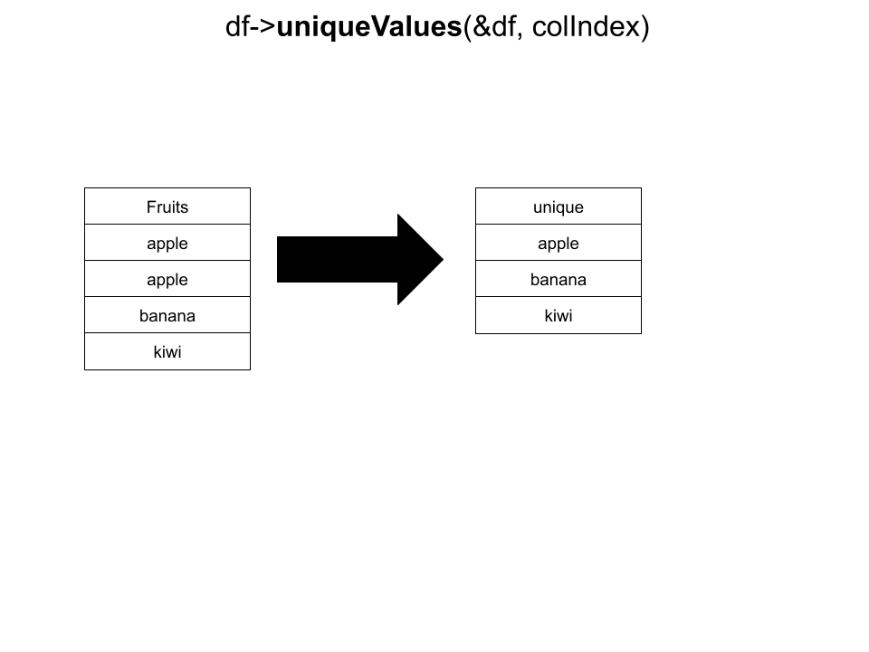

## Usage:
```c
    DataFrame df;
    DataFrame_Create(&df);

    // DF_INT => [2,2,5,7,5]
    Series s;
    seriesInit(&s, "UniqueValTest", DF_INT);
    seriesAddInt(&s,2);
    seriesAddInt(&s,2);
    seriesAddInt(&s,5);
    seriesAddInt(&s,7);
    seriesAddInt(&s,5);
    df.addSeries(&df,&s);
    seriesFree(&s);

    DataFrame uniqueDF = df.uniqueValues(&df, 0);
    // distinct => {2,5,7} => we expect 3 rows in uniqueDF
    size_t rowCount = uniqueDF.numRows(&uniqueDF);
    assert(rowCount==3);

    // We won't check the exact order. Just check the total.
    DataFrame_Destroy(&uniqueDF);
    DataFrame_Destroy(&df);
```


# Aggregate::DataFrame valueCounts(const DataFrame* df, size_t colIndex)

Given a DataFrame `df` and a column index `colIndex`, the **valueCounts** function returns a new DataFrame listing each **distinct value** in that column along with its **frequency**.

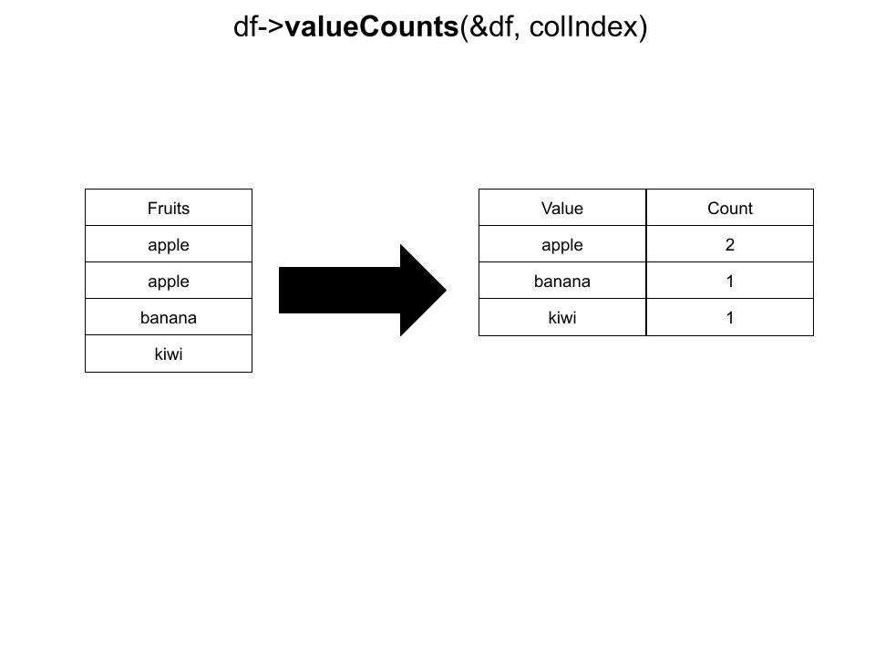


## Usage:
```c
    DataFrame df;
    DataFrame_Create(&df);

    // DF_STRING => ["apple", "apple", "banana"]
    Series s;
    seriesInit(&s, "VCtest", DF_STRING);
    seriesAddString(&s, "apple");
    seriesAddString(&s, "apple");
    seriesAddString(&s, "banana");
    df.addSeries(&df, &s);
    seriesFree(&s);

    DataFrame vc = df.valueCounts(&df, 0);
    // Expect 2 distinct => "apple" (2), "banana"(1)
    // We'll just check numRows=2
    size_t rowCount = vc.numRows(&vc);
    assert(rowCount==2);

    DataFrame_Destroy(&vc);
    DataFrame_Destroy(&df);
```


# Aggregate::DataFrame cumulativeSum(const DataFrame* df, size_t colIndex)

It creates a new column that, for each row, holds the running total (sum) of all previous rows (including the current row).


## Usage:
```c
    DataFrame df;
    DataFrame_Create(&df);

    // DF_DOUBLE => [1.0, 2.0, 3.0]
    Series s;
    seriesInit(&s, "CumSumTest", DF_DOUBLE);
    seriesAddDouble(&s,1.0);
    seriesAddDouble(&s,2.0);
    seriesAddDouble(&s,3.0);
    df.addSeries(&df,&s);
    seriesFree(&s);

    DataFrame cs = df.cumulativeSum(&df, 0);
    // col "cumsum" => [1.0, 3.0, 6.0]
    const Series* csumCol = cs.getSeries(&cs, 0);
    assert(csumCol && csumCol->type==DF_DOUBLE);

    double v0,v1,v2;
    seriesGetDouble(csumCol, 0, &v0);
    seriesGetDouble(csumCol, 1, &v1);
    seriesGetDouble(csumCol, 2, &v2);
    assertAlmostEqual(v0,1.0,1e-9);
    assertAlmostEqual(v1,3.0,1e-9);
    assertAlmostEqual(v2,6.0,1e-9);

    DataFrame_Destroy(&cs);
    DataFrame_Destroy(&df);
```


# Aggregate::DataFrame cumulativeProduct(const DataFrame* df, size_t colIndex)
For each row in a numeric column, cumulative product stores the running product of all previous values (including the current one)


## Usage:
```c
    DataFrame df;
    DataFrame_Create(&df);

    // DF_INT => [2,2,3]
    Series s;
    seriesInit(&s, "CumProdTest", DF_INT);
    seriesAddInt(&s,2);
    seriesAddInt(&s,2);
    seriesAddInt(&s,3);
    df.addSeries(&df,&s);
    seriesFree(&s);

    DataFrame cp = df.cumulativeProduct(&df,0);
    // expect => [2,4,12]
    const Series* cprodCol = cp.getSeries(&cp, 0);
    double v0,v1,v2;
    seriesGetDouble(cprodCol,0,&v0);
    seriesGetDouble(cprodCol,1,&v1);
    seriesGetDouble(cprodCol,2,&v2);
    assertAlmostEqual(v0,2.0,1e-9);
    assertAlmostEqual(v1,4.0,1e-9);
    assertAlmostEqual(v2,12.0,1e-9);

    DataFrame_Destroy(&cp);
    DataFrame_Destroy(&df);
```


# Aggregate::DataFrame cumulativeMax(const DataFrame* df, size_t colIndex)

The cumulative max at row 𝑖 is the largest value seen so far (from row 0 up to row 𝑖)


## Usage:
```c
    DataFrame df;
    DataFrame_Create(&df);

    // DF_INT => [1,3,2,5]
    Series s;
    seriesInit(&s, "CumMaxTest", DF_INT);
    seriesAddInt(&s,1);
    seriesAddInt(&s,3);
    seriesAddInt(&s,2);
    seriesAddInt(&s,5);
    df.addSeries(&df,&s);
    seriesFree(&s);

    DataFrame cm = df.cumulativeMax(&df,0);
    // row0 =>1, row1=>3, row2=>3, row3=>5
    const Series* cmaxCol = cm.getSeries(&cm,0);
    double v0,v1,v2,v3;
    seriesGetDouble(cmaxCol,0,&v0);
    seriesGetDouble(cmaxCol,1,&v1);
    seriesGetDouble(cmaxCol,2,&v2);
    seriesGetDouble(cmaxCol,3,&v3);
    assertAlmostEqual(v0,1.0,1e-9);
    assertAlmostEqual(v1,3.0,1e-9);
    assertAlmostEqual(v2,3.0,1e-9);
    assertAlmostEqual(v3,5.0,1e-9);

    DataFrame_Destroy(&cm);
    DataFrame_Destroy(&df);
```


# Aggregate::DataFrame cumulativeMin(const DataFrame* df, size_t colIndex)

The cumulative max at row 𝑖 is the smallest value seen so far (from row 0 up to row 𝑖)

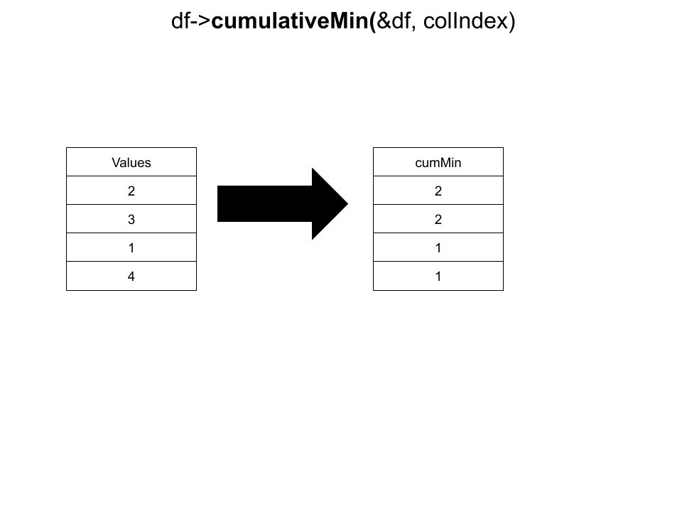

## Usage:
```c
    DataFrame df;
    DataFrame_Create(&df);

    // DF_INT => [3,2,5,1]
    Series s;
    seriesInit(&s, "CumMinTest", DF_INT);
    seriesAddInt(&s,3);
    seriesAddInt(&s,2);
    seriesAddInt(&s,5);
    seriesAddInt(&s,1);
    df.addSeries(&df,&s);
    seriesFree(&s);

    DataFrame cmi = df.cumulativeMin(&df,0);
    // row0=>3, row1=>2, row2=>2, row3=>1
    const Series* cminCol = cmi.getSeries(&cmi,0);
    double v0,v1,v2,v3;
    seriesGetDouble(cminCol,0,&v0);
    seriesGetDouble(cminCol,1,&v1);
    seriesGetDouble(cminCol,2,&v2);
    seriesGetDouble(cminCol,3,&v3);
    assertAlmostEqual(v0,3.0,1e-9);
    assertAlmostEqual(v1,2.0,1e-9);
    assertAlmostEqual(v2,2.0,1e-9);
    assertAlmostEqual(v3,1.0,1e-9);

    DataFrame_Destroy(&cmi);
    DataFrame_Destroy(&df);
```


# Aggregate::DataFrame groupBy(const DataFrame* df, size_t groupColIndex)

Given a DataFrame `df` and a column index `colIndex`, the **groupBy** function returns a new DataFrame listing each **distinct value** in that column along with its **frequency**.

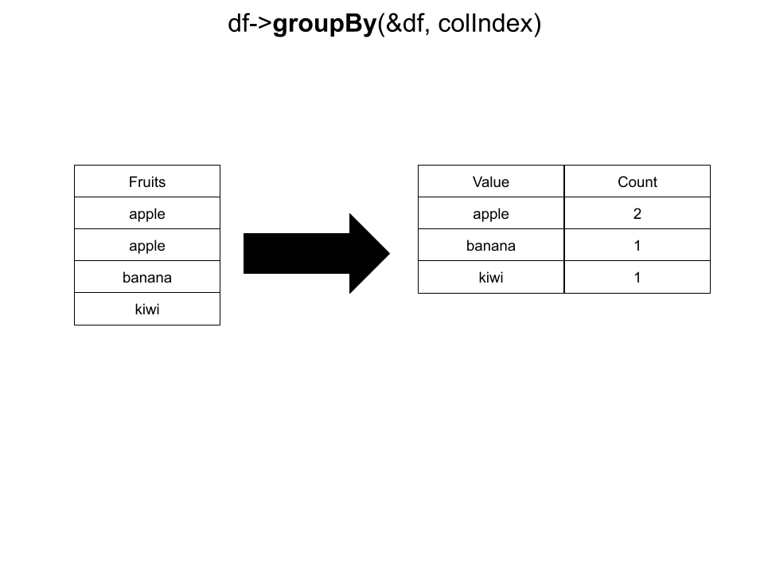

## Usage:
```c
    DataFrame df;
    DataFrame_Create(&df);

    // We'll store DF_STRING => ["apple","banana","banana","apple"]
    // so group => "apple"(2), "banana"(2)
    Series s;
    seriesInit(&s, "Fruit", DF_STRING);
    seriesAddString(&s,"apple");
    seriesAddString(&s,"banana");
    seriesAddString(&s,"banana");
    seriesAddString(&s,"apple");
    df.addSeries(&df,&s);
    seriesFree(&s);

    DataFrame g = df.groupBy(&df,0);
    // We expect 2 rows => group => "apple", "banana"
    size_t r = g.numRows(&g);
    assert(r==2);

    // Also might check the "count" column => each should be 2
    // We'll do minimal here
    DataFrame_Destroy(&g);
    DataFrame_Destroy(&df);
```


# Combine::DataFrame concat(const DataFrame* top, const DataFrame* bottom)

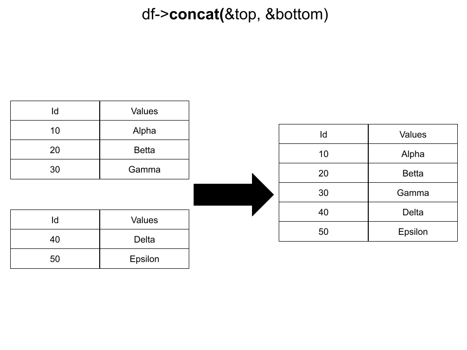


## Usage
```c
    // Build top DataFrame: 2 columns => col1(int), col2(string), 3 rows
    DataFrame top;
    DataFrame_Create(&top);

    int col1_top[] = { 10, 20, 30 };
    const char* col2_top[] = { "Alpha", "Beta", "Gamma" };

    Series s1 = buildIntSeries("Numbers", col1_top, 3);
    bool ok = top.addSeries(&top, &s1);
    assert(ok);
    seriesFree(&s1);

    Series s2 = buildStringSeries("Words", col2_top, 3);
    ok = top.addSeries(&top, &s2);
    assert(ok);
    seriesFree(&s2);

    // Build bottom DataFrame: same 2 columns => same names & types, 2 rows
    DataFrame bottom;
    DataFrame_Create(&bottom);

    int col1_bot[] = { 40, 50 };
    const char* col2_bot[] = { "Delta", "Epsilon" };

    Series s3 = buildIntSeries("Numbers", col1_bot, 2);
    bottom.addSeries(&bottom, &s3);
    seriesFree(&s3);

    Series s4 = buildStringSeries("Words", col2_bot, 2);
    bottom.addSeries(&bottom, &s4);
    seriesFree(&s4);

    // Now concat
    DataFrame concatDF = top.concat(&top, &bottom);

    // Expect 5 rows, 2 columns
    assert(concatDF.numColumns(&concatDF)==2);
    assert(concatDF.numRows(&concatDF)==5);

    // Check data in "Numbers"
    const Series* numbers = concatDF.getSeries(&concatDF, 0);
    assert(strcmp(numbers->name, "Numbers")==0);
    // row0 =>10, row1 =>20, row2=>30, row3=>40, row4=>50
    for (size_t r=0; r<5; r++) {
        int val=0;
        bool g = seriesGetInt(numbers, r, &val);
        assert(g);
        int expected = (int)((r+1)*10);
        assert(val==expected); 
    }

    // Check data in "Words"
    const Series* words = concatDF.getSeries(&concatDF,1);
    assert(strcmp(words->name,"Words")==0);
    // row0=>"Alpha", row1=>"Beta", row2=>"Gamma", row3=>"Delta", row4=>"Epsilon"
    const char* expectedWords[5] = {"Alpha","Beta","Gamma","Delta","Epsilon"};
    for (size_t r=0; r<5; r++) {
        char* st=NULL;
        bool g = seriesGetString(words, r, &st);
        assert(g);
        assert(strcmp(st, expectedWords[r])==0);
        free(st);
    }

    DataFrame_Destroy(&concatDF);
    DataFrame_Destroy(&top);
    DataFrame_Destroy(&bottom);
```

# Combine::DataFrame merge(const DataFrame* left, const DataFrame* right, const char* leftKeyName, const char* rightKeyName)

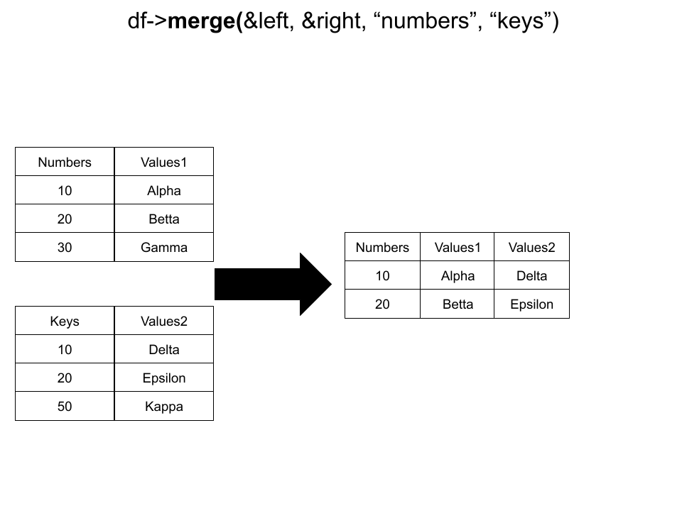


## Usage
```c
    // We'll create left DF with columns: "Key"(int), "A"(int)
    // 4 rows => Key=1,2,3,4; A=100,200,300,400
    DataFrame left;
    DataFrame_Create(&left);

    int keysLeft[] = {1,2,3,4};
    int colA[]     = {100,200,300,400};

    Series sKeyLeft = buildIntSeries("Key", keysLeft, 4);
    left.addSeries(&left, &sKeyLeft);
    seriesFree(&sKeyLeft);

    Series sA = buildIntSeries("A", colA, 4);
    left.addSeries(&left, &sA);
    seriesFree(&sA);

    // Right DF => columns: "kid"(int), "B"(string)
    // 3 rows => kid=2,3,5; B= "two", "three", "five"
    DataFrame right;
    DataFrame_Create(&right);

    int keysRight[] = {2,3,5};
    const char* colB[] = {"two","three","five"};

    Series sKid = buildIntSeries("kid", keysRight, 3);
    right.addSeries(&right, &sKid);
    seriesFree(&sKid);

    Series sB = buildStringSeries("B", colB, 3);
    right.addSeries(&right, &sB);
    seriesFree(&sB);

    // Merge => leftKey="Key", rightKey="kid"
    DataFrame merged = left.merge(&left, &right, "Key","kid");
    // We expect an inner join => matches on key=2,3 => so 2 rows
    // columns => [ Key, A, B ]
    assert(merged.numColumns(&merged)==3);
    assert(merged.numRows(&merged)==2);

    // check row0 => Key=2 => A=200 => B="two"
    // check row1 => Key=3 => A=300 => B="three"
    const Series* keyMerged = merged.getSeries(&merged,0);
    const Series* aMerged   = merged.getSeries(&merged,1);
    const Series* bMerged   = merged.getSeries(&merged,2);

    assert(strcmp(keyMerged->name,"Key")==0);
    assert(strcmp(aMerged->name,"A")==0);
    assert(strcmp(bMerged->name,"B")==0);

    // row0 => Key=2
    {
        int kv; bool g = seriesGetInt(keyMerged, 0, &kv);
        assert(g && kv==2);
        int av; g= seriesGetInt(aMerged, 0, &av);
        assert(g && av==200);
        char* st=NULL;
        g= seriesGetString(bMerged, 0, &st);
        assert(g && strcmp(st,"two")==0);
        free(st);
    }
    // row1 => Key=3
    {
        int kv; bool g = seriesGetInt(keyMerged, 1, &kv);
        assert(g && kv==3);
        int av; g= seriesGetInt(aMerged, 1, &av);
        assert(g && av==300);
        char* st=NULL;
        g= seriesGetString(bMerged, 1, &st);
        assert(g && strcmp(st,"three")==0);
        free(st);
    }

    DataFrame_Destroy(&merged);
    DataFrame_Destroy(&left);
    DataFrame_Destroy(&right);

```


# Combine::DataFrame join(const DataFrame* left, const DataFrame* right, const char* leftKeyName, const char* rightKeyName, JoinType how)
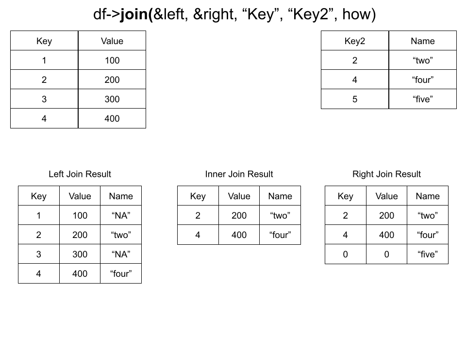

## Usage
```c
    // We'll reuse a scenario similar to testMerge, but add a twist
    // Left => Key=1,2,3,4 ; A=100,200,300,400
    // Right => Key2=2,4,5 ; C="two","four","five" 
    // We'll do leftKeyName="Key", rightKeyName="Key2"

    DataFrame left;
    DataFrame_Create(&left);

    int keysLeft[] = {1,2,3,4};
    int colA[]     = {100,200,300,400};

    Series sKeyLeft = buildIntSeries("Key", keysLeft, 4);
    left.addSeries(&left, &sKeyLeft);
    seriesFree(&sKeyLeft);

    Series sA = buildIntSeries("A", colA, 4);
    left.addSeries(&left, &sA);
    seriesFree(&sA);

    DataFrame right;
    DataFrame_Create(&right);

    int keysRight[] = {2,4,5};
    const char* colC[] = {"two","four","five"};

    Series sKeyRight = buildIntSeries("Key2", keysRight, 3);
    right.addSeries(&right, &sKeyRight);
    seriesFree(&sKeyRight);

    Series sC = buildStringSeries("C", colC, 3);
    right.addSeries(&right, &sC);
    seriesFree(&sC);

    // a) JOIN_INNER => matches are Key=2,4 => expect 2 rows => columns => [Key, A, C]
    {
        DataFrame joined = left.join(&left, &right, "Key","Key2", JOIN_INNER);
        assert(joined.numColumns(&joined)==3);
        assert(joined.numRows(&joined)==2);

        // row0 => Key=2 => A=200 => C="two"
        // row1 => Key=4 => A=400 => C="four"
        const Series* k = joined.getSeries(&joined, 0);
        const Series* a = joined.getSeries(&joined, 1);
        const Series* c = joined.getSeries(&joined, 2);

        int kv; seriesGetInt(k, 0, &kv); assert(kv==2);
        int av; seriesGetInt(a, 0, &av); assert(av==200);
        char* st=NULL; seriesGetString(c, 0, &st); assert(strcmp(st,"two")==0); free(st);

        seriesGetInt(k,1,&kv); assert(kv==4);
        seriesGetInt(a,1,&av); assert(av==400);
        seriesGetString(c,1,&st); assert(strcmp(st,"four")==0); free(st);

        DataFrame_Destroy(&joined);
    }

    // b) JOIN_LEFT => keep unmatched left => Key=1,3 => those rows => right columns => "NA"
    {
        DataFrame joined = left.join(&left, &right, "Key","Key2", JOIN_LEFT);
        // matched => Key=2,4 => 2 rows
        // unmatched => Key=1,3 => 2 rows => total 4 rows
        // columns => [Key,A,C]
        assert(joined.numColumns(&joined)==3);
        assert(joined.numRows(&joined)==4);

        const Series* k = joined.getSeries(&joined,0);
        const Series* a = joined.getSeries(&joined,1);
        const Series* c = joined.getSeries(&joined,2);

        // row0 => key=1 => A=100 => c="NA"
        {
            int kv; bool g= seriesGetInt(k, 0, &kv);
            assert(g && kv==1);
            int av; g= seriesGetInt(a,0,&av);
            assert(g && av==100);
            char* st=NULL;
            g= seriesGetString(c,0,&st);
            assert(g && strcmp(st,"NA")==0);
            free(st);
        }
        // row1 => key=2 => c="two"
        {
            int kv; seriesGetInt(k,1,&kv);
            assert(kv==2);
            int av; seriesGetInt(a,1,&av);
            assert(av==200);
            char* st=NULL; seriesGetString(c,1,&st);
            assert(strcmp(st,"two")==0);
            free(st);
        }
        // row2 => key=3 => c="NA"
        {
            int kv; seriesGetInt(k,2,&kv);
            assert(kv==3);
            int av; seriesGetInt(a,2,&av);
            assert(av==300);
            char* st=NULL; seriesGetString(c,2,&st);
            assert(strcmp(st,"NA")==0);
            free(st);
        }
        // row3 => key=4 => c="four"
        {
            int kv; seriesGetInt(k,3,&kv);
            assert(kv==4);
            int av; seriesGetInt(a,3,&av);
            assert(av==400);
            char* st=NULL; seriesGetString(c,3,&st);
            assert(strcmp(st,"four")==0);
            free(st);
        }

        DataFrame_Destroy(&joined);
    }

    // c) JOIN_RIGHT => keep unmatched right => Key2=5 => that row => left columns => "NA"
    {
        DataFrame joined = left.join(&left, &right, "Key","Key2", JOIN_RIGHT);
        // matched => Key=2,4 => 2 rows
        // unmatched => Key2=5 => 1 row => total 3 rows
        // columns => [Key,A,C]
        assert(joined.numColumns(&joined)==3);
        assert(joined.numRows(&joined)==3);

        const Series* k = joined.getSeries(&joined, 0);
        const Series* a = joined.getSeries(&joined, 1);
        const Series* c = joined.getSeries(&joined, 2);

        // row0 => key=2 => a=200 => c="two"
        {
            int kv; bool g= seriesGetInt(k,0,&kv);
            assert(g && kv==2);
            int av; g= seriesGetInt(a,0,&av);
            assert(g && av==200);
            char* st=NULL; g= seriesGetString(c,0,&st);
            assert(g && strcmp(st,"two")==0);
            free(st);
        }
        // row1 => key=4 => a=400 => c="four"
        {
            int kv; bool g= seriesGetInt(k,1,&kv);
            assert(g && kv==4);
            int av; g= seriesGetInt(a,1,&av);
            assert(g && av==400);
            char* st=NULL; g= seriesGetString(c,1,&st);
            assert(g && strcmp(st,"four")==0);
            free(st);
        }
        // row2 => Key=0 => A=0 => c="five" 
        {
            int kv; bool g= seriesGetInt(k,2,&kv);
            assert(g && kv==0);  // we store int "NA" as 0
            int av; g= seriesGetInt(a,2,&av);
            assert(g && av==0);
            char* st=NULL; g= seriesGetString(c,2,&st);
            assert(g && strcmp(st,"five")==0);
            free(st);
        }

        DataFrame_Destroy(&joined);
    }

    DataFrame_Destroy(&left);
    DataFrame_Destroy(&right);
```


# Combine::DataFrame unionDF(const DataFrame* dfA, const DataFrame* dfB)
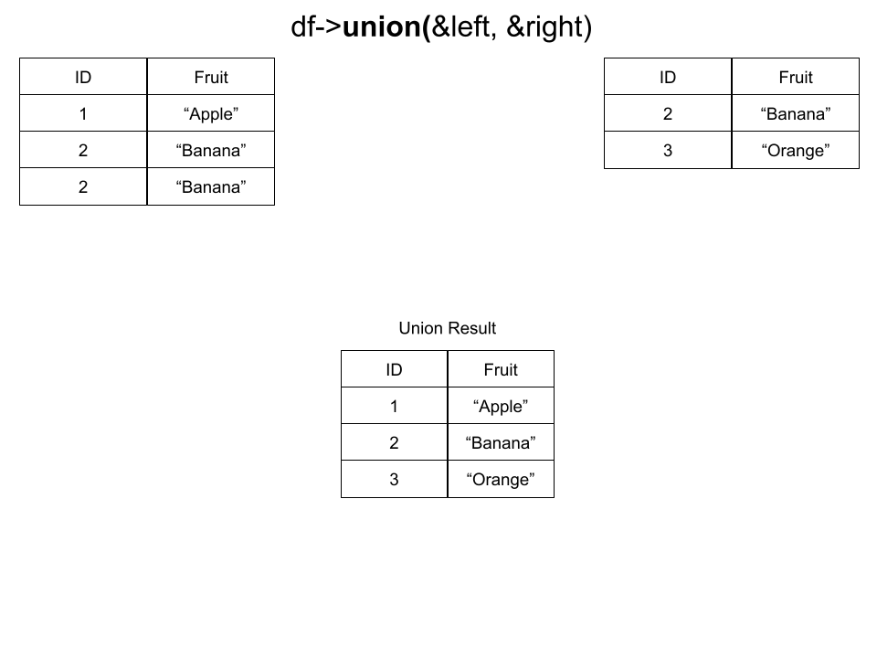

## Usage
```c
    // We'll create 2 DataFrames with 1 column => "Val" (int).
    // dfA => [1,2,2], dfB => [2,3]
    // Union => distinct => [1,2,3]
    DataFrame dfA;
    DataFrame_Create(&dfA);
    int arrA[] = {1,2,2};
    Series sA = buildIntSeries("Val", arrA, 3);
    dfA.addSeries(&dfA, &sA);
    seriesFree(&sA);

    DataFrame dfB;
    DataFrame_Create(&dfB);
    int arrB[] = {2,3};
    Series sB = buildIntSeries("Val", arrB, 2);
    dfB.addSeries(&dfB, &sB);
    seriesFree(&sB);

    // union => [1,2,3]
    DataFrame un = dfA.unionDF(&dfA, &dfB);
    // expect 1 col, 3 rows => distinct => 1,2,3
    assert(un.numColumns(&un)==1);
    assert(un.numRows(&un)==3);

    // check that the set is {1,2,3}
    // we won't check order strictly, but let's read them:
    bool found1=false, found2=false, found3=false;
    const Series* sU = un.getSeries(&un,0);
    size_t nr = un.numRows(&un);
    for (size_t r=0; r< nr; r++){
        int v; seriesGetInt(sU, r, &v);
        if (v==1) found1=true;
        if (v==2) found2=true;
        if (v==3) found3=true;
    }
    assert(found1 && found2 && found3);

    DataFrame_Destroy(&un);
    DataFrame_Destroy(&dfA);
    DataFrame_Destroy(&dfB);
```


# Combine::DataFrame intersectionDF(const DataFrame* dfA, const DataFrame* dfB)
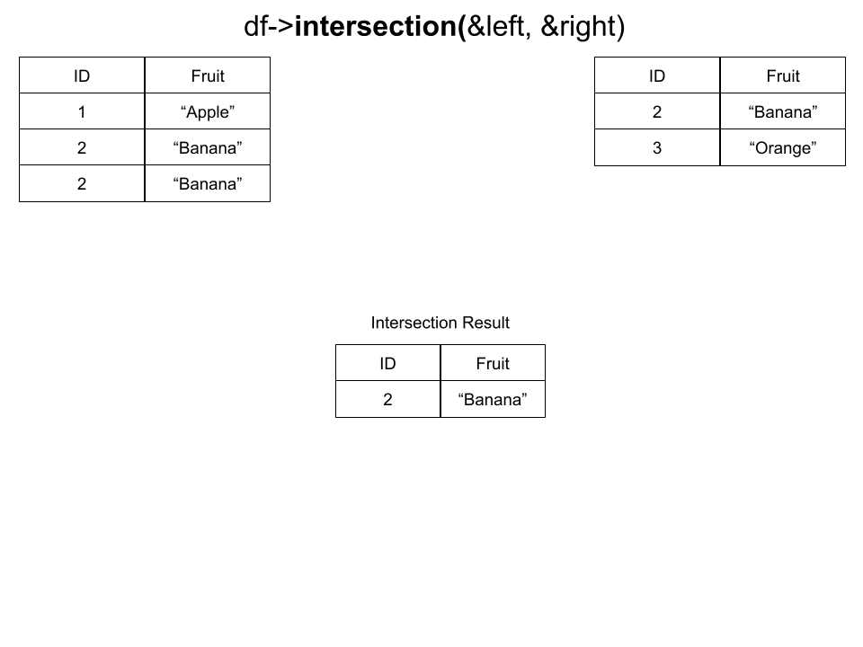

## Usage
```c
    // dfA => [2,2,3,4]
    // dfB => [2,4,4,5]
    // intersection => {2,4} (unique rows wise)
    DataFrame dfA;
    DataFrame_Create(&dfA);
    int arrA[] = {2,2,3,4};
    Series sA = buildIntSeries("Num", arrA, 4);
    dfA.addSeries(&dfA, &sA);
    seriesFree(&sA);

    DataFrame dfB;
    DataFrame_Create(&dfB);
    int arrB[] = {2,4,4,5};
    Series sB = buildIntSeries("Num", arrB, 4);
    dfB.addSeries(&dfB, &sB);
    seriesFree(&sB);

    DataFrame inter = dfA.intersectionDF(&dfA, &dfB);
    // expect {2,4} => 2 distinct rows
    assert(inter.numColumns(&inter)==1);
    size_t nr= inter.numRows(&inter);
    // might have duplicates if implemented literally. If you do a "drop duplicates" approach, expect 2. 
    // We'll assume your code does set-like intersection => 2 unique rows.

    assert(nr==2);

    const Series* sI = inter.getSeries(&inter,0);
    bool found2=false, found4=false;
    for (size_t r=0; r< nr; r++){
        int v=0;
        seriesGetInt(sI, r, &v);
        if (v==2) found2=true;
        if (v==4) found4=true;
    }
    assert(found2 && found4);

    DataFrame_Destroy(&inter);
    DataFrame_Destroy(&dfA);
    DataFrame_Destroy(&dfB);
```


# Combine::DataFrame differenceDF(const DataFrame* dfA, const DataFrame* dfB)
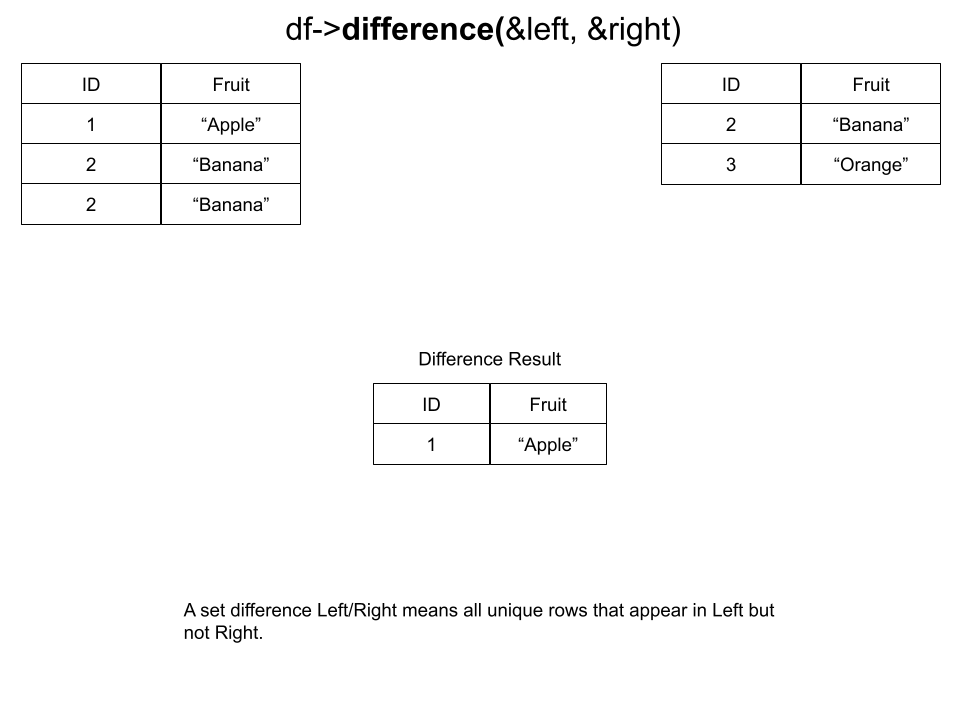

## Usage
```c
    // dfA => [1,2,3]
    // dfB => [2,4]
    // difference => {1,3}  ( i.e. A\B )
    DataFrame dfA;
    DataFrame_Create(&dfA);
    int arrA[] = {1,2,3};
    Series sA = buildIntSeries("Val", arrA, 3);
    dfA.addSeries(&dfA, &sA);
    seriesFree(&sA);

    DataFrame dfB;
    DataFrame_Create(&dfB);
    int arrB[] = {2,4};
    Series sB = buildIntSeries("Val", arrB, 2);
    dfB.addSeries(&dfB, &sB);
    seriesFree(&sB);

    DataFrame diff = dfA.differenceDF(&dfA, &dfB);
    // expect [1,3]
    assert(diff.numColumns(&diff)==1);
    size_t nr= diff.numRows(&diff);
    // might be 2 rows => val=1, val=3
    assert(nr==2);

    const Series* sD = diff.getSeries(&diff,0);
    bool found1=false, found3=false;
    for (size_t r=0; r<nr; r++){
        int v=0;
        seriesGetInt(sD, r, &v);
        if (v==1) found1=true;
        if (v==3) found3=true;
    }
    assert(found1 && found3);

    DataFrame_Destroy(&diff);
    DataFrame_Destroy(&dfA);
    DataFrame_Destroy(&dfB);
```


# Combine::DataFrame semiJoin(const DataFrame* left, const DataFrame* right, const char* leftKey, const char* rightKey)
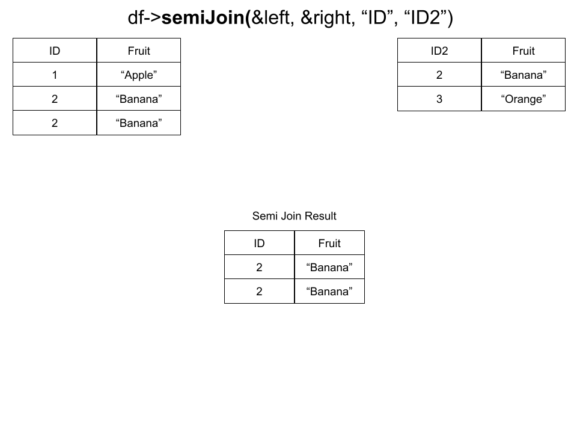

## Usage
```c
    // left => Key=[1,2,3], left => colX=[10,20,30]
    // right => Key2=[2,4], colY= "two","four"
    // semiJoin(leftKey="Key", rightKey="Key2") => keep left rows that match
    // => matches only Key=2 => row => Key=2 => colX=20
    DataFrame left;
    DataFrame_Create(&left);

    int keyA[] = {1,2,3};
    int colX[] = {10,20,30};
    Series sKeyA = buildIntSeries("Key", keyA, 3);
    left.addSeries(&left, &sKeyA);
    seriesFree(&sKeyA);
    Series sXA = buildIntSeries("X", colX, 3);
    left.addSeries(&left, &sXA);
    seriesFree(&sXA);

    DataFrame right;
    DataFrame_Create(&right);

    int keyB[] = {2,4};
    const char* colY[] = {"two","four"};
    Series sKeyB = buildIntSeries("Key2", keyB, 2);
    right.addSeries(&right, &sKeyB);
    seriesFree(&sKeyB);
    Series sYB = buildStringSeries("Y", colY, 2);
    right.addSeries(&right, &sYB);
    seriesFree(&sYB);

    // semiJoin => left->semiJoin(leftKey="Key", rightKey="Key2")
    DataFrame semi = left.semiJoin(&left, &right, "Key","Key2");
    // expect 1 row => Key=2, X=20
    assert(semi.numColumns(&semi)==2);
    assert(semi.numRows(&semi)==1);

    const Series* k = semi.getSeries(&semi,0);
    const Series* x = semi.getSeries(&semi,1);

    int kv=0; seriesGetInt(k,0,&kv);
    assert(kv==2);
    int xv=0; seriesGetInt(x,0,&xv);
    assert(xv==20);

    DataFrame_Destroy(&semi);
    DataFrame_Destroy(&right);
    DataFrame_Destroy(&left);

```


# Combine::DataFrame antiJoin(const DataFrame* left, const DataFrame* right, const char* leftKey, const char* rightKey)
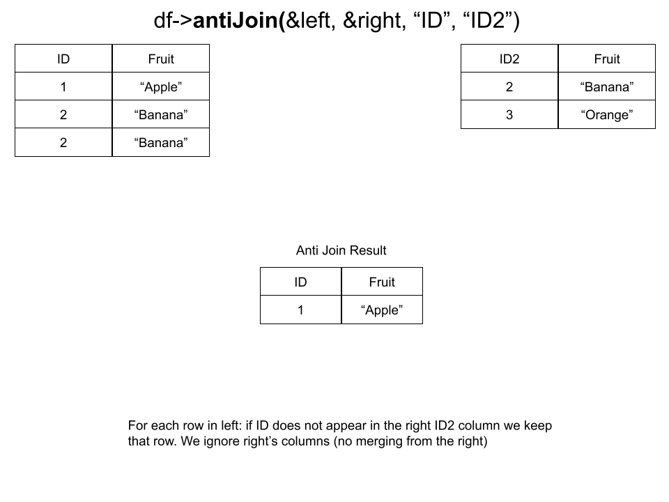

## Usage
```c
    // left => Key=[1,2,3], colX=[10,20,30]
    // right => Key2=[2,4], colY= ...
    // antiJoin => keep left rows that DO NOT match => Key=1,3 => 2 rows
    DataFrame left;
    DataFrame_Create(&left);

    int keyA[] = {1,2,3};
    int colX[] = {10,20,30};
    Series sKeyA = buildIntSeries("Key", keyA, 3);
    left.addSeries(&left, &sKeyA);
    seriesFree(&sKeyA);
    Series sXA = buildIntSeries("X", colX, 3);
    left.addSeries(&left, &sXA);
    seriesFree(&sXA);

    DataFrame right;
    DataFrame_Create(&right);
    int keyB[] = {2,4};
    Series sKeyB = buildIntSeries("Key2", keyB, 2);
    right.addSeries(&right, &sKeyB);
    seriesFree(&sKeyB);

    // do the antiJoin
    DataFrame anti = left.antiJoin(&left, &right, "Key","Key2");
    // expected => 2 rows => Key=1 => colX=10, Key=3 => colX=30
    assert(anti.numColumns(&anti)==2);
    assert(anti.numRows(&anti)==2);

    const Series* k = anti.getSeries(&anti,0);
    const Series* x = anti.getSeries(&anti,1);

    // row0 => Key=1 => X=10
    {
        int kv; bool g= seriesGetInt(k,0,&kv);
        assert(g && kv==1);
        int xv; g= seriesGetInt(x,0,&xv);
        assert(g && xv==10);
    }
    // row1 => Key=3 => X=30
    {
        int kv; bool g= seriesGetInt(k,1,&kv);
        assert(g && kv==3);
        int xv; g= seriesGetInt(x,1,&xv);
        assert(g && xv==30);
    }

    DataFrame_Destroy(&anti);
    DataFrame_Destroy(&right);
    DataFrame_Destroy(&left);
```


# Combine::DataFrame crossJoin(const DataFrame* left, const DataFrame* right)
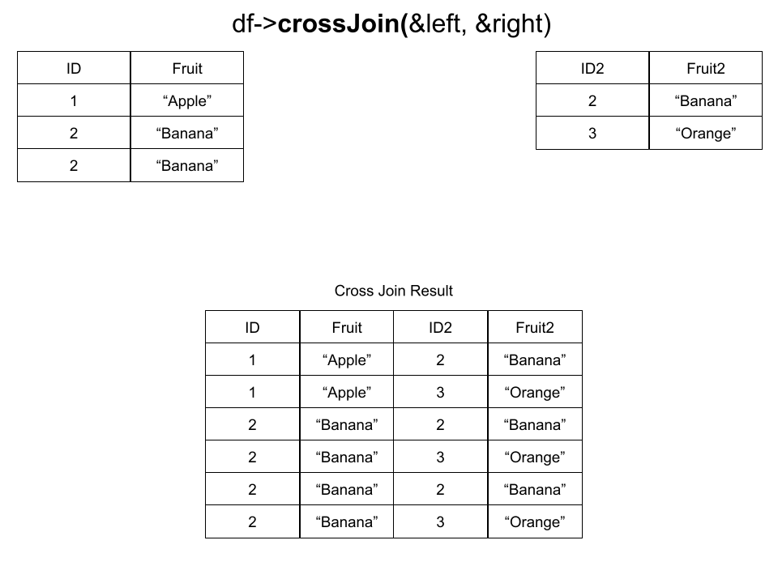

## Usage
```c
    // 1) Create a "left" DataFrame with 1 column => "L" = [1,2]
    DataFrame left;
    DataFrame_Create(&left);

    int leftVals[] = {1,2};
    Series sLeft;
    seriesInit(&sLeft, "L", DF_INT);
    seriesAddInt(&sLeft, leftVals[0]);
    seriesAddInt(&sLeft, leftVals[1]);
    left.addSeries(&left, &sLeft);
    seriesFree(&sLeft);

    // 2) Create a "right" DataFrame with 1 column => "R" = [10,20,30]
    DataFrame right;
    DataFrame_Create(&right);

    int rightVals[] = {10,20,30};
    Series sRight;
    seriesInit(&sRight, "R", DF_INT);
    for (int i = 0; i < 3; i++) {
        seriesAddInt(&sRight, rightVals[i]);
    }
    right.addSeries(&right, &sRight);
    seriesFree(&sRight);

    // 3) Call crossJoin => expect (2 * 3) = 6 rows
    DataFrame cross = left.crossJoin(&left, &right);
    // We expect 2 columns => "L" and "R"
    assert(cross.numColumns(&cross) == 2);

    // Should produce 6 rows
    size_t nRows = cross.numRows(&cross);
    assert(nRows == 6);

    // 4) Retrieve the Series => "L" is col0, "R" is col1
    const Series* colL = cross.getSeries(&cross, 0);
    const Series* colR = cross.getSeries(&cross, 1);
    assert(strcmp(colL->name, "L") == 0);
    assert(strcmp(colR->name, "R") == 0);

    // 5) Check the values row-by-row
    // Typically, cross join goes in row-major order:
    //   left row0 => 1 joined with right row0 => 10
    //   left row0 => 1 joined with right row1 => 20
    //   left row0 => 1 joined with right row2 => 30
    //   left row1 => 2 joined with right row0 => 10
    //   left row1 => 2 joined with right row1 => 20
    //   left row1 => 2 joined with right row2 => 30
    // So we expect (L,R): 
    //   (1,10), (1,20), (1,30), (2,10), (2,20), (2,30)

    int expectL[6] = {1,1,1,2,2,2};
    int expectR[6] = {10,20,30,10,20,30};

    for (size_t i = 0; i < 6; i++) {
        int lv, rv;
        bool gotL = seriesGetInt(colL, i, &lv);
        bool gotR = seriesGetInt(colR, i, &rv);
        assert(gotL && gotR);
        assert(lv == expectL[i]);
        assert(rv == expectR[i]);
    }

    DataFrame_Destroy(&cross);
    DataFrame_Destroy(&left);
    DataFrame_Destroy(&right);

```

# Indexing
# Indexing::DataFrame at(const DataFrame* df, size_t rowIndex, const char*colName)
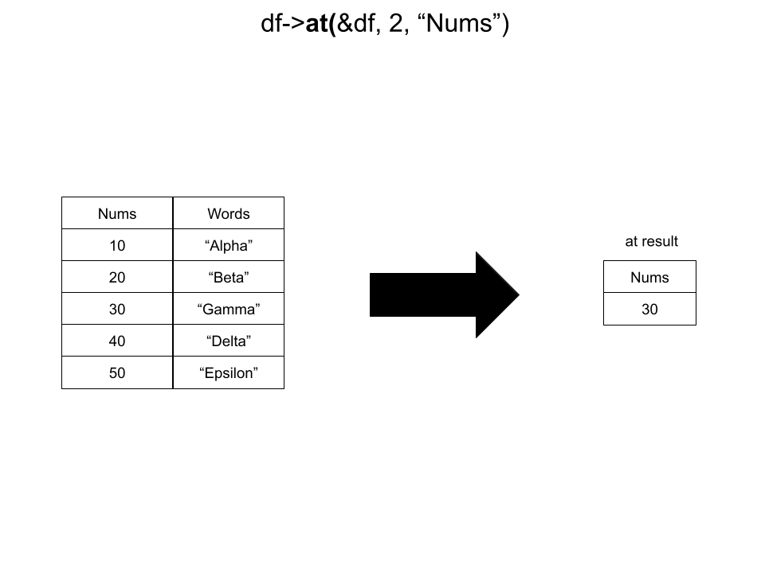

## Usage:
```c
    DataFrame df;
    DataFrame_Create(&df);

    // Build 2 columns: "Nums"(int), "Words"(string), 5 rows
    int nums[] = {10,20,30,40,50};
    const char* words[] = {"Alpha","Beta","Gamma","Delta","Epsilon"};

    Series sNums = buildIntSeries("Nums", nums, 5);
    df.addSeries(&df, &sNums);
    seriesFree(&sNums);

    Series sWords = buildStringSeries("Words", words, 5);
    df.addSeries(&df, &sWords);
    seriesFree(&sWords);

    // 1) Normal usage: at(row=2, colName="Nums") => should produce a 1×1 DF with "Nums"[0] = 30
    {
        DataFrame cellDF = df.at(&df, 2, "Nums");
        assert(cellDF.numColumns(&cellDF)==1);
        assert(cellDF.numRows(&cellDF)==1);

        const Series* c = cellDF.getSeries(&cellDF, 0);
        assert(strcmp(c->name, "Nums")==0);
        int val=0;
        bool got = seriesGetInt(c, 0, &val);
        assert(got && val==30);

        DataFrame_Destroy(&cellDF);
    }

    // 2) Out-of-range row => empty DF
    {
        DataFrame emptyDF = df.at(&df, 10, "Nums");
        assert(emptyDF.numColumns(&emptyDF)==0);
        assert(emptyDF.numRows(&emptyDF)==0);
        DataFrame_Destroy(&emptyDF);
    }

    // 3) colName not found => empty DF
    {
        DataFrame noCol = df.at(&df, 1, "Bogus");
        assert(noCol.numColumns(&noCol)==0);
        assert(noCol.numRows(&noCol)==0);
        DataFrame_Destroy(&noCol);
    }

    DataFrame_Destroy(&df);
```


# Indexing::DataFrame iat(const DataFrame* df, size_t rowIndex, size_t colIndex)
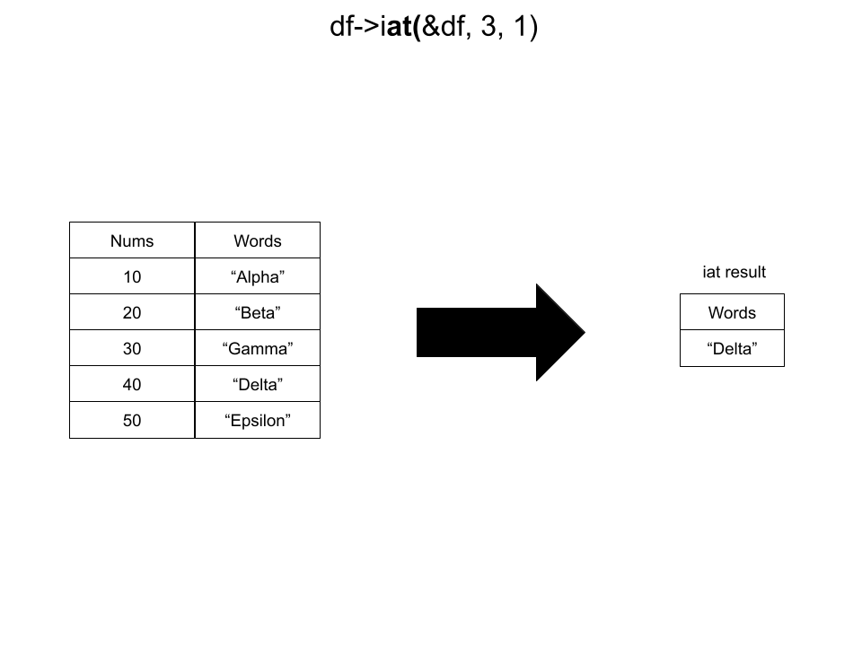
## Usage:
```c
    DataFrame df;
    DataFrame_Create(&df);

    int nums[] = {10,20,30,40,50};
    const char* words[] = {"Alpha","Beta","Gamma","Delta","Epsilon"};

    Series sNums = buildIntSeries("Nums", nums, 5);
    df.addSeries(&df, &sNums);
    seriesFree(&sNums);

    Series sWords = buildStringSeries("Words", words, 5);
    df.addSeries(&df, &sWords);
    seriesFree(&sWords);

    // 1) dfIat(row=3, col=1) => should produce "Words" row => "Delta"
    {
        DataFrame cDF = df.iat(&df, 3, 1);
        assert(cDF.numColumns(&cDF)==1);
        assert(cDF.numRows(&cDF)==1);

        const Series* col = cDF.getSeries(&cDF, 0);
        assert(strcmp(col->name,"Words")==0);
        char* st=NULL;
        bool got = seriesGetString(col, 0, &st);
        assert(got && strcmp(st,"Delta")==0);
        free(st);

        DataFrame_Destroy(&cDF);
    }

    // 2) row out-of-range => empty
    {
        DataFrame eDF = df.iat(&df, 10, 1);
        assert(eDF.numColumns(&eDF)==0);
        assert(eDF.numRows(&eDF)==0);
        DataFrame_Destroy(&eDF);
    }

    // 3) col out-of-range => empty
    {
        DataFrame e2 = df.iat(&df, 1, 5);
        assert(e2.numColumns(&e2)==0);
        assert(e2.numRows(&e2)==0);
        DataFrame_Destroy(&e2);
    }

    DataFrame_Destroy(&df);
```


# Indexing::DataFrame loc(const DataFrame* df, const size_t* rowIndices, size_t rowCount, const char* const* colNames, size_t colCount)
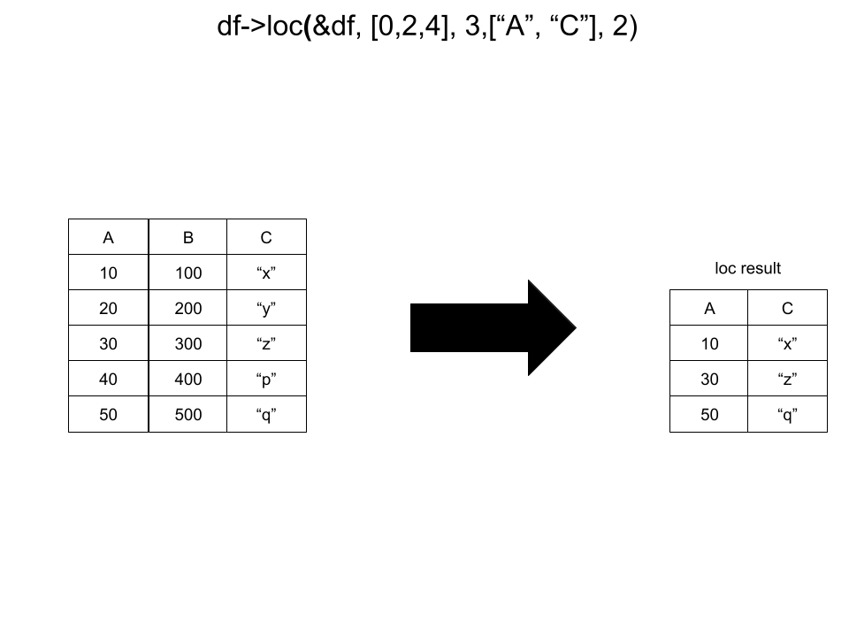
## Usage:
```c
    DataFrame df;
    DataFrame_Create(&df);

    // 3 columns => "A","B","C"
    int arrA[] = {10,20,30,40,50};
    int arrB[] = {100,200,300,400,500};
    const char* arrC[] = {"X","Y","Z","P","Q"};

    Series sA = buildIntSeries("A", arrA, 5);
    df.addSeries(&df, &sA);
    seriesFree(&sA);

    Series sB = buildIntSeries("B", arrB, 5);
    df.addSeries(&df, &sB);
    seriesFree(&sB);

    Series sC = buildStringSeries("C", arrC, 5);
    df.addSeries(&df, &sC);
    seriesFree(&sC);

    // 1) rowIndices => {0,2,4}, colNames => {"A","C"}
    {
        size_t rowIdx[] = {0,2,4};
        const char* colNames[] = {"A","C"};
        DataFrame subDF = df.loc(&df, rowIdx, 3, colNames, 2);
        assert(subDF.numColumns(&subDF)==2);
        assert(subDF.numRows(&subDF)==3);

        // col0 => "A" => row0 =>10, row1 =>30, row2 =>50
        const Series* c0 = subDF.getSeries(&subDF, 0);
        assert(strcmp(c0->name,"A")==0);
        int val=0;
        bool got = seriesGetInt(c0, 2, &val);
        assert(got && val==50);

        // col1 => "C" => row1 => "Z"
        const Series* c1 = subDF.getSeries(&subDF, 1);
        char* st=NULL;
        got = seriesGetString(c1, 1, &st);
        assert(got && strcmp(st,"Z")==0);
        free(st);

        DataFrame_Destroy(&subDF);
    }

    // 2) unknown col => skip
    {
        size_t rowIdx2[] = {0,1,2};
        const char* colNames2[] = {"A","Bogus","C"};
        DataFrame skipDF = df.loc(&df, rowIdx2, 3, colNames2, 3);
        // => col "A","C" only
        assert(skipDF.numColumns(&skipDF)==2);
        DataFrame_Destroy(&skipDF);
    }

    // 3) out-of-range row => skip
    {
        size_t rowIdx3[] = {1,9}; 
        const char* coln[] = {"B"};
        DataFrame part = df.loc(&df, rowIdx3, 2, coln, 1);
        // => only row1 is valid => 1 row
        assert(part.numColumns(&part)==1);
        assert(part.numRows(&part)==1);
        DataFrame_Destroy(&part);
    }

    DataFrame_Destroy(&df);
```


# Indexing::DataFrame iloc(const DataFrame* df, size_t rowStart, size_t rowEnd, const size_t* colIndices, size_t colCount)
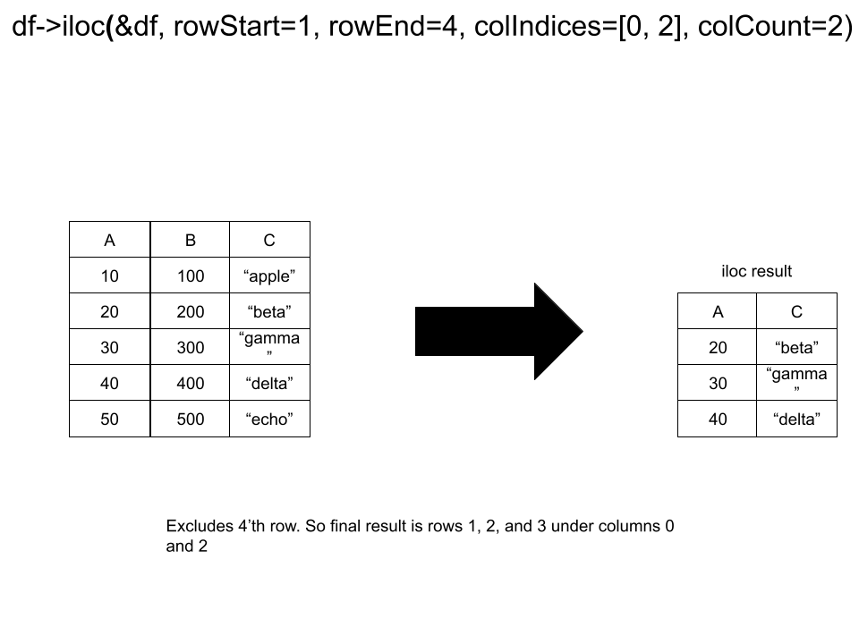
## Usage:
```c
    DataFrame df;
    DataFrame_Create(&df);

    // 3 columns => "X"(string), "Y"(int), "Z"(int)
    const char* vx[] = {"cat","dog","bird","fish","lion"};
    Series sX = buildStringSeries("X", vx, 5);
    df.addSeries(&df, &sX);
    seriesFree(&sX);

    int vy[] = {1,2,3,4,5};
    Series sY = buildIntSeries("Y", vy, 5);
    df.addSeries(&df, &sY);
    seriesFree(&sY);

    int vz[] = {10,20,30,40,50};
    Series sZ = buildIntSeries("Z", vz, 5);
    df.addSeries(&df, &sZ);
    seriesFree(&sZ);

    // 1) rows => [1..4) => row1,row2,row3 => columns => col0("X"), col2("Z")
    {
        size_t wantedCols[] = {0,2};
        DataFrame slice = df.iloc(&df, 1, 4, wantedCols, 2);
        assert(slice.numColumns(&slice)==2);
        assert(slice.numRows(&slice)==3);

        // col0 => "X", row2 => originally row3 => "fish"
        const Series* cX = slice.getSeries(&slice, 0);
        char* st=NULL;
        bool got = seriesGetString(cX, 2, &st);
        assert(got && strcmp(st,"fish")==0);
        free(st);

        // col1 => "Z", row0 => originally row1 => 20
        const Series* cZ = slice.getSeries(&slice, 1);
        int val=0;
        got = seriesGetInt(cZ, 0, &val);
        assert(got && val==20);

        DataFrame_Destroy(&slice);
    }

    // 2) rowStart >= nRows => empty
    {
        size_t wantedCols2[] = {0,1};
        DataFrame eDF = df.iloc(&df, 10, 12, wantedCols2, 2);
        assert(eDF.numColumns(&eDF)==0);
        assert(eDF.numRows(&eDF)==0);
        DataFrame_Destroy(&eDF);
    }

    // 3) colIndices out-of-range => skip
    {
        size_t bigCols[] = {1,5};
        DataFrame skipCols = df.iloc(&df, 0, 2, bigCols, 2);
        // => only col1 => "Y"
        assert(skipCols.numColumns(&skipCols)==1);
        assert(skipCols.numRows(&skipCols)==2);
        DataFrame_Destroy(&skipCols);
    }

    DataFrame_Destroy(&df);
```


# Indexing::DataFrame drop(const DataFrame* df, const char* const* colNames, size_t nameCount)
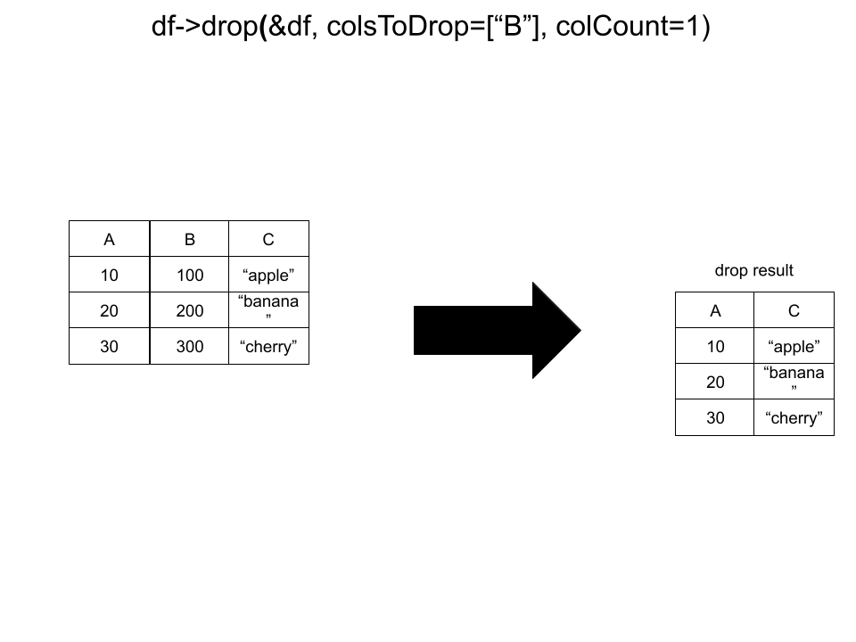
## Usage:
```c
    DataFrame df;
    DataFrame_Create(&df);

    int colA[] = {1,2,3};
    int colB[] = {10,20,30};
    const char* colC[] = {"apple","banana","cherry"};

    Series sA = buildIntSeries("A", colA, 3);
    Series sB = buildIntSeries("B", colB, 3);
    Series sC = buildStringSeries("C", colC, 3);

    df.addSeries(&df, &sA);
    df.addSeries(&df, &sB);
    df.addSeries(&df, &sC);

    seriesFree(&sA);
    seriesFree(&sB);
    seriesFree(&sC);

    // drop "B"
    {
        const char* dropNames[] = {"B"};
        DataFrame dropped = df.drop(&df, dropNames, 1);
        assert(dropped.numColumns(&dropped)==2);
        assert(dropped.numRows(&dropped)==3);

        const Series* c0 = dropped.getSeries(&dropped, 0);
        assert(strcmp(c0->name,"A")==0);
        const Series* c1 = dropped.getSeries(&dropped, 1);
        assert(strcmp(c1->name,"C")==0);

        DataFrame_Destroy(&dropped);
    }

    // drop multiple => e.g. "A","C"
    {
        const char* dropMulti[] = {"A","C"};
        DataFrame d2 = df.drop(&df, dropMulti, 2);
        // => only "B" remains
        assert(d2.numColumns(&d2)==1);
        assert(d2.numRows(&d2)==3);

        const Series* onlyCol = d2.getSeries(&d2, 0);
        assert(strcmp(onlyCol->name,"B")==0);

        DataFrame_Destroy(&d2);
    }

    DataFrame_Destroy(&df);
```


# Indexing::DataFrame pop(const DataFrame* df, const char* colName, DataFrame* poppedColDF)
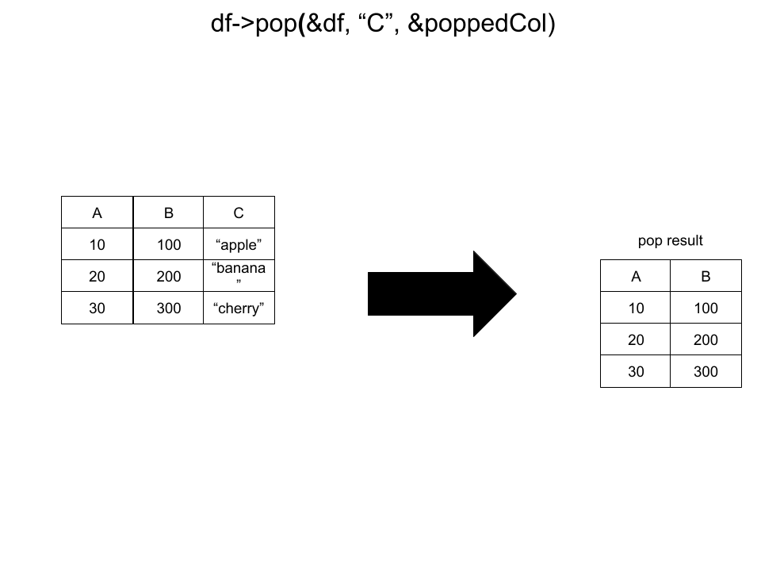
## Usage:
```c
    DataFrame df;
    DataFrame_Create(&df);

    int colA[] = {1,2,3};
    int colB[] = {10,20,30};
    const char* colC[] = {"apple","banana","cherry"};

    Series sA = buildIntSeries("A", colA, 3);
    df.addSeries(&df, &sA);
    seriesFree(&sA);

    Series sB = buildIntSeries("B", colB, 3);
    df.addSeries(&df, &sB);
    seriesFree(&sB);

    Series sC = buildStringSeries("C", colC, 3);
    df.addSeries(&df, &sC);
    seriesFree(&sC);

    // pop "B"
    {
        DataFrame poppedCol;
        DataFrame_Create(&poppedCol);

        DataFrame afterPop = df.pop(&df, "B", &poppedCol);
        // afterPop => "A","C" => 2 cols, 3 rows
        // poppedCol => "B" => 1 col, 3 rows
        assert(afterPop.numColumns(&afterPop)==2);
        assert(afterPop.numRows(&afterPop)==3);
        assert(poppedCol.numColumns(&poppedCol)==1);
        assert(poppedCol.numRows(&poppedCol)==3);

        const Series* poppedSeries = poppedCol.getSeries(&poppedCol, 0);
        assert(strcmp(poppedSeries->name,"B")==0);
        int val=0;
        bool got = seriesGetInt(poppedSeries,2,&val);
        assert(got && val==30);

        DataFrame_Destroy(&poppedCol);
        DataFrame_Destroy(&afterPop);
    }

    DataFrame_Destroy(&df);
```


# Indexing::DataFrame insert(const DataFrame* df, size_t insertPos, const Series* newCol)
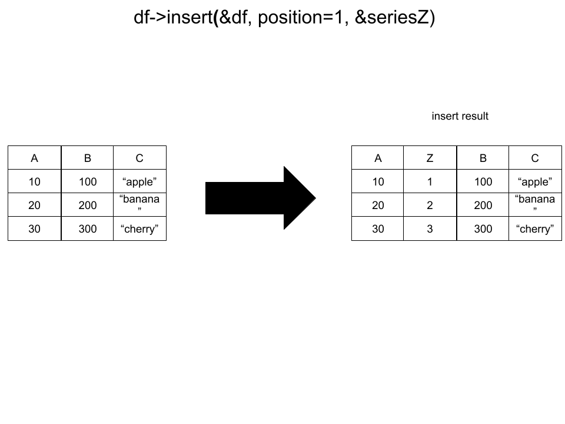
## Usage:
```c
    DataFrame df;
    DataFrame_Create(&df);

    int colA[] = {1,2,3};
    int colB[] = {10,20,30};
    Series sA = buildIntSeries("A", colA, 3);
    Series sB = buildIntSeries("B", colB, 3);

    df.addSeries(&df, &sA);
    df.addSeries(&df, &sB);

    seriesFree(&sA);
    seriesFree(&sB);

    // Insert "Z"(3 rows) at position=1
    Series sZ;
    seriesInit(&sZ, "Z", DF_INT);
    seriesAddInt(&sZ,100);
    seriesAddInt(&sZ,200);
    seriesAddInt(&sZ,300);

    DataFrame insDF = df.insert(&df,1,&sZ);
    // => columns => ["A"(0), "Z"(1), "B"(2)] => total 3 columns
    assert(insDF.numColumns(&insDF)==3);
    const Series* zCol = insDF.getSeries(&insDF, 1);
    assert(strcmp(zCol->name,"Z")==0);
    int val=0;
    bool got = seriesGetInt(zCol, 2, &val);
    assert(got && val==300);

    DataFrame_Destroy(&insDF);
    seriesFree(&sZ);

    // Insert mismatch => 2 rows vs. DF has 3 => skip
    Series sBad;
    seriesInit(&sBad,"Bad",DF_INT);
    seriesAddInt(&sBad,999);
    seriesAddInt(&sBad,111);

    DataFrame mismatch = df.insert(&df,1,&sBad);
    // => should remain 2 columns => "A","B"
    assert(mismatch.numColumns(&mismatch)==2);

    DataFrame_Destroy(&mismatch);
    seriesFree(&sBad);

    DataFrame_Destroy(&df);
```


# Indexing::DataFrame index(const DataFrame* df)

## Usage:
```c
    DataFrame df;
    DataFrame_Create(&df);

    // 2 columns => 4 rows
    int colX[] = {11,22,33,44};
    int colY[] = {100,200,300,400};
    Series sX = buildIntSeries("X", colX, 4);
    Series sY = buildIntSeries("Y", colY, 4);
    df.addSeries(&df, &sX);
    df.addSeries(&df, &sY);

    seriesFree(&sX);
    seriesFree(&sY);

    // df.index => single col => "index" => [0,1,2,3]
    DataFrame idxDF = df.index(&df);
    assert(idxDF.numColumns(&idxDF)==1);
    assert(idxDF.numRows(&idxDF)==4);

    const Series* idxS = idxDF.getSeries(&idxDF, 0);
    assert(strcmp(idxS->name,"index")==0);
    int val=0;
    bool got = seriesGetInt(idxS,3,&val);
    assert(got && val==3);

    DataFrame_Destroy(&idxDF);
    DataFrame_Destroy(&df);
```


# Indexing::DataFrame cols(const DataFrame* df)
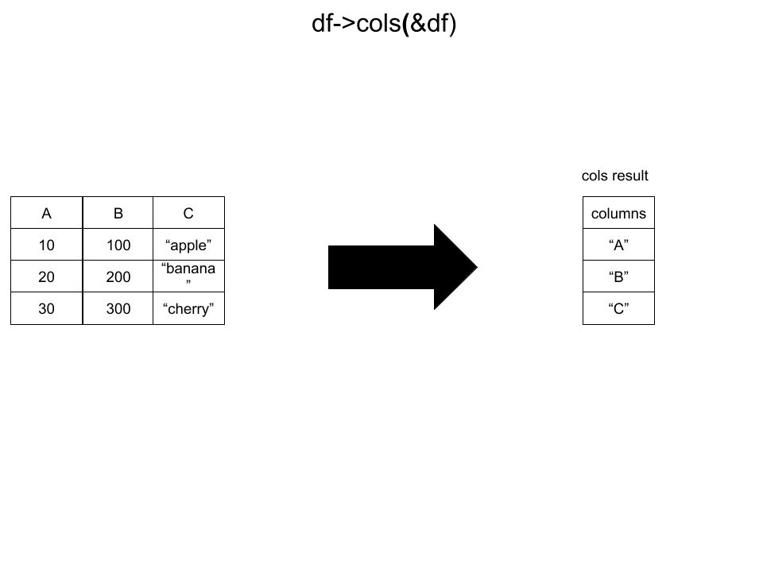
## Usage:
```c
    DataFrame df;
    DataFrame_Create(&df);

    // 3 columns => "One","Two","Three"
    int col1[] = {10,20};
    Series s1 = buildIntSeries("One", col1, 2);
    df.addSeries(&df, &s1);
    seriesFree(&s1);

    int col2[] = {100,200};
    Series s2 = buildIntSeries("Two", col2, 2);
    df.addSeries(&df, &s2);
    seriesFree(&s2);

    const char* arr3[] = {"Hello","World"};
    Series s3 = buildStringSeries("Three", arr3, 2);
    df.addSeries(&df,&s3);
    seriesFree(&s3);

    // df.columns => single col => "columns" => rows => "One","Two","Three"
    DataFrame colsDF = df.cols(&df);
    assert(colsDF.numColumns(&colsDF)==1);
    assert(colsDF.numRows(&colsDF)==3);

    const Series* colSer = colsDF.getSeries(&colsDF, 0);
    assert(strcmp(colSer->name,"columns")==0);

    char* st=NULL;
    // row0 => "One", row1=>"Two", row2=>"Three"
    bool got = seriesGetString(colSer, 2, &st);
    assert(got && strcmp(st,"Three")==0);
    free(st);

    DataFrame_Destroy(&colsDF);
    DataFrame_Destroy(&df);
```


# Indexing::DataFrame setValue(const DataFrame* df, size_t rowIndex, size_t colIndex, const void* newValue)

## Usage:
```c
    DataFrame df;
    DataFrame_Create(&df);

    int colA[] = {10,20,30};
    Series sA = buildIntSeries("A", colA, 3);
    df.addSeries(&df, &sA);
    seriesFree(&sA);

    // set cell => row=1,col=0 => from 20 => let's set it to 999
    int newVal = 999;
    DataFrame updated = df.setValue(&df, 1, 0, &newVal);
    // check if updated => col0 => row1 => 999
    const Series* updCol = updated.getSeries(&updated, 0);
    int val=0;
    bool got = seriesGetInt(updCol, 1, &val);
    assert(got && val==999);

    // check row0 => remains 10
    seriesGetInt(updCol, 0, &val);
    assert(val==10);

    DataFrame_Destroy(&updated);
    DataFrame_Destroy(&df);

```


# Indexing::DataFrame setRow(const DataFrame* df, size_t rowIndex, const void** rowValues, size_t valueCount)
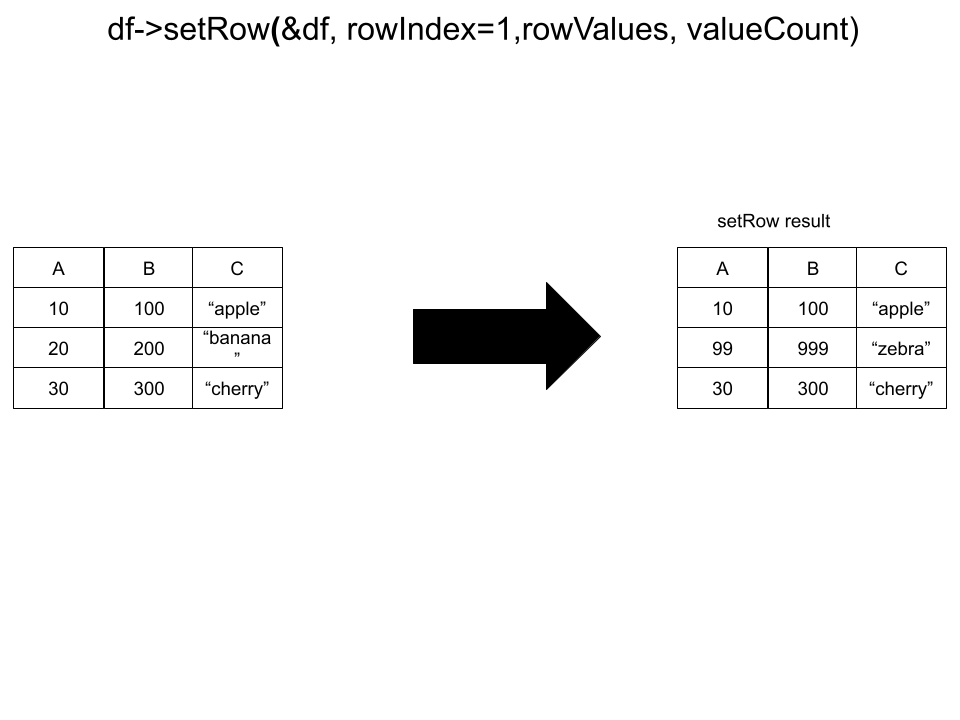
## Usage:
```c
    DataFrame df;
    DataFrame_Create(&df);

    int colA[] = {1,2,3,4};
    int colB[] = {10,20,30,40};
    Series sA = buildIntSeries("A", colA, 4);
    Series sB = buildIntSeries("B", colB, 4);
    df.addSeries(&df, &sA);
    df.addSeries(&df, &sB);

    seriesFree(&sA);
    seriesFree(&sB);

    // We'll set row=2 => new values => for 2 columns => {777,888}
    int newValA = 777;
    int newValB = 888;
    const void* rowVals[2];
    rowVals[0] = &newValA; // for col0 => "A"
    rowVals[1] = &newValB; // for col1 => "B"

    DataFrame updated = df.setRow(&df, 2, rowVals, 2);
    // check => row2 => col"A"=777, col"B"=888
    {
        const Series* cA = updated.getSeries(&updated, 0);
        const Series* cB = updated.getSeries(&updated, 1);
        int vA=0, vB=0;
        bool gotA = seriesGetInt(cA, 2, &vA);
        bool gotB = seriesGetInt(cB, 2, &vB);
        assert(gotA && gotB);
        assert(vA==777);
        assert(vB==888);
    }
    // check row1 => still 2,20
    {
        const Series* cA = updated.getSeries(&updated, 0);
        int valA=0;
        seriesGetInt(cA,1,&valA);
        assert(valA==2);
    }

    DataFrame_Destroy(&updated);
    DataFrame_Destroy(&df);

```


# Indexing::DataFrame setColumn(const DataFrame* df, const char* colName, const Series* newCol)

## Usage:
```c
    DataFrame df;
    DataFrame_Create(&df);

    int cX[] = {11,22,33};
    Series sX = buildIntSeries("X", cX, 3);
    int cY[] = {100,200,300};
    Series sY = buildIntSeries("Y", cY, 3);

    df.addSeries(&df, &sX);
    df.addSeries(&df, &sY);

    seriesFree(&sX);
    seriesFree(&sY);

    // We'll build a new column "NewY" with values => 999,999,999 => but same rowcount
    int newVals[] = {999,999,999};
    Series sNew;
    seriesInit(&sNew, "NewY", DF_INT);
    for (int i=0;i<3;i++){
        seriesAddInt(&sNew, newVals[i]);
    }

    // setColumn => oldName="Y" => newCol => sNew
    DataFrame updated = df.setColumn(&df, "Y", &sNew);
    // check => col0 => "X" unchanged => row0 => 11, col1 => "Y" data => now [999,999,999], but name => "NewY"? 
    // Actually we keep the new name => "NewY" or you can keep old name. Up to your implementation.
    // We'll assume we replaced with exactly newCol => name => "NewY".
    const Series* c0 = updated.getSeries(&updated, 0);
    const Series* c1 = updated.getSeries(&updated, 1);
    assert(strcmp(c0->name,"X")==0);
    assert(strcmp(c1->name,"NewY")==0);

    int val=0;
    bool got = seriesGetInt(c1,2,&val);
    assert(got && val==999);

    DataFrame_Destroy(&updated);
    seriesFree(&sNew);
    DataFrame_Destroy(&df);
```


# Indexing::DataFrame renameColumn(const DataFrame* df, const char* oldName, const char* newName)
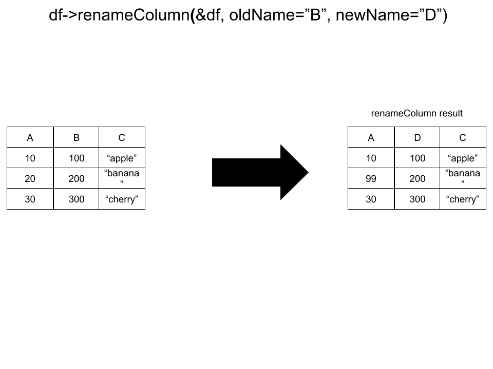
## Usage:
```c
    DataFrame df;
    DataFrame_Create(&df);

    int colA[] = {1,2,3};
    Series sA = buildIntSeries("A", colA, 3);
    df.addSeries(&df,&sA);
    seriesFree(&sA);

    int colB[] = {10,20,30};
    Series sB = buildIntSeries("B", colB, 3);
    df.addSeries(&df,&sB);
    seriesFree(&sB);

    // rename "A" => "Alpha"
    DataFrame renamed = df.renameColumn(&df, "A","Alpha");
    // check => col0 => name="Alpha", col1 => name="B"
    const Series* c0 = renamed.getSeries(&renamed, 0);
    const Series* c1 = renamed.getSeries(&renamed, 1);
    assert(strcmp(c0->name,"Alpha")==0);
    assert(strcmp(c1->name,"B")==0);

    // rename non-existing => "Bogus" => "Nope" => skip
    DataFrame skip = df.renameColumn(&df, "Bogus","Nope");
    // col0 => "A", col1=>"B"
    const Series* sc0 = skip.getSeries(&skip, 0);
    assert(strcmp(sc0->name,"A")==0);

    DataFrame_Destroy(&renamed);
    DataFrame_Destroy(&skip);
    DataFrame_Destroy(&df);
```


# Indexing::DataFrame reindex(const DataFrame* df, const size_t* newIndices, size_t newN)
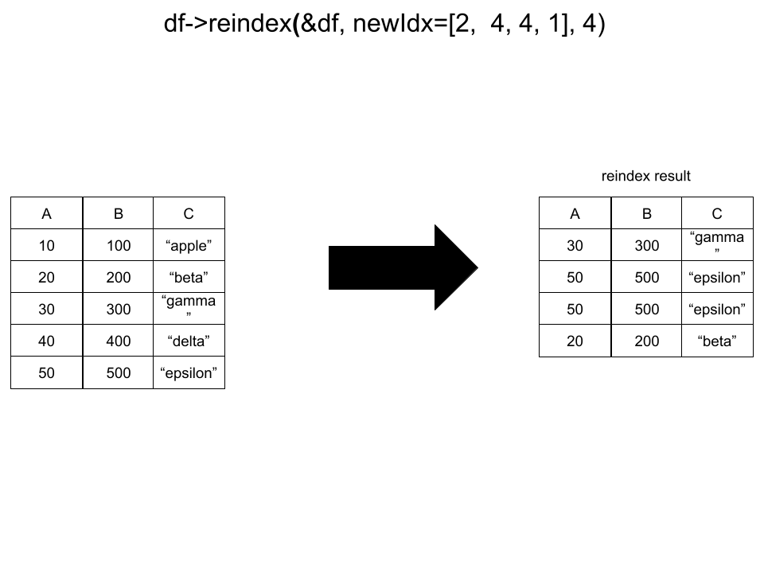
## Usage:
```c
    DataFrame df;
    DataFrame_Create(&df);

    int arr1[] = {10,20,30,40};
    Series s1 = buildIntSeries("One", arr1, 4);
    df.addSeries(&df,&s1);
    seriesFree(&s1);

    // reindex => e.g. newIndices => {0,2,5}, size=3 => row0=>0, row1=>2, row2=>5 => out-of-range => NA
    size_t newIdx[] = {0,2,5};
    DataFrame rdx = df.reindex(&df, newIdx, 3);

    // col0 => "One", row0 => 10, row1 =>30, row2 => NA(0?)
    const Series* col0 = rdx.getSeries(&rdx, 0);
    int val=0;
    bool got = seriesGetInt(col0, 1, &val);
    assert(got && val==30);
    got = seriesGetInt(col0, 2, &val);
    // row2 => old row5 => out-of-range => NA => 0 if int
    assert(got && val==0);

    DataFrame_Destroy(&rdx);
    DataFrame_Destroy(&df);
```


# Indexing::DataFrame take(const DataFrame* df, const size_t* rowIndices, size_t count)
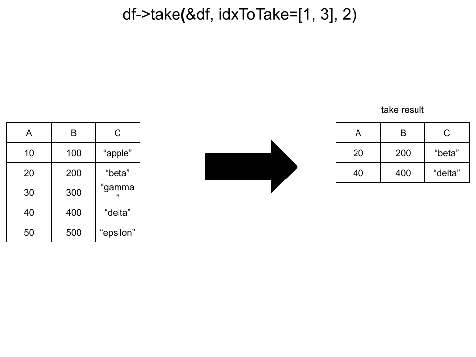
## Usage:
```c
    DataFrame df;
    DataFrame_Create(&df);

    int arrA[] = {10,20,30};
    Series sA = buildIntSeries("A", arrA, 3);
    df.addSeries(&df,&sA);
    seriesFree(&sA);

    // e.g. take => {2,2,0} => duplicates => row2, row2, row0
    size_t tIdx[] = {2,2,0};
    DataFrame took = df.take(&df, tIdx, 3);
    // => 1 column => "A", 3 rows => row0 => old row2 => 30, row1 => old row2 => 30, row2 => old row0 => 10
    assert(took.numColumns(&took)==1);
    assert(took.numRows(&took)==3);

    const Series* col = took.getSeries(&took,0);
    int val=0;
    bool got = seriesGetInt(col,0,&val);
    assert(got && val==30);
    seriesGetInt(col,2,&val);
    assert(val==10);

    DataFrame_Destroy(&took);
    DataFrame_Destroy(&df);
```


# Indexing::DataFrame reorderColumns(const DataFrame* df, const size_t* newOrder, size_t colCount)
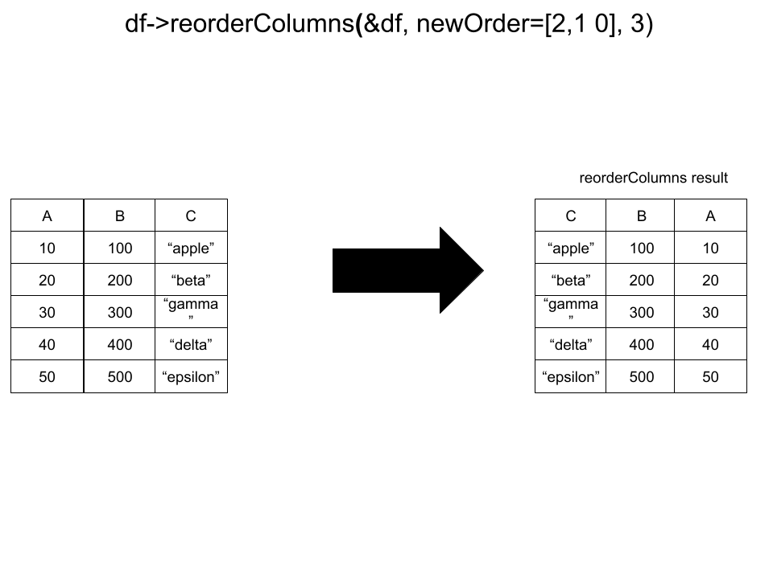
## Usage:
```c
    DataFrame df;
    DataFrame_Create(&df);

    int colA[] = {1,2,3};
    int colB[] = {4,5,6};
    int colC[] = {7,8,9};
    Series sA = buildIntSeries("A", colA, 3);
    Series sB = buildIntSeries("B", colB, 3);
    Series sC = buildIntSeries("C", colC, 3);

    df.addSeries(&df,&sA);
    df.addSeries(&df,&sB);
    df.addSeries(&df,&sC);

    seriesFree(&sA);
    seriesFree(&sB);
    seriesFree(&sC);

    // reorder => e.g. newOrder => {2,0,1} => means col2->A, col0->B, col1->C
    size_t newOrd[] = {2,0,1};
    DataFrame reordered = df.reorderColumns(&df, newOrd, 3);
    // => columns => 3 => col0 => old2 => "C", col1 => old0 => "A", col2 => old1 => "B"

    const Series* c0 = reordered.getSeries(&reordered,0);
    const Series* c1 = reordered.getSeries(&reordered,1);
    const Series* c2 = reordered.getSeries(&reordered,2);
    assert(strcmp(c0->name,"C")==0);
    assert(strcmp(c1->name,"A")==0);
    assert(strcmp(c2->name,"B")==0);

    // check row2 => c0 => old row2 => colC => 9
    int val=0;
    bool got = seriesGetInt(c0,2,&val);
    assert(got && val==9);

    DataFrame_Destroy(&reordered);
    DataFrame_Destroy(&df);
```

# Querying
# Querying::DataFrame head(const DataFrame* df, size_t n)

## Usage:
```c
    // Create a DataFrame with 1 column & 6 rows for demonstration
    DataFrame df;
    DataFrame_Create(&df);

    int col1[] = {10,20,30,40,50,60};
    Series s1 = buildIntSeries("Nums", col1, 6);
    bool ok = df.addSeries(&df, &s1);
    assert(ok);
    seriesFree(&s1);

    // HEAD(3) => expect 3 rows
    DataFrame headDF = df.head(&df, 3);
    assert(headDF.numColumns(&headDF) == 1);
    assert(headDF.numRows(&headDF) == 3);

    // Spot check values
    const Series* s = headDF.getSeries(&headDF, 0);
    int val=0;
    bool got = seriesGetInt(s, 0, &val);
    assert(got && val==10);
    got = seriesGetInt(s, 2, &val);
    assert(got && val==30);

    DataFrame_Destroy(&headDF);
    DataFrame_Destroy(&df);
```

# Querying::DataFrame tail(const DataFrame* df, size_t n)

## Usage:
```c
    DataFrame df;
    DataFrame_Create(&df);

    int col1[] = {100,200,300,400,500};
    Series s1 = buildIntSeries("Data", col1, 5);
    bool ok = df.addSeries(&df, &s1);
    assert(ok);
    seriesFree(&s1);

    // TAIL(2) => last 2 rows => [400, 500]
    DataFrame tailDF = df.tail(&df, 2);
    assert(tailDF.numColumns(&tailDF) == 1);
    assert(tailDF.numRows(&tailDF) == 2);

    const Series* s = tailDF.getSeries(&tailDF, 0);
    int val=0;
    // row0 => 400, row1 => 500
    bool got = seriesGetInt(s, 0, &val);
    assert(got && val==400);
    seriesGetInt(s, 1, &val);
    assert(val==500);

    DataFrame_Destroy(&tailDF);
    DataFrame_Destroy(&df);
```


# Querying::DataFrame describe(const DataFrame* df)

## Usage:
```c
    DataFrame df;
    DataFrame_Create(&df);

    // We'll add 2 numeric columns
    int col1[] = {10,20,30,40};
    Series s1 = buildIntSeries("C1", col1, 4);
    df.addSeries(&df, &s1);
    seriesFree(&s1);

    int col2[] = {5,5,10,20};
    Series s2 = buildIntSeries("C2", col2, 4);
    df.addSeries(&df, &s2);
    seriesFree(&s2);

    // describe => should produce 2 rows (one per col), each with 5 columns: 
    // colName, count, min, max, mean
    DataFrame descDF = df.describe(&df);
    // expect 2 rows, 5 columns
    assert(descDF.numRows(&descDF)==2);
    assert(descDF.numColumns(&descDF)==5);

    DataFrame_Destroy(&descDF);
    DataFrame_Destroy(&df);
```


# Querying::DataFrame slice(const DataFrame* df, size_t start, size_t end)

## Usage:
```c
    DataFrame df;
    DataFrame_Create(&df);

    // Single column => 6 values => 0..5
    int arr[] = {0,1,2,3,4,5};
    Series s = buildIntSeries("Vals", arr, 6);
    df.addSeries(&df, &s);
    seriesFree(&s);

    // SLICE(2..5) => rows 2,3,4 => total 3
    DataFrame sliceDF = df.slice(&df, 2, 5);
    assert(sliceDF.numRows(&sliceDF)==3);
    {
        const Series* c = sliceDF.getSeries(&sliceDF, 0);
        int val;
        seriesGetInt(c, 0, &val); // originally row2 => 2
        assert(val==2);
        seriesGetInt(c, 2, &val); // originally row4 => 4
        assert(val==4);
    }

    DataFrame_Destroy(&sliceDF);
    DataFrame_Destroy(&df);
```

# Querying::DataFrame sample(const DataFrame* df, size_t count)

## Usage:
```c
    DataFrame df;
    DataFrame_Create(&df);

    int arr[] = {10,11,12,13,14,15};
    Series s = buildIntSeries("Rand", arr, 6);
    df.addSeries(&df, &s);
    seriesFree(&s);

    // sample(3) => random subset of 3
    DataFrame samp = df.sample(&df, 3);
    assert(samp.numRows(&samp)==3);
    assert(samp.numColumns(&samp)==1);

    DataFrame_Destroy(&samp);
    DataFrame_Destroy(&df);
```


# Querying::DataFrame selectColumns(const DataFrame* df, const size_t* colIndices, size_t count)

## Usage:
```c
    DataFrame df;
    DataFrame_Create(&df);

    // We'll have 3 columns, want to select the second & third
    int colA[] = {1,2,3};
    int colB[] = {10,20,30};
    const char* colC[] = {"X","Y","Z"};

    Series sA = buildIntSeries("A", colA, 3);
    Series sB = buildIntSeries("B", colB, 3);
    Series sC = buildStringSeries("C", colC, 3);

    df.addSeries(&df, &sA);
    df.addSeries(&df, &sB);
    df.addSeries(&df, &sC);

    seriesFree(&sA);
    seriesFree(&sB);
    seriesFree(&sC);

    // We want to select columns #1 and #2 => "B","C"
    size_t indices[] = {1,2};
    DataFrame sel = df.selectColumns(&df, indices, 2);
    assert(sel.numColumns(&sel)==2);
    assert(sel.numRows(&sel)==3);

    // check col0 => "B"
    const Series* s0 = sel.getSeries(&sel, 0);
    assert(strcmp(s0->name,"B")==0);

    DataFrame_Destroy(&sel);
    DataFrame_Destroy(&df);
```

# Querying::DataFrame dropColumns(const DataFrame* df, const size_t* dropIndices, size_t dropCount)

## Usage:
```c
    DataFrame df;
    DataFrame_Create(&df);

    // 3 columns => "A","B","C"
    int colA[] = {5,6,7};
    int colB[] = {10,20,30};
    int colC[] = {1,2,3};

    Series sA = buildIntSeries("A", colA, 3);
    Series sB = buildIntSeries("B", colB, 3);
    Series sC;
    seriesInit(&sC, "C", DF_INT);
    for (int i=0; i<3; i++){
        seriesAddInt(&sC, colC[i]);
    }

    df.addSeries(&df, &sA);
    df.addSeries(&df, &sB);
    df.addSeries(&df, &sC);

    seriesFree(&sA);
    seriesFree(&sB);
    seriesFree(&sC);

    // drop columns #1 => that is "B"
    size_t dropIdx[] = {1};
    DataFrame dropped = df.dropColumns(&df, dropIdx, 1);
    // we keep "A","C"
    assert(dropped.numColumns(&dropped)==2);
    assert(dropped.numRows(&dropped)==3);

    // check first col => "A"
    const Series* c0 = dropped.getSeries(&dropped, 0);
    assert(strcmp(c0->name, "A")==0);

    DataFrame_Destroy(&dropped);
    DataFrame_Destroy(&df);
```

# Querying::DataFrame renameColumns(const DataFrame* df, const char** oldNames, const char** newNames, size_t count)

## Usage:
```c
    DataFrame df;
    DataFrame_Create(&df);

    int arr[] = {9,8,7};
    Series s = buildIntSeries("OldName", arr, 3);
    df.addSeries(&df, &s);
    seriesFree(&s);

    // rename OldName => NewName
    const char* oldN[] = {"OldName"};
    const char* newN[] = {"NewName"};
    DataFrame ren = df.renameColumns(&df, oldN, newN, 1);

    // check col0 => "NewName"
    const Series* c0 = ren.getSeries(&ren, 0);
    assert(strcmp(c0->name,"NewName")==0);

    DataFrame_Destroy(&ren);
    DataFrame_Destroy(&df);
```


# Querying::DataFrame filter(const DataFrame* df, RowPredicate predicate)

## Usage:
```c
    DataFrame df;
    DataFrame_Create(&df);

    int arr[] = {10,20,50,60};
    Series sCol = buildIntSeries("Col", arr, 4);
    df.addSeries(&df, &sCol);
    seriesFree(&sCol);

    DataFrame filtered = df.filter(&df, filterPredicateExample);
    // keep rows where col<50 => that is row0=10, row1=20 => total 2
    assert(filtered.numRows(&filtered)==2);

    DataFrame_Destroy(&filtered);
    DataFrame_Destroy(&df);
```

# Querying::DataFrame dropNA(const DataFrame* df)

## Usage:
```c
    DataFrame df;
    DataFrame_Create(&df);

    // 1 column => [0,10,0,20]
    int arr[] = {0,10,0,20};
    Series s = buildIntSeries("Values", arr, 4);
    df.addSeries(&df, &s);
    seriesFree(&s);

    // dropNA => remove row if col=0
    // => we keep row1=10, row3=20 => total 2
    DataFrame noNA = df.dropNA(&df);
    assert(noNA.numRows(&noNA)==2);

    DataFrame_Destroy(&noNA);
    DataFrame_Destroy(&df);
```

# Querying::DataFrame sort(const DataFrame* df, size_t columnIndex, bool ascending)

## Usage:
```c
    DataFrame df;
    DataFrame_Create(&df);

    int arr[] = {30,10,20};
    Series s = buildIntSeries("Data", arr, 3);
    df.addSeries(&df, &s);
    seriesFree(&s);

    // sort ascending => [10,20,30]
    DataFrame asc = df.sort(&df, 0, true);
    {
        const Series* c0 = asc.getSeries(&asc, 0);
        int val;
        seriesGetInt(c0, 0, &val); assert(val==10);
        seriesGetInt(c0, 2, &val); assert(val==30);
    }
    DataFrame_Destroy(&asc);

    // sort descending => [30,20,10]
    DataFrame desc = df.sort(&df, 0, false);
    {
        const Series* c0 = desc.getSeries(&desc, 0);
        int val;
        seriesGetInt(c0, 0, &val); assert(val==30);
        seriesGetInt(c0, 2, &val); assert(val==10);
    }
    DataFrame_Destroy(&desc);

    DataFrame_Destroy(&df);
```

# Querying::DataFrame dropDuplicates(const DataFrame* df, const size_t* subsetCols, size_t subsetCount)

## Usage:
```c
    DataFrame df;
    DataFrame_Create(&df);

    const char* arr[] = {"Apple","Apple","Banana","Apple"};
    Series s = buildStringSeries("Fruits", arr, 4);
    df.addSeries(&df, &s);
    seriesFree(&s);

    // dropDuplicates => keep first occurrence => Apple, Banana
    DataFrame dd = df.dropDuplicates(&df, NULL, 0); // entire row
    assert(dd.numRows(&dd)==2);
    DataFrame_Destroy(&dd);

    DataFrame_Destroy(&df);
```

# Querying::DataFrame unique(const DataFrame* df, size_t colIndex)

## Usage:
```c
    DataFrame df;
    DataFrame_Create(&df);

    // 1 col => repeated strings
    const char* arr[] = {"A","A","B","C","C","C"};
    Series s = buildStringSeries("Letters", arr, 6);
    df.addSeries(&df, &s);
    seriesFree(&s);

    DataFrame un = df.unique(&df, 0);
    // distinct => "A","B","C"
    assert(un.numRows(&un)==3);
    DataFrame_Destroy(&un);

    DataFrame_Destroy(&df);
```
# Querying::DataFrame transpose(const DataFrame* df)

## Usage:
```c
    DataFrame df;
    DataFrame_Create(&df);

    // 2 columns => "X"(int), "Y"(string), each 2 rows
    int colX[] = {1,2};
    const char* colY[] = {"Alpha","Beta"};

    Series sX = buildIntSeries("X", colX, 2);
    Series sY = buildStringSeries("Y", colY, 2);

    df.addSeries(&df, &sX);
    df.addSeries(&df, &sY);

    seriesFree(&sX);
    seriesFree(&sY);

    DataFrame t = df.transpose(&df);
    // now we get 2 original rows => so 2 columns in new DF. 
    // each col has 2 strings (since we do a textual transpose).

    assert(t.numColumns(&t)==2);
    // spot check row count => 2
    assert(t.numRows(&t)==2);

    DataFrame_Destroy(&t);
    DataFrame_Destroy(&df);
```

# Querying::size_t indexOf(const DataFrame* df, size_t colIndex, double value)

## Usage:
```c
    DataFrame df;
    DataFrame_Create(&df);

    int arr[] = {10,20,30,20};
    Series s = buildIntSeries("Vals", arr, 4);
    df.addSeries(&df, &s);
    seriesFree(&s);

    // indexOf => find first row where col=20 => row1
    size_t idx = df.indexOf(&df, 0, 20.0);
    assert(idx==1);

    // not found => -1
    size_t idx2 = df.indexOf(&df, 0, 999.0);
    assert(idx2 == (size_t)-1);

    DataFrame_Destroy(&df);
```

# Querying::DataFrame apply(const DataFrame* df, RowFunction func)

## Usage:
```c
    DataFrame df;
    DataFrame_Create(&df);

    int arr[] = {1,2,3};
    Series s = buildIntSeries("Base", arr, 3);
    df.addSeries(&df, &s);
    seriesFree(&s);

    DataFrame result = df.apply(&df, rowFunc);
    // => col0 => [1+5, 2+5, 3+5] => [6,7,8]
    assert(result.numRows(&result)==3);
    const Series* c0 = result.getSeries(&result, 0);
    int val;
    seriesGetInt(c0, 2, &val);
    assert(val==8);

    DataFrame_Destroy(&result);
    DataFrame_Destroy(&df);
```


# Querying::DataFrame where(const DataFrame* df, RowPredicate predicate, double defaultVal)

## Usage:
```c
    DataFrame df;
    DataFrame_Create(&df);

    int arr[] = {10,20,50};
    Series s = buildIntSeries("Vals", arr, 3);
    df.addSeries(&df, &s);
    seriesFree(&s);

    // where => if predicate fails => set default=999
    // row0=10 => keep 10, row1=20 => keep 20, row2=50 => 999
    DataFrame wh = df.where(&df, wherePred, 999.0);
    assert(wh.numRows(&wh)==3);
    {
        const Series* c0 = wh.getSeries(&wh, 0);
        int val;
        seriesGetInt(c0, 2, &val);
        assert(val==999);
    }
    DataFrame_Destroy(&wh);
    DataFrame_Destroy(&df);
```

# Querying::DataFrame explode(const DataFrame* df, size_t colIndex)

## Usage:
```c
    DataFrame df;
    DataFrame_Create(&df);

    // "List" => string, "Code" => int
    Series sList, sCode;
    seriesInit(&sList, "List", DF_STRING);
    seriesInit(&sCode, "Code", DF_INT);

    seriesAddString(&sList, "A,B");
    seriesAddInt(&sCode, 100);

    seriesAddString(&sList, "X");
    seriesAddInt(&sCode, 200);

    df.addSeries(&df, &sList);
    df.addSeries(&df, &sCode);

    seriesFree(&sList);
    seriesFree(&sCode);

    // explode col0 => "List"
    DataFrame ex = df.explode(&df, 0);
    // row0 => "A", code=100
    // row1 => "B", code=100
    // row2 => "X", code=200
    assert(ex.numRows(&ex)==3);
    {
        const Series* cList = ex.getSeries(&ex, 0);
        char* st=NULL;
        seriesGetString(cList, 1, &st);
        assert(strcmp(st,"B")==0);
        free(st);
    }

    DataFrame_Destroy(&ex);
    DataFrame_Destroy(&df);
```
