# DataFrame::Core


# Core::void Dataframe_Create(DataFrame* df)
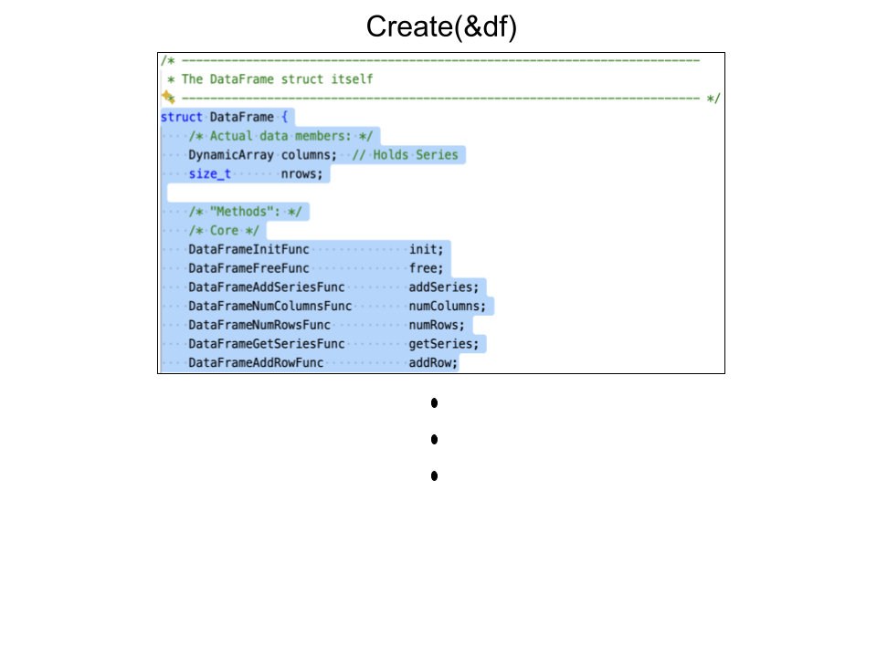

## Usage:
```c
    DataFrame df;
    DataFrame_Create(&df);
```


# Core::bool df.addSeries(DataFrame* df, const Series* s)

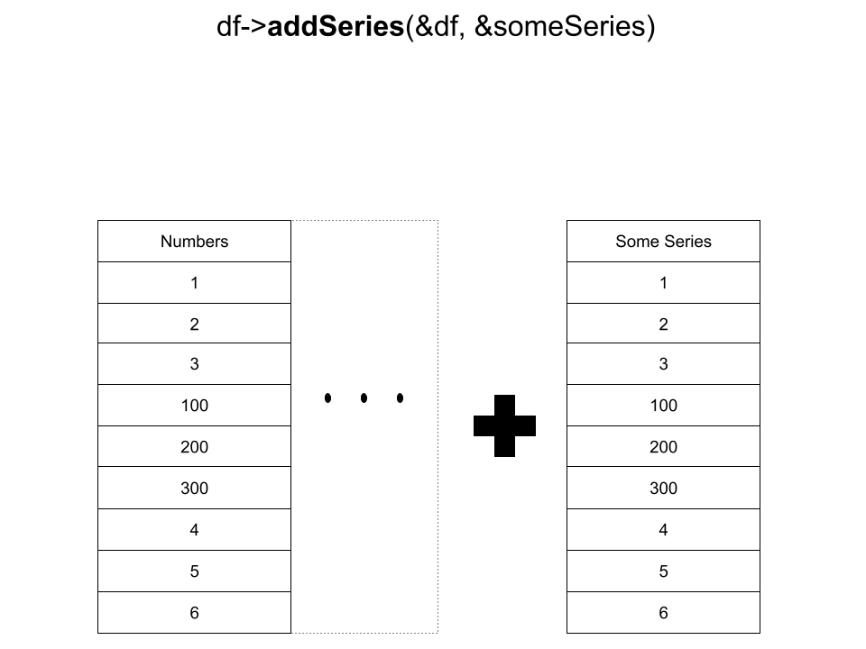
## Usage:
```c
    DataFrame df;
    DataFrame_Create(&df);

    // 1) Build some sample data
    int intVals[] = { 10, 20, 30, 40 };
    double doubleVals[] = { 1.5, 2.5, 3.25, 4.75 };
    const char* stringVals[] = { "apple", "banana", "cherry", "date" };
    long long datetimeVals[] = { 1677612345LL, 1677612400LL, 1677612500LL, 1677613000LL }; 
    // E.g., some arbitrary epoch seconds

    Series sInt = buildIntSeries("IntCol", intVals, 4);
    Series sDouble = buildDoubleSeries("DoubleCol", doubleVals, 4);
    Series sString = buildStringSeries("StrCol", stringVals, 4);
    Series sDatetime = buildDatetimeSeries("TimeCol", datetimeVals, 4);

    bool ok = df.addSeries(&df, &sInt);
    ok = df.addSeries(&df, &sDouble);
    ok = df.addSeries(&df, &sString);
    ok = df.addSeries(&df, &sDatetime);

    // We can free the local series copies now
    seriesFree(&sInt);
    seriesFree(&sDouble);
    seriesFree(&sString);
    seriesFree(&sDatetime);
```


# Core::const Series* df.getSeries(const DataFrame* df, size_t colIndex)
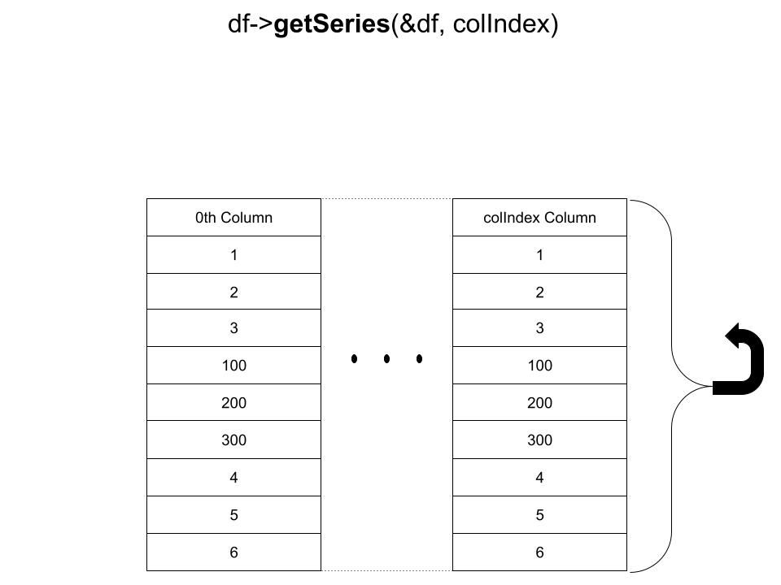

## Usage:
```c
    DataFrame df;
    DataFrame_Create(&df);

    // 1) Build some sample data
    int intVals[] = { 10, 20, 30, 40 };

    Series sInt = buildIntSeries("IntCol", intVals, 4);

    bool ok = df.addSeries(&df, &sInt);

    // We can free the local series copies now
    seriesFree(&sInt);

    const Series* col1 = df.getSeries(&df, 0);

```

# Core::size_t df.numColumns(const DataFrame* df)
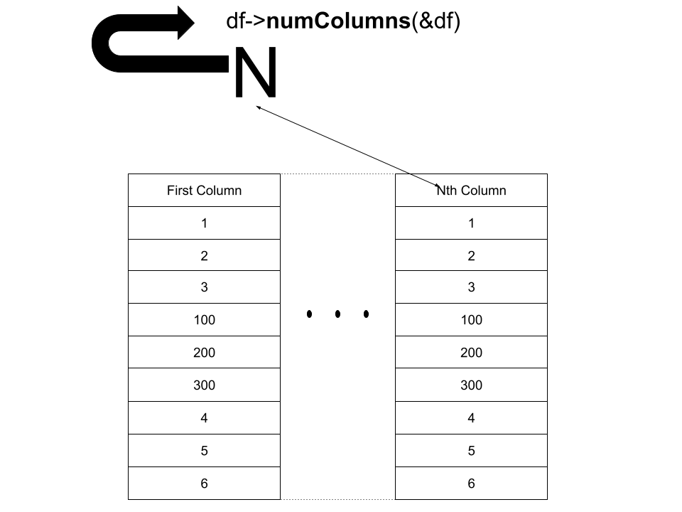

## Usage:
```c
    DataFrame df;
    DataFrame_Create(&df);

    // 1) Build some sample data
    int intVals[] = { 10, 20, 30, 40 };

    Series sInt = buildIntSeries("IntCol", intVals, 4);

    bool ok = df.addSeries(&df, &sInt);

    seriesFree(&sInt);

    assert(df.numColumns(&df) == 1);

```

# Core::bool df.addRow(DataFrame* df, const void** rowData)
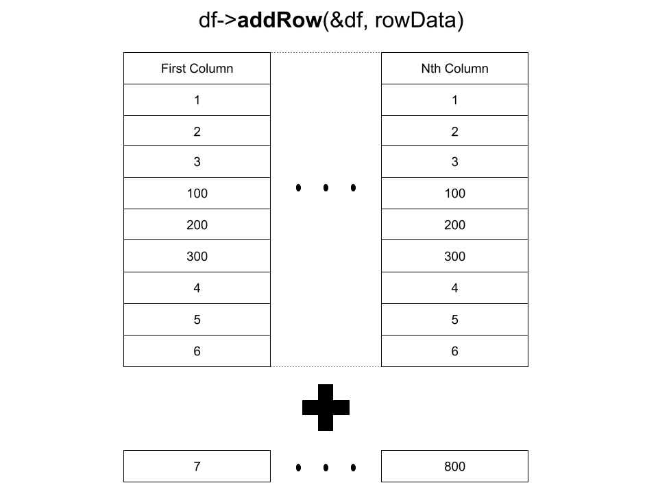

## Usage:
```c
    DataFrame df;
    DataFrame_Create(&df);

    // 1) Build some sample data
    int intVals[] = { 10, 20, 30, 40 };

    Series sInt = buildIntSeries("IntCol", intVals, 4);

    bool ok = df.addSeries(&df, &sInt);

    seriesFree(&sInt);

    int newValA = 50;
    const void* rowData[] = { &newValA };

    ok = df.addRow(&df, rowData);

```

# Core::bool df.getRow(DataFrame* df, size_t rowIndex, void** outRow)
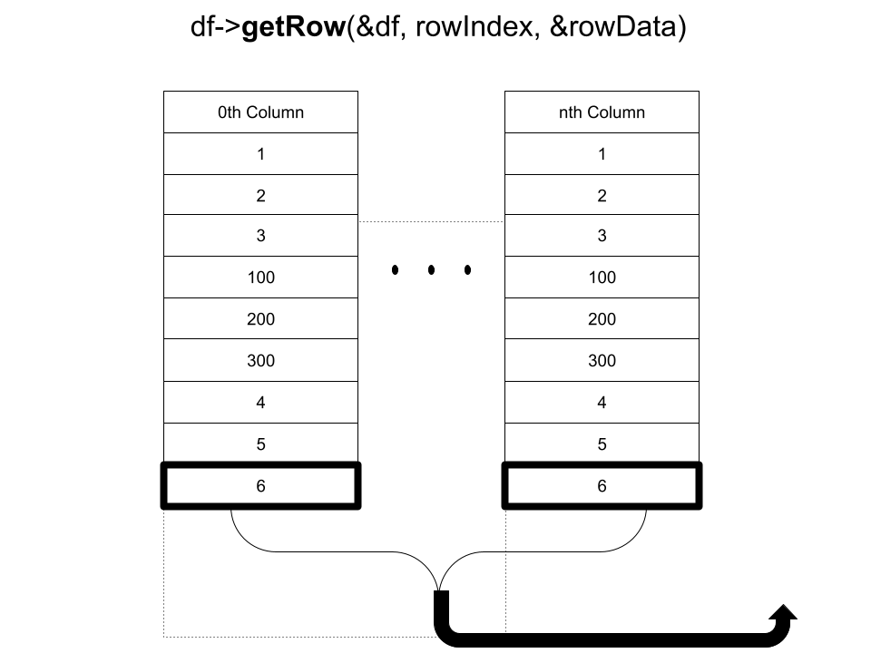
## Usage:
```c
    DataFrame df;
    DataFrame_Create(&df);

    // 1) Build some sample data
    int intVals[] = { 10, 20, 30, 40 };

    Series sInt = buildIntSeries("IntCol", intVals, 4);

    bool ok = df.addSeries(&df, &sInt);

    seriesFree(&sInt);

    void** rowData = NULL;
    ok = df.getRow(&df, 2, &rowData);
    int* pInt = (int*)rowData[0];
    assert(pInt && *pInt==30);

```

# Core::size_t df.numRows(const DataFrame *df)
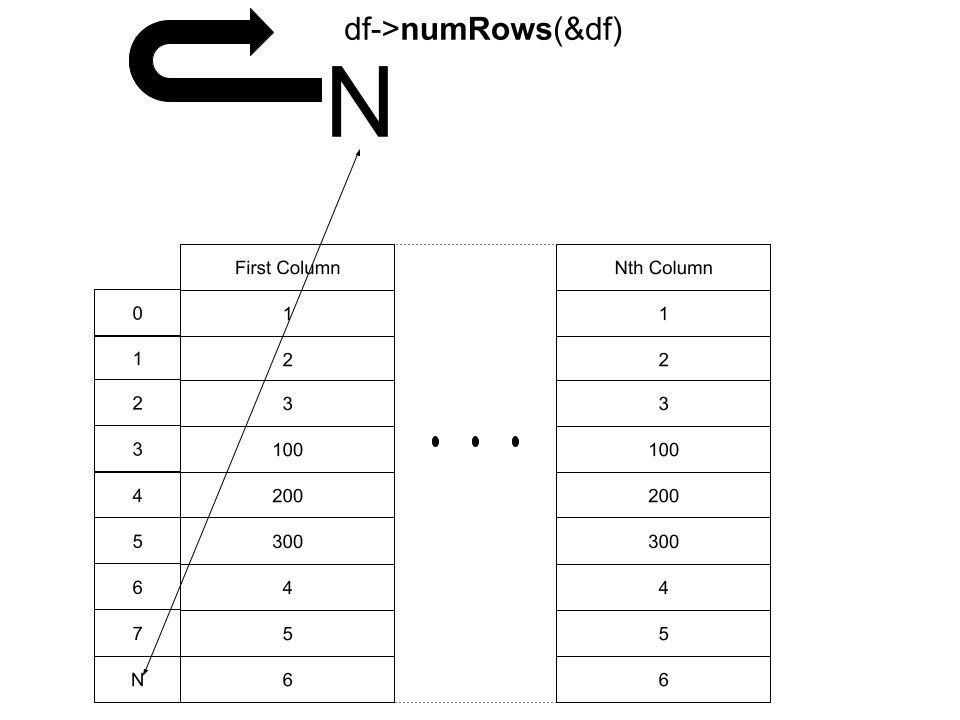
## Usage:
```c
    DataFrame df;
    DataFrame_Create(&df);

    // 1) Build some sample data
    int intVals[] = { 10, 20, 30, 40 };

    Series sInt = buildIntSeries("IntCol", intVals, 4);

    bool ok = df.addSeries(&df, &sInt);

    seriesFree(&sInt);

    assert(df.numRows(&df) == 4);

```


# DataFrame::Date

# Date::bool convertToDatetime(DataFrame* df, size_t dateColIndex, const char* formatType)

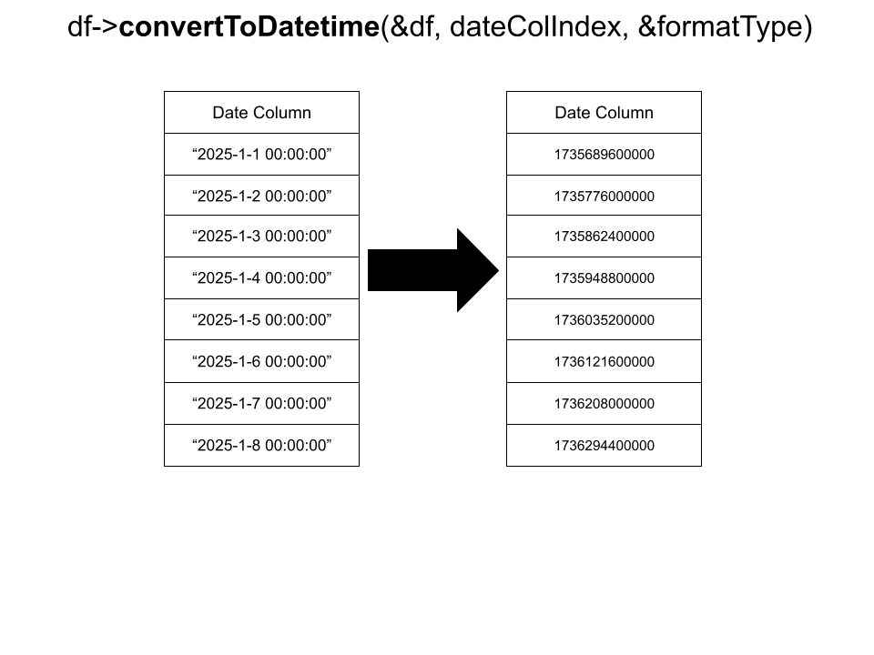


| **Original Column Type** | **Example Cell Value**  | **`formatType`**             | **Result in DF_DATETIME (milliseconds)**                                                   |
|--------------------------|-------------------------|------------------------------|--------------------------------------------------------------------------------------------|
| **DF_STRING**            | `"2023-03-15 12:34:56"` | `"%Y-%m-%d %H:%M:%S"`        | Parse string → epoch seconds (UTC) via `strptime+timegm` ⇒ multiply by 1000. For example: <br/> `1678882496 * 1000 = 1678882496000` ms. |
| **DF_STRING**            | `"20230315"`           | `"YYYYMMDD"`                 | Interpreted as YYYY=2023, MM=03, DD=15, midnight UTC. For example: <br/> `1678838400` seconds → `1678838400000` ms. |
| **DF_STRING**            | `"1678882496000"`      | `"unix_millis"`             | Interpreted as **epoch milliseconds** => `1678882496000 / 1000 = 1678882496` seconds. <br/> Then re-multiplied by 1000 => stays `1678882496000` ms. |
| **DF_STRING**            | `"1678882496"`         | `"unix_seconds"`            | Interpreted as epoch seconds => `1678882496`. <br/> Convert to ms => `1678882496000`.       |
| **DF_INT**               | `1678882496`           | (any) e.g. `"unix_seconds"`  | The integer is converted to a string `"1678882496"`. Then parsed as above. If `"unix_seconds"`, we end up with `1678882496000` ms. |
| **DF_DOUBLE**            | `1.678882496e9`        | `"unix_seconds"`            | The double is `snprintf`’d to e.g. `"1678882496"` → parse as seconds => re-multiplied => `1678882496000` ms. |
| **DF_STRING**            | `"invalid date"`       | `"%Y-%m-%d %H:%M:%S"`        | Fails parse => final epoch = 0 ms.                                                         |
| **DF_STRING**            | `"2023-03-15 12:34:56"` | `"unrecognized_format"`      | No match => final epoch = 0 ms.                                                            |
| **DF_DATETIME**          | *Any input*            | (function does nothing)      | Actually your code overwrites with 0 ms if you attempt to parse DF_DATETIME. Typically no change. |


## Usage:
```c
    DataFrame df;
    DataFrame_Create(&df);

    // Build a DF_STRING column of date/time
    const char* dates[] = {
        "2023-03-15 12:34:56",
        "2023-03-16 00:00:00",
        "invalid date",
        "2023-03-17 23:59:59"
    };
    Series s;
    seriesInit(&s, "TestDates", DF_STRING);
    for (int i=0; i<4; i++) {
        seriesAddString(&s, dates[i]);
    }

    bool ok = df.addSeries(&df, &s);
    seriesFree(&s); // free local copy

    ok = df.convertToDatetime(&df, 0, "%Y-%m-%d %H:%M:%S");

    const Series* converted = df.getSeries(&df, 0);
    assert(converted != NULL);
    assert(converted->type == DF_DATETIME);

    // For row 2 "invalid date", we expect epoch=0
    long long val=0;
    bool got = seriesGetDateTime(converted, 2, &val);
    assert(got && val == 0);

    DataFrame_Destroy(&df);

```


# Date::bool datetimeToString(DataFrame* df, size_t dateColIndex, const char* outFormat)
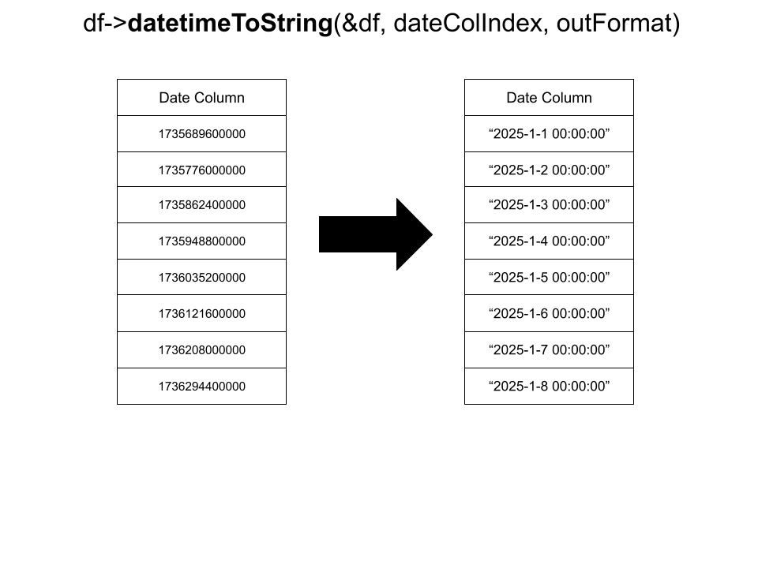


| **DF_DATETIME Cell** (msVal)     | **Seconds** (msVal/1000) | **Remainder** (msVal % 1000) | **Output (assuming outFormat=\"%Y-%m-%d %H:%M:%S\")**                                                      | **Notes**                                                                                                        |
|----------------------------------|--------------------------|------------------------------|----------------------------------------------------------------------------------------------------------------------------------------------------|------------------------------------------------------------------------------------------------------------------|
| `0`                              | `0`                      | `0`                          | `"1970-01-01 00:00:00"`                                                                                                                           | No fractional appended since remainder = 0.                                                                     |
| `1678882496000`                  | `1678882496`            | `0`                          | `"2023-03-15 12:34:56"`                                                                                                                           | `gmtime(1678882496)` => March 15, 2023 12:34:56 UTC. No fractional.                                             |
| `1678882496123`                  | `1678882496`            | `123`                        | `"2023-03-15 12:34:56.123"`                                                                                                                       | Same date/time as above, plus `.123` appended because remainder=123.                                            |
| `9999999999999999999` (overflow)| (overflow if too large)  | (overflow)                   | `""` (empty)                                                                                                                                        | If `gmtime` fails due to out-of-range `time_t`, we store an empty string.                                        |
| *Any valid msVal but `gmtime` fails internally* | *N/A*            | *N/A*                      | `""`                                                                                                                                                | If `gmtime` returns `NULL`, we store an empty string.                                                            |

## Usage:
```c
    DataFrame df;
    DataFrame_Create(&df);

    // Make DF_DATETIME column with some known epochs (UTC)
    // e.g. 1678871696 => "2023-03-15 12:34:56" if truly UTC
    long long epochs[] = {
        1678871696LL,
        1678924800LL,
        0LL,
        1679003999LL
    };
    Series sd;
    seriesInit(&sd, "Epochs", DF_DATETIME);
    for (int i=0; i<4; i++) {
        seriesAddDateTime(&sd, epochs[i]);
    }
    bool ok = df.addSeries(&df, &sd);
    seriesFree(&sd);
    assert(ok);

    // Convert => DF_STRING
    ok = df.datetimeToString(&df, 0, "%Y-%m-%d %H:%M:%S");
    assert(ok);

    // Check results
    const Series* s2 = df.getSeries(&df, 0);
    assert(s2 && s2->type == DF_STRING);
    char* strVal = NULL;
    bool got = seriesGetString(s2, 2, &strVal);
    assert(got && strVal);
    // row 2 => "1970-01-01 00:00:00" presumably
    assert(strlen(strVal) > 0);
    free(strVal);

    DataFrame_Destroy(&df);
```


# Date:bool datetimeAdd(DataFrame* df, size_t dateColIndex, int daysToAdd)

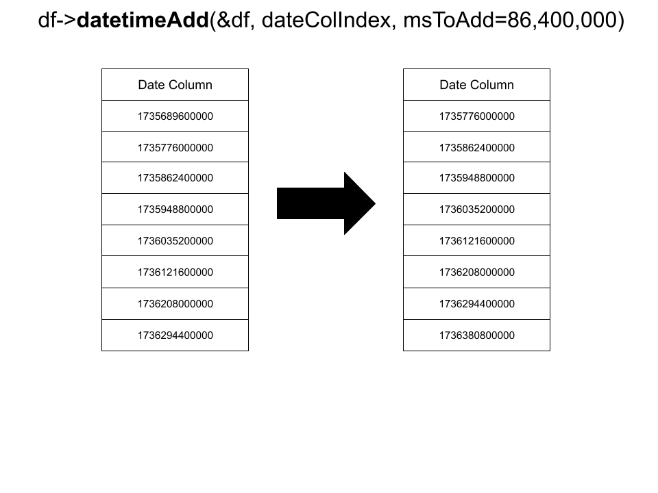


| **Row** | **Original Value** (`msVal`)                                               | **msToAdd** = `86400000` (1 day)        | **Final Value** = `msVal + msToAdd`                                              | **Notes**                                                                                                    |
|---------|---------------------------------------------------------------------------|-----------------------------------------|----------------------------------------------------------------------------------|----------------------------------------------------------------------------------------------------------------|
| Row 0   | `baseMs = 1678871696 * 1000` = `1678871696000`                            | `86400000`                              | `1678871696000 + 86400000 = 1678958096000`                                       | This represents shifting the initial date/time by exactly one day in milliseconds.                             |
| Row 1   | `baseMs + (1 * 3600000) = 1678871696000 + 3600000 = 1678875296000`        | `86400000`                              | `1678875296000 + 86400000 = 1678961696000`                                       | An hour later than row 0 originally; still ends up exactly 1 day further in total.                             |
| Row 2   | `baseMs + (2 * 3600000) = 1678871696000 + 7200000 = 1678878896000`        | `86400000`                              | `1678878896000 + 86400000 = 1678965296000`                                       | Two hours later than row 0; also gains 86400000 ms.                                                           |
| *Invalid cell* | *Fails to read msVal (e.g. out-of-range?)*                        | *N/A*                                   | *No change or possibly set to 0 if your code clamps negative.*                    | If `seriesGetDateTime` fails, your code might skip or store 0. Depends on the exact logic in your implementation. |


## Usage:

```c
    DataFrame df;
    DataFrame_Create(&df);

    // Build a DF_DATETIME column in milliseconds
    Series sdt;
    seriesInit(&sdt, "Times", DF_DATETIME);

    // For example, base epoch ~ 2023-03-15 12:34:56 UTC
    // Convert to ms by multiplying by 1000
    long long baseMs = 1678871696LL * 1000LL;

    // Add three rows, each 1 hour apart => 3600000 ms
    for (int i = 0; i < 3; i++) {
        seriesAddDateTime(&sdt, baseMs + (i * 3600000LL));
    }
    bool ok = df.addSeries(&df, &sdt);
    seriesFree(&sdt);
    assert(ok);

    // We want to add 1 day => 86,400 seconds => 86,400,000 ms
    // (Assuming your "df.datetimeAdd" now expects ms to add)
    long long oneDayMs = 86400000LL;
    ok = df.datetimeAdd(&df, 0, oneDayMs);
    assert(ok);

    // Check the first row's new value
    const Series* s2 = df.getSeries(&df, 0);
    long long val = 0;
    bool got = seriesGetDateTime(s2, 0, &val);

    // Expect baseMs + 86,400,000
    long long expected = baseMs + oneDayMs;
    assert(got && val == expected);

    DataFrame_Destroy(&df);
```

# Date::DataFrame datetimeDiff(const DataFrame* df, size_t col1Index, size_t col2Index, const char* newColName)

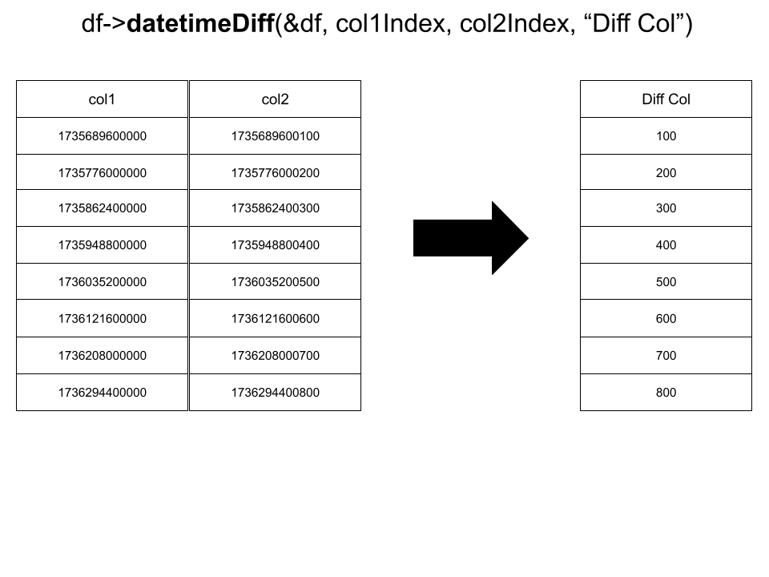


| **Row** | **Column1 (msVal)** | **Column2 (msVal)** | **Operation**               | **Result in DF_INT** (ms) | **Notes**                                                                                     |
|---------|---------------------|---------------------|-----------------------------|---------------------------|-----------------------------------------------------------------------------------------------|
| 0       | 1,000,000          | 2,000,000          | (2,000,000 - 1,000,000)     | 1,000,000                | If both valid, returns the millisecond difference.                                           |
| 1       | 5,000,000          | 6,000,000          | (6,000,000 - 5,000,000)     | 1,000,000                | Also valid => 1 million ms difference.                                                       |
| 2       | 0                  | 0                  | (0 - 0)                     | 0                         | Same timestamps => difference = 0 ms.                                                        |
| 3       | 10,000,000         | 5,000,000          | (5,000,000 - 10,000,000)    | -5,000,000               | If col2 < col1, result can be negative.                                                      |
| 4       | *Invalid or missing*| 2,000,000          | *cannot read first value*   | 0                         | If reading ms fails for a row, the function stores 0 by default.                             |
| 5       | 99999999999999     | 99999999999999 + 1 | (~1×10^14 ms difference)     | Might overflow as DF_INT  | If difference > 2^31-1 or < -2^31, the stored int may overflow. Consider using 64-bit field. |
| 6       | 1678882496000      | 1678882896000       | (1678882896000 - 1678882496000)| 400,000                | e.g. 400 sec difference in ms if your timestamps are ~2023-03-15 plus some offset.            |

## Usage:
```c
    DataFrame df;
    DataFrame_Create(&df);

    // We'll have 2 DF_DATETIME columns: Start, End
    // Each storing epoch in milliseconds.
    Series sStart, sEnd;
    seriesInit(&sStart, "Start", DF_DATETIME);
    seriesInit(&sEnd, "End", DF_DATETIME);

    // row 0 => start=1,000,000 ms, end=2,000,000 ms => diff=1,000,000 ms
    // row 1 => start=5,000,000 ms, end=6,000,000 ms => diff=1,000,000 ms
    // row 2 => start=0, end=0 => diff=0 ms
    long long starts[] = {1000000LL, 5000000LL, 0LL};
    long long ends[]   = {2000000LL, 6000000LL, 0LL};

    for (int i = 0; i < 3; i++) {
        seriesAddDateTime(&sStart, starts[i]);
        seriesAddDateTime(&sEnd,   ends[i]);
    }
    bool ok = df.addSeries(&df, &sStart);
    assert(ok);
    ok = df.addSeries(&df, &sEnd);
    assert(ok);

    seriesFree(&sStart);
    seriesFree(&sEnd);

    // Diff => new DF with one column named "Diff"
    // Now returns difference in ms
    DataFrame diffDF = df.datetimeDiff(&df, 0, 1, "Diff");
    assert(diffDF.numColumns(&diffDF) == 1);

    const Series* diffS = diffDF.getSeries(&diffDF, 0);
    assert(diffS && diffS->type == DF_INT);

    // Check the results
    int check = 0;
    bool gotVal = seriesGetInt(diffS, 0, &check);
    // row0 => 2,000,000 - 1,000,000 => 1,000,000 ms
    assert(gotVal && check == 1000000);

    seriesGetInt(diffS, 1, &check);
    // row1 => 6,000,000 - 5,000,000 => 1,000,000 ms
    assert(check == 1000000);

    seriesGetInt(diffS, 2, &check);
    // row2 => 0 - 0 => 0
    assert(check == 0);

    DataFrame_Destroy(&diffDF);
    DataFrame_Destroy(&df);

```
# Date::DataFrame datetimeFilter(const DataFrame* df, size_t dateColIndex, long long startMs, long long endMs)

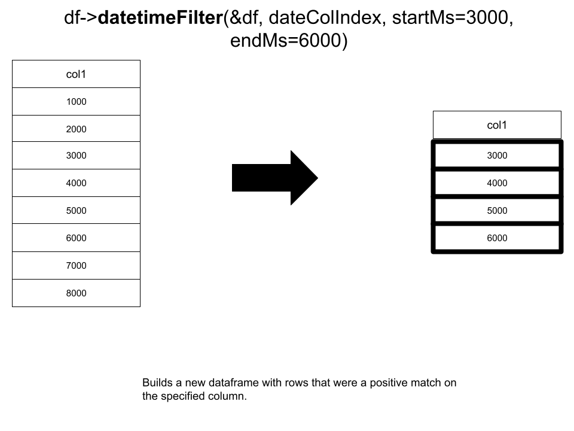

| **Column Type** | **Row Value** (`msVal`) | **`startMs`**         | **`endMs`**           | **Filter Condition**                  | **Included in Result?**                         |
|-----------------|-------------------------|------------------------|-----------------------|---------------------------------------|-------------------------------------------------|
| `DF_DATETIME`   | `0`                    | `0`                    | `9999999999`         | `0 >= 0 && 0 <= 9999999999`           | **Yes** (0 is in [0..9999999999])              |
| `DF_DATETIME`   | `2000`                 | `1000`                 | `3000`               | `2000 >= 1000 && 2000 <= 3000`        | **Yes** (2000 is in [1000..3000])              |
| `DF_DATETIME`   | `4000`                 | `1000`                 | `3000`               | `4000 >= 1000 && 4000 <= 3000`        | **No** (4000 > 3000)                           |
| `DF_DATETIME`   | `1678882496000`        | `1678880000000`       | `1679000000000`      | `1678882496000 >= 1678880000000 && 1678882496000 <= 1679000000000` | **Yes** (it's within the provided ms range)    |
| `DF_DATETIME`   | `9999999999999999`     | `0`                    | `9999999999999999`   | `9999999999999999 >= 0 && 9999999999999999 <= 9999999999999999`    | **Yes** (it’s exactly the upper boundary)       |
| `DF_DATETIME`   | *Invalid or missing*    | *Any*                 | *Any*                | *Cannot read msVal => default false*  | **Excluded** (if `seriesGetDateTime` fails)    |

## Usage:
```c
    DataFrame df;
    DataFrame_Create(&df);

    // DF_DATETIME col => 1000,2000,3000,4000
    Series sdt;
    seriesInit(&sdt, "Times", DF_DATETIME);
    for (int i=1; i<=4; i++) {
        seriesAddDateTime(&sdt, i*1000LL);
    }
    bool ok = df.addSeries(&df, &sdt);
    seriesFree(&sdt);
    assert(ok);

    // Filter => keep [2000..3000]
    DataFrame filtered = df.datetimeFilter(&df, 0, 2000LL, 3000LL);
    assert(filtered.numRows(&filtered)==2);

    const Series* fcol = filtered.getSeries(&filtered, 0);
    long long val=0;
    bool got = seriesGetDateTime(fcol, 0, &val);
    assert(got && val==2000);
    seriesGetDateTime(fcol, 1, &val);
    assert(val==3000);

    DataFrame_Destroy(&filtered);
    DataFrame_Destroy(&df);
```

# Date:: bool datetimeTruncate(DataFrame* df, size_t colIndex, const char* unit)

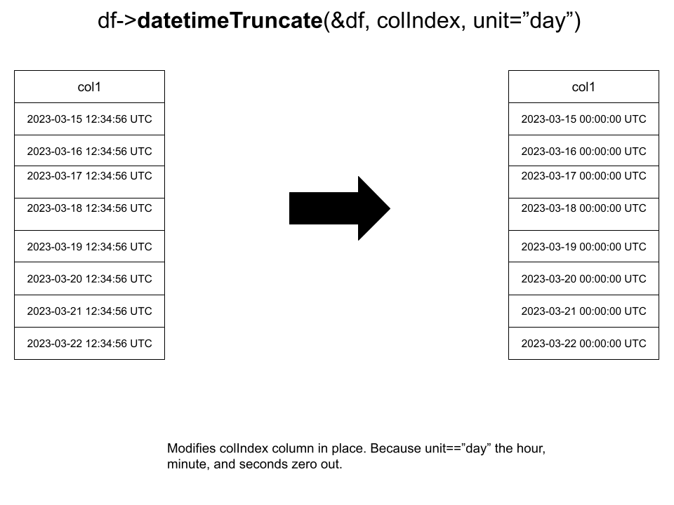


| **DF_DATETIME Cell** (msVal)   | **Unit**     | **Initial UTC Date/Time**       | **Zeroed-Out Fields**                          | **New UTC Date/Time**                          | **Final Stored Value (ms)**                                  | **Notes**                                                                                                           |
|--------------------------------|-------------|---------------------------------|------------------------------------------------|------------------------------------------------|----------------------------------------------------------------|---------------------------------------------------------------------------------------------------------------------|
| `1678871696000` (e.g. ~2023-03-15 12:34:56) | `"day"`     | 2023-03-15 12:34:56 UTC        | Hour=0, Min=0, Sec=0                           | 2023-03-15 00:00:00 UTC                        | `1678838400000`                                              | Eliminates partial hours, minutes, seconds => start of that day in UTC.                                             |
| `1678871696000`               | `"hour"`    | 2023-03-15 12:34:56 UTC         | Min=0, Sec=0                                   | 2023-03-15 12:00:00 UTC                        | `1678872000000`                                              | Truncates to start of hour => 12:00:00.                                                                             |
| `1678871696000`               | `"month"`   | 2023-03-15 12:34:56 UTC         | Day=1, Hour=0, Min=0, Sec=0                    | 2023-03-01 00:00:00 UTC                        | `1677628800000`                                              | Moves to first day of that month => March 1, 2023, midnight UTC.                                                    |
| `1678871696000`               | `"year"`    | 2023-03-15 12:34:56 UTC         | Month=0 (Jan), Day=1, Hour=0, Min=0, Sec=0      | 2023-01-01 00:00:00 UTC                        | `1672531200000`                                              | Zero out month=January, day=1 => start of the year.                                                                 |
| `0`                            | `"day"`     | 1970-01-01 00:00:00 UTC         | (Already 0:00:00)                              | 1970-01-01 00:00:00 UTC                        | `0`                                                          | If it’s already midnight epoch, no change.                                                                          |
| `9999999999999999999`         | `"month"`   | Very large => `gmtime` might fail| If `gmtime` fails => skip or fallback to 0      | Possibly 0 if out of range                     | `0`                                                          | If date is out-of-range for `timegm`, set to 0.                                                                     |
| *Invalid row*                  | *any*       | *Cannot read msVal*            | *No operation performed*                        | *No change or fallback*                        | Possibly unchanged or 0                                      | If `seriesGetDateTime` fails, we skip that row.                                                                     |

## Usage:
```c
    DataFrame df;
    DataFrame_Create(&df);

    // We'll store an epoch for "2023-03-15 12:34:56"
    long long e = 1678871696; // 12:34:56 UTC (approx!)
    long long eMs = 1678838400LL * 1000; // 1678838400000
    Series sdt;
    seriesInit(&sdt, "TruncTest", DF_DATETIME);
    seriesAddDateTime(&sdt, eMs);
    bool ok = df.addSeries(&df, &sdt);
    seriesFree(&sdt);
    assert(ok);

    // Truncate => "day"
    ok = df.datetimeTruncate(&df, 0, "day");
    assert(ok);

    // Now should be ~1678838400 => "2023-03-15 00:00:00"
    const Series* sc = df.getSeries(&df, 0);
    long long msVal = 0;
    bool got = seriesGetDateTime(sc, 0, &msVal);

    long long secVal = msVal / 1000LL;  // because this library stores ms

    assert(secVal == 1678838400LL);

    DataFrame_Destroy(&df);

```


# Date::DataFrame datetimeExtract(const DataFrame* df, size_t dateColIndex, const char* const* fields, size_t numFields)

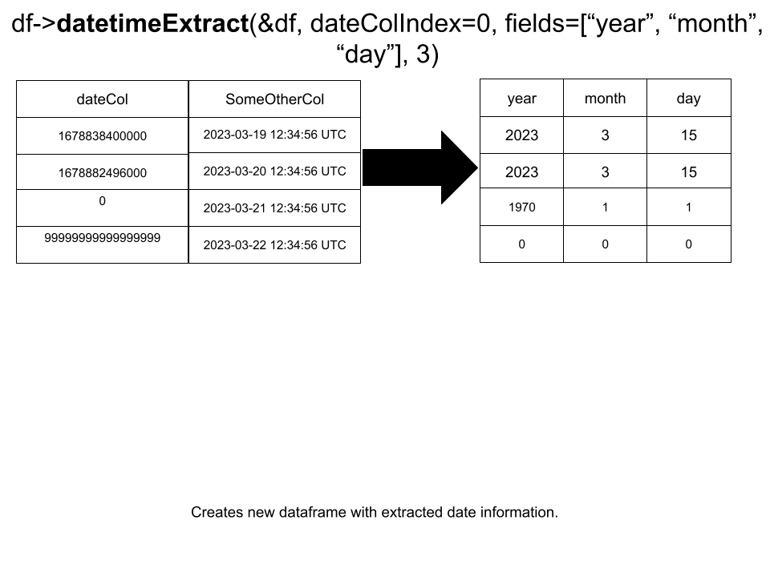

| **DF_DATETIME Cell (msVal)** | **Converted UTC** (`msVal/1000` → `gmtime`) | **Requested Field** | **Extracted Value**                        | **Stored in DF_INT** | **Notes**                                                                                                  |
|------------------------------|---------------------------------------------|---------------------|--------------------------------------------|-----------------------|------------------------------------------------------------------------------------------------------------|
| `1678882496000`             | 2023-03-15 12:34:56 UTC                     | `"year"`            | `2023` (tm_year + 1900)                    | `2023`                | For that timestamp, year=123 in `struct tm`, plus 1900 => 2023.                                            |
| `1678882496000`             | 2023-03-15 12:34:56 UTC                     | `"month"`           | `3` (tm_mon + 1)                           | `3`                   | If tm_mon=2 => +1 => 3 => “March.”                                                                         |
| `1678882496000`             | 2023-03-15 12:34:56 UTC                     | `"day"`             | `15` (tm_mday)                             | `15`                  |                                                                                                            |
| `1678882496000`             | 2023-03-15 12:34:56 UTC                     | `"hour"`            | `12` (tm_hour)                             | `12`                  | 24-hour clock in UTC.                                                                                      |
| `1678882496000`             | 2023-03-15 12:34:56 UTC                     | `"minute"`          | `34` (tm_min)                              | `34`                  |                                                                                                            |
| `1678882496000`             | 2023-03-15 12:34:56 UTC                     | `"second"`          | `56` (tm_sec)                              | `56`                  |                                                                                                            |
| `0`                          | 1970-01-01 00:00:00 UTC                     | `"year","month",...`| e.g. year=1970, month=1, day=1, hour=0, etc.| e.g. 1970,1,1,0,...   | If msVal=0 => epoch => 1970-01-01.                                                                          |
| `9999999999999999`          | May overflow `time_t` => `gmtime` fails     | (any field)         | `0` (since it can’t parse)                 | `0`                   | If `gmtime` returns NULL, the code stores 0.                                                               |
| *Invalid cell*               | *No data read*                              | (any field)         | `0`                                        | `0`                   | If `seriesGetDateTime` fails for that row, store 0.                                                        |
| Unrecognized field (not in `year,month,day,hour,minute,second`) | Still code only checks known fields | => `outVal=0` fallback  | `0`                                        | `0`                   | The snippet only sets those 6 fields. If a user passes `"millis"`, code results in 0.                      |

## Usage:
```c
    DataFrame df;
    DataFrame_Create(&df);

    // DF_DATETIME => 1 row => aiming for 2023-03-15 12:14:56
    long long e = 1678882496L * 1000; // approximately => "2023-03-15 12:14:56" UTC
    Series sdt;
    seriesInit(&sdt, "DTExtract", DF_DATETIME);
    seriesAddDateTime(&sdt, e);
    bool ok = df.addSeries(&df, &sdt);
    seriesFree(&sdt);
    assert(ok);

    // Extract => year, month, day, hour, minute, second
    const char* fields[] = {"year","month","day","hour","minute","second"};
    DataFrame extracted = df.datetimeExtract(&df, 0, fields, 6);
    assert(extracted.numColumns(&extracted)==6);

    // row0 => year=2023, month=3, day=15, hour=12, minute=14, second=56 (for this epoch)
    const Series* sy = extracted.getSeries(&extracted, 0);
    int val=0;
    bool gotVal = seriesGetInt(sy, 0, &val);
    assert(gotVal && val==2023);

    const Series* sm = extracted.getSeries(&extracted, 1);
    seriesGetInt(sm, 0, &val);
    assert(val==3);

    const Series* sd = extracted.getSeries(&extracted, 2);
    seriesGetInt(sd, 0, &val);
    assert(val==15);

    const Series* sh = extracted.getSeries(&extracted, 3);
    seriesGetInt(sh, 0, &val);
    // should be 12 if that epoch is correct
    assert(val==12);

    const Series* smin = extracted.getSeries(&extracted, 4);
    seriesGetInt(smin, 0, &val);
    // we expect 14 from that epoch
    assert(val==14);

    const Series* ssec = extracted.getSeries(&extracted, 5);
    seriesGetInt(ssec, 0, &val);
    assert(val==56);

    DataFrame_Destroy(&extracted);
    DataFrame_Destroy(&df);
```


# Date::DataFrame datetimeGroupBy(const DataFrame* df, size_t dateColIndex, const char* truncateUnit)
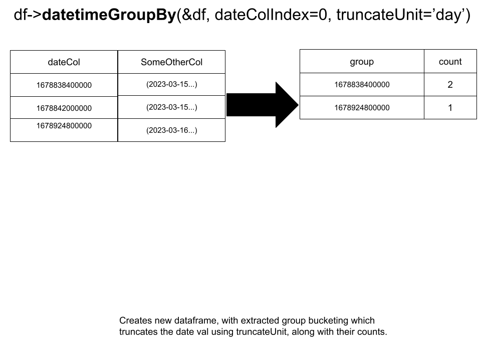

| **Original DataFrame**                           | **`dateColIndex`** | **`truncateUnit`** | **Steps**                                                                                                                             | **Final Returned DataFrame**                                    | **Notes**                                                                                                                                                  |
|--------------------------------------------------|--------------------|--------------------|----------------------------------------------------------------------------------------------------------------------------------------|------------------------------------------------------------------|------------------------------------------------------------------------------------------------------------------------------------------------------------|
| A DF_DATETIME column in ms (e.g., storing 2023-03-15 12:34:56, 2023-03-15 14:10:00, 2023-03-16 00:00:00, etc.). Other columns as well. | e.g. `1`          | `"day"`            | 1) **Slice** all rows → `copyAll` <br/> 2) **Truncate** that DF’s `dateColIndex` to `"day"` → zero out hour/min/sec => e.g. 2023-03-15 00:00:00, 2023-03-16 00:00:00, etc. <br/> 3) **GroupBy** that truncated column. | A new grouped DataFrame, typically with columns like `["group", "count"]` or more depending on your `groupBy` design. | Often yields fewer rows if multiple datetimes collapse to the same truncated day (or hour/month/year).                                                      |
| A DF_DATETIME column in ms, *but no rows*        | e.g. `0`          | `"month"`          | 1) Slice => an empty DataFrame (since numRows=0) <br/> 2) Truncation + GroupBy on an empty set => results in an empty DF as well.      | **Empty** DataFrame with 0 rows                                   | If `copyAll.numRows(...)` is 0, we just return that empty DataFrame.                                                                                        |
| DF_DATETIME w/ partial times => `truncateUnit="year"` | `2`              | `"year"`           | 1) Slice => copyAll <br/> 2) `dfDatetimeTruncate_impl(...,"year")` => sets month=0, day=1, etc. <br/> 3) groupBy that year-level date  | Possibly columns like `[TruncatedDate, otherAggregations?]` depending on groupBy output | All times in the same year now become the *same* group if they share the same truncated year (like 2023-01-01 00:00:00).                                  |
| DF_DATETIME w/ massive out-of-range or invalid rows | any index        | any unit ("hour") | 1) Slicing includes them <br/> 2) Truncation might set them to 0 if `gmtime` fails <br/> 3) groupBy lumps all invalid => 1970-01-01  | A grouped DF, possibly including a `1970-01-01 00:00:00` group for those out-of-range.   | If `timegm` fails, the truncated ms => 0 => they appear in the group for “1970-01-01 00:00:00.”                                                           |

## Usage:

```c
    DataFrame df;
    DataFrame_Create(&df);

    // times => same day => 2023-03-15, but different hours
    // plus another day => 2023-03-16
    long long day1_0 = 1678838400LL * 1000LL; // "2023-03-15 00:00:00"
    long long day1_1 = 1678842000LL * 1000LL; // "2023-03-15 01:00:00"
    long long day2_0 = 1678924800LL * 1000LL; // "2023-03-16 00:00:00"
    Series sdt;
    seriesInit(&sdt, "GroupDT", DF_DATETIME);
    seriesAddDateTime(&sdt, day1_0);
    seriesAddDateTime(&sdt, day1_1);
    seriesAddDateTime(&sdt, day2_0);
    bool ok = df.addSeries(&df, &sdt);
    seriesFree(&sdt);
    assert(ok);

    // group by day
    DataFrame grouped = df.datetimeGroupBy(&df, 0, "day");
    // We'll do a minimal check => at least 2 distinct days => 2 rows
    assert(grouped.numRows(&grouped)==2);
    df.print(&grouped);

    DataFrame_Destroy(&grouped);
    DataFrame_Destroy(&df);


```


# Date::bool datetimeRound(const DataFrame* df, size_t colIndex, const char* unit)
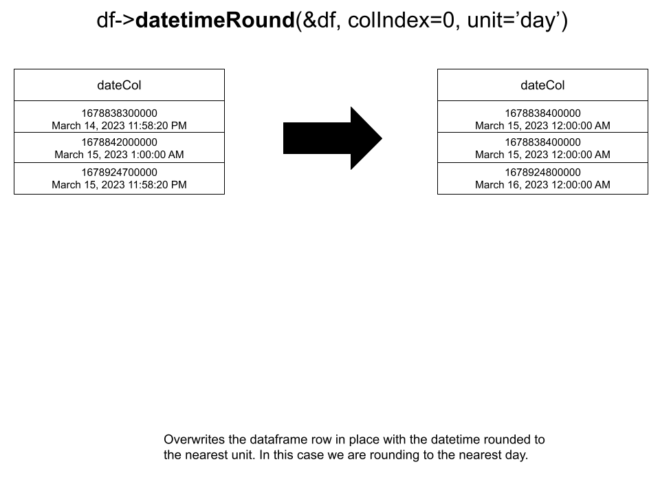

| Original `msVal`      | Rounding Unit | New (Rounded) `msVal` | Explanation                                                                                     |
|-----------------------|---------------|------------------------|-------------------------------------------------------------------------------------------------|
| **1678871696789**     | `"minute"`    | **1678871700000**      | - Original ≈ 2023-03-15 12:34:56.789 UTC.<br/>- remainder = 789 ms ≥ 500 ⇒ round up to 12:34:57.<br/>- Now rounding to minute: 57 ≥ 30 ⇒ minute++ ⇒ 12:35:00.<br/>- Final epoch ms = 1678871700000. |
| **1679003999123**     | `"day"`       | **1679001600000**      | - Original ≈ 2023-03-16 23:59:59.123 UTC.<br/>- remainder = 123 ms < 500 ⇒ remains 23:59:59.<br/>- Rounding to day: hour=23 ≥ 12 ⇒ next day ⇒ 2023-03-17 00:00:00.<br/>- Final epoch ms = 1679001600000. |
| **1678838400650**     | `"second"`    | **1678838401000**      | - Original ≈ 2023-03-15 00:00:00.650 UTC.<br/>- remainder = 650 ms ≥ 500 ⇒ increment second ⇒ 00:00:01.<br/>- Rounding to second does nothing more ⇒ final epoch ms = 1678838401000. |
| **1677871204000**     | `"hour"`      | **1677871200000**      | - Original ≈ 2023-03-03 11:00:04.000 UTC.<br/>- remainder=0, no change to seconds.<br/>- Rounding to hour: minute=0 but sec=4≥30? No, so hour stays 11 ⇒ zero out minutes & seconds ⇒ 2023-03-03 11:00:00.<br/>- Final epoch ms = 1677871200000. |

## Usage:
```c
    DataFrame df;
    DataFrame_Create(&df);

    // Create a DF_DATETIME column with some known epoch-millis:
    // Let's pick a base time: 2023-03-15 12:34:56.789 => epoch = 1678871696, leftover .789 ms
    // Multiply by 1000 for ms => 1678871696789
    long long baseMs = 1678871696789LL;
    long long times[] = {
        baseMs,                // ~ 12:34:56.789
        baseMs + 501,         // ~ 12:34:57.290 (should round up to 12:34:58 if rounding second)
        baseMs + 45*1000,     // ~ 12:35:41.789 (should test rounding minute)
        baseMs + 3600*1000,   // ~ 13:34:56.789 (test hour rounding)
        baseMs - 200LL        // negative remainder check near the boundary
    };

    Series sdt;
    seriesInit(&sdt, "RoundTimes", DF_DATETIME);
    for (int i = 0; i < 5; i++) {
        seriesAddDateTime(&sdt, times[i]);
    }
    bool ok = df.addSeries(&df, &sdt);
    seriesFree(&sdt);
    assert(ok);

    // We'll test a single rounding unit first: "second"
    ok = df.datetimeRound(&df, 0, "second");
    assert(ok);

    // Validate row 0 => original remainder .789 => >= 500 => +1 sec
    // row0 was 1678871696789 => break that into (seconds=1678871696, remainder=789).
    // => final => 1678871697 in seconds => *1000 => 1678871697000
    const Series* col = df.getSeries(&df, 0);
    long long val = 0;
    bool gotVal = seriesGetDateTime(col, 0, &val);
    assert(gotVal);
    assert(val == 1678871697000LL);

    // Validate row 1 => was baseMs+501 => remainder ~ 501 => round up => +1 sec from base
    // So we expect second = baseSec+1 => 1678871697 in seconds => 1678871697000 ms
    seriesGetDateTime(col, 1, &val);
    assert(val == 1678871697000LL);

    // We won’t check all rows in detail here, but you can. Let’s at least confirm row 4 works.
    seriesGetDateTime(col, 4, &val);
    // row4 was baseMs - 200 => 1678871696589 => remainder=589 => round up => second=1678871697
    assert(val == 1678871697000LL);

    // Now let’s do "minute" rounding on row0 to see if it changes to 12:35:00
    // We can re-round the entire column or re-add times. For simplicity, re-insert them:
    DataFrame_Destroy(&df);
    DataFrame_Create(&df);
    seriesInit(&sdt, "RoundTimes", DF_DATETIME);
    for (int i = 0; i < 5; i++) {
        seriesAddDateTime(&sdt, times[i]);
    }
    df.addSeries(&df, &sdt);
    seriesFree(&sdt);

    // Round to minute
    df.datetimeRound(&df, 0, "minute");

    col = df.getSeries(&df, 0);
    seriesGetDateTime(col, 0, &val);
    // base => "12:34:56.789" => second=56 => >=30 => round up => minute=35 => new time=12:35:00
    // Let's check the resulting epoch in UTC
    // 12:35:00 on 2023-03-15 => epoch=1678871700 => in ms => 1678871700000
    assert(val == 1678871700000LL);

    DataFrame_Destroy(&df);

```

# Date::DataFrame datetimeBetween(const DataFrame* df, size_t dateColIndex, const char* startStr, const char* endStr, const char* formatType)
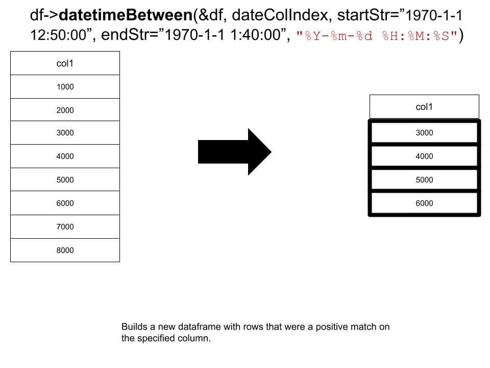

| **Input**                                                      | **Parsed Range**                                      | **Output**                                                                                                          | **Explanation**                                                                                                                                                                                               |
|----------------------------------------------------------------|--------------------------------------------------------|----------------------------------------------------------------------------------------------------------------------|---------------------------------------------------------------------------------------------------------------------------------------------------------------------------------------------------------------|
| `startStr = "2023-03-15 00:00:00", endStr = "2023-03-16 00:00:00"`<br>`formatType = "%Y-%m-%d %H:%M:%S"` | - `parseEpochSec("2023-03-15 00:00:00")` => `1678838400` (seconds)<br>- `parseEpochSec("2023-03-16 00:00:00")` => `1678924800`<br>- Converted to ms => `[1678838400000..1678924800000]` | A new `DataFrame` containing **only rows** whose timestamp in `colIndex` is within **[1678838400000..1678924800000]** (inclusive). | - The function multiplies each parsed epoch-second by 1000 to get milliseconds.<br>- It then calls `df->datetimeFilter(...)`, filtering rows where `DF_DATETIME` ∈ [1678838400000..1678924800000].                                                    |
| `startStr = "2023-03-20", endStr = "2023-03-15"`<br>`formatType = "%Y-%m-%d"`                            | - Suppose `"2023-03-20"` => `1679270400` (sec)<br>- `"2023-03-15"` => `1678838400` (sec)<br>- Ms => `[1679270400000..1678838400000]` but swapped ⇒ `[1678838400000..1679270400000]` | Similar `DataFrame` subset, but the range is **[1678838400000..1679270400000]** after swap.                                    | - If `startMs > endMs`, the code swaps them, ensuring the final filter range is always ascending.<br>- Only rows within that millisecond window remain in the returned `DataFrame`.                                                                  |
| `startStr = "invalid date", endStr = "2023-03-15 12:00:00"`<br>`formatType = "%Y-%m-%d %H:%M:%S"`        | - `parseEpochSec("invalid date", ...)` => 0 (failure)<br>- `parseEpochSec("2023-03-15 12:00:00", ...)` => `1678872000` (sec) => `1678872000000` (ms)<br>- Final range => `[0..1678872000000]` | Any row with a timestamp ≤ 1678872000000 ms is kept.                                                                            | - An invalid date string returns `0`, so `startMs = 0`.<br>- `endMs` is ~ `1678872000000`.<br>- The final filter is `[0..1678872000000]`, meaning rows at or after the Unix epoch but before 2023-03-15 12:00:00 remain.                              |


## Usage:
```c
    DataFrame df;
    DataFrame_Create(&df);

    
    long long times[] = {
        1678838400LL * 1000, // "2023-03-15 00:00:00" in MILLISECONDS
        1678871696LL * 1000, // "2023-03-15 9:14:56"
        1678924800LL * 1000, // "2023-03-16 00:00:00"
        1679000000LL * 1000  // "2023-03-16 20:53:20"
    };
    

    Series sdt;
    seriesInit(&sdt, "BetweenTest", DF_DATETIME);
    for (int i = 0; i < 4; i++) {
        // Storing raw seconds. If your code expects ms in DF_DATETIME,
        // multiply by 1000. But we'll store seconds for clarity here.
        seriesAddDateTime(&sdt, times[i]);
    }
    bool ok = df.addSeries(&df, &sdt);
    seriesFree(&sdt);
    assert(ok);

    // We'll keep rows between "2023-03-15 12:00:00" and "2023-03-16 00:00:00" inclusive
    // => start=1678862400, end=1678924800
    DataFrame result = df.datetimeBetween(
        &df,              // inDF
        0,                // dateColIndex
        "2023-03-15 9:13:00",  // start
        "2023-03-16 00:00:00",  // end
        "%Y-%m-%d %H:%M:%S"     // format
    );

    // The only rows in that range:
    //   times[1] = 1678871696000 => ~ 2023-03-15 12:34:56
    //   times[2] = 1678924800000 => 2023-03-16 00:00:00 (inclusive)
    assert(result.numRows(&result) == 2);
    result.print(&result);
    const Series* sres = result.getSeries(&result, 0);
    long long val=0;
    // row0 => 1678871696
    bool gotVal = seriesGetDateTime(sres, 0, &val);
    assert(gotVal && val == 1678871696000LL);
    // row1 => 1678924800
    seriesGetDateTime(sres, 1, &val);
    assert(val == 1678924800000LL);

    DataFrame_Destroy(&result);
    DataFrame_Destroy(&df);

```


# Date::bool datetimeRebase(const DataFrame* df, size_t colIndex, long long anchorMs)
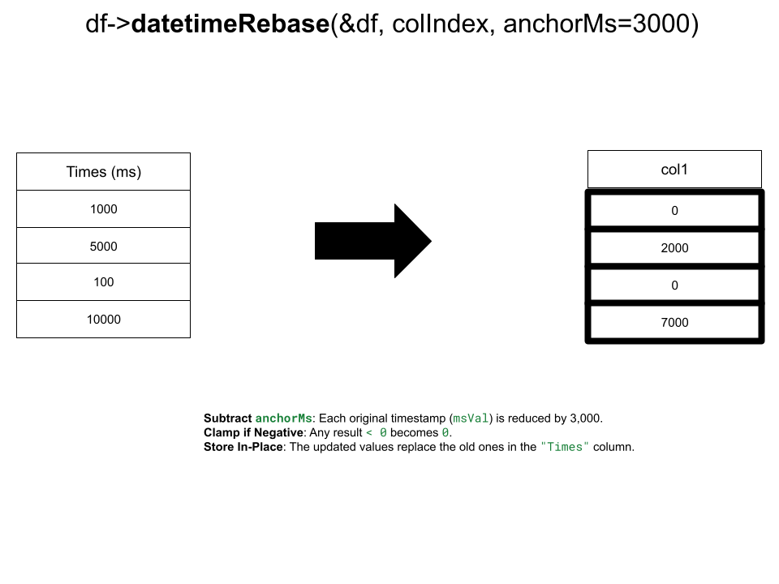


| **Original `msVal`** | **`anchorMs`** | **Computation**                  | **New (Rebased) `msVal`** | **Explanation**                                                         |
|----------------------|---------------:|----------------------------------|---------------------------:|-------------------------------------------------------------------------|
| **10,000**          |         5,000  | `newMs = (10000 - 5000) = 5000`  | **5000**                   | - Original value = 10,000 ms.<br>- Subtract anchor=5,000 ms => 5,000 ms.<br>- 5,000 ≥ 0, so no clamp needed.                                       |
| **2,000**           |         3,000  | `newMs = (2000 - 3000) = -1000`  | **0**                      | - Original = 2,000 ms.<br>- Subtract anchor=3,000 => -1,000.<br>- Negative => clamp to 0.                                                         |
| **123,456,789**     |    100,000,000 | `newMs = (123,456,789 - 100,000,000) = 23,456,789` | **23,456,789**           | - Original = 123,456,789 ms (~1.43 days from epoch).<br>- Anchor=100,000,000 => result=23,456,789 ms.                                             |
| **1,000**           |         1,000  | `newMs = (1000 - 1000) = 0`      | **0**                      | - Perfect offset => exactly zero after rebase.<br>- No clamp needed.                                        |
| **500**             |         500    | `newMs = (500 - 500) = 0`        | **0**                      | - Another example => results in 0.                                                                          |
| **2,500**           |         500    | `newMs = (2500 - 500) = 2000`    | **2,000**                  | - Subtract anchor => 2,000 ms.                                                                              |


## Usage:

```c
    DataFrame df;
    DataFrame_Create(&df);

    Series sdt;
    seriesInit(&sdt, "RebaseTest", DF_DATETIME);
    // We'll store times: 1000, 2000, 3000, 500
    long long times[] = {1000LL, 2000LL, 3000LL, 500LL};
    for (int i=0; i<4; i++) {
        seriesAddDateTime(&sdt, times[i]);
    }
    bool ok = df.addSeries(&df, &sdt);
    seriesFree(&sdt);
    assert(ok);

    // rebase with anchor=1500 => newVal = oldVal -1500, clamp >=0
    // so => row0=1000 => -500 => clamp=0
    //        row1=2000 => 500
    //        row2=3000 => 1500
    //        row3=500  => -1000 => clamp=0
    ok = df.datetimeRebase(&df, 0, 1500LL);
    assert(ok);

    const Series* col = df.getSeries(&df, 0);
    long long val=0;
    seriesGetDateTime(col, 0, &val);
    assert(val == 0LL);
    seriesGetDateTime(col, 1, &val);
    assert(val == 500LL);
    seriesGetDateTime(col, 2, &val);
    assert(val == 1500LL);
    seriesGetDateTime(col, 3, &val);
    assert(val == 0LL);

    DataFrame_Destroy(&df);

```

# Date::bool datetimeClamp(const DataFrame* df, size_t colIndex, long long minMs, long long maxMs)
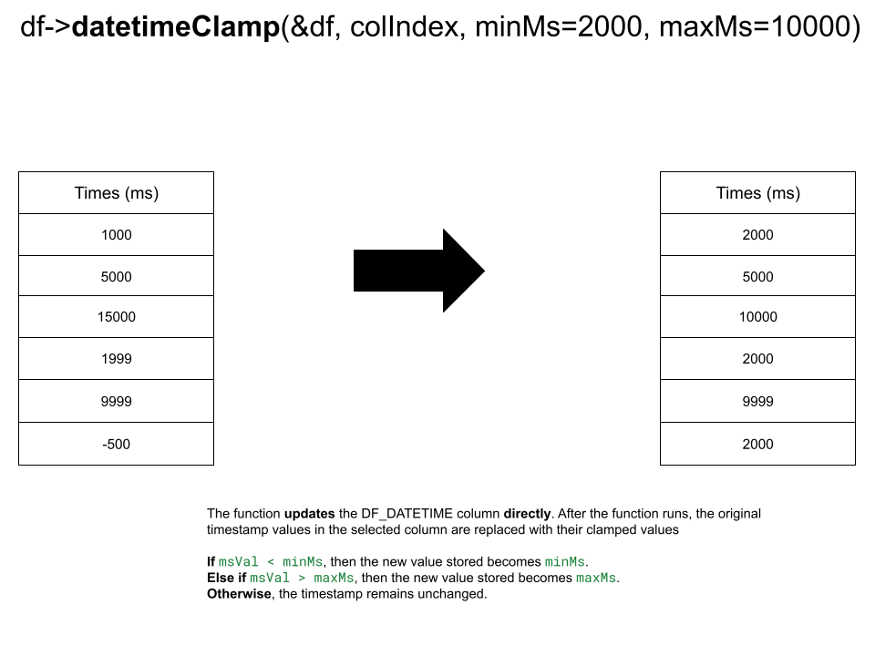

| **Original `msVal`** | **`minMs`** | **`maxMs`** | **Computed `msVal`**                     | **Explanation**                                                                                               |
|----------------------|------------:|------------:|-------------------------------------------|---------------------------------------------------------------------------------------------------------------|
| **1,000**           |       2,000 |      10,000 | **2,000**                                 | - `1,000` < `minMs` => clamped up to `2,000`.                                                                 |
| **5,000**           |       2,000 |      10,000 | **5,000**                                 | - Already within `[2,000..10,000]` => remains `5,000`.                                                        |
| **15,000**          |       2,000 |      10,000 | **10,000**                                | - `15,000` > `maxMs` => clamped down to `10,000`.                                                             |
| **1,999**           |       2,000 |      10,000 | **2,000**                                 | - Just below `minMs` => clamped up to `2,000`.                                                                |
| **9,999**           |       2,000 |      10,000 | **9,999**                                 | - Falls within the range => unchanged.                                                                        |
| **-500**            |       2,000 |      10,000 | **2,000**                                 | - Negative value => also clamped up to `2,000`.                                                               |


## Usage:

```c
    DataFrame df;
    DataFrame_Create(&df);

    // Create a DF_DATETIME col => 10, 50, 100, 9999
    Series sdt;
    seriesInit(&sdt, "ClampTest", DF_DATETIME);
    long long vals[] = {10LL, 50LL, 100LL, 9999LL};
    for (int i=0; i<4; i++) {
        seriesAddDateTime(&sdt, vals[i]);
    }
    bool ok = df.addSeries(&df, &sdt);
    seriesFree(&sdt);
    assert(ok);

    // clamp => min=20, max=9000
    // => 10 => 20
    // => 50 => 50
    // => 100 => 100
    // => 9999 => 9000
    ok = df.datetimeClamp(&df, 0, 20LL, 9000LL);
    assert(ok);

    const Series* col = df.getSeries(&df, 0);
    long long val=0;

    seriesGetDateTime(col, 0, &val);
    assert(val == 20LL);
    seriesGetDateTime(col, 1, &val);
    assert(val == 50LL);
    seriesGetDateTime(col, 2, &val);
    assert(val == 100LL);
    seriesGetDateTime(col, 3, &val);
    assert(val == 9000LL);

    DataFrame_Destroy(&df);
```
